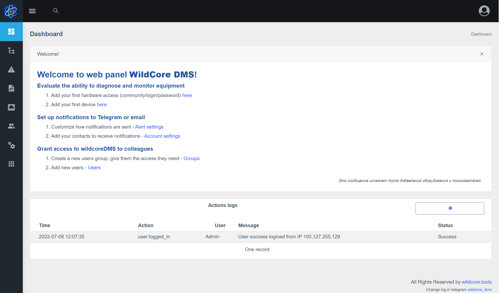

## Влезте в уеб интерфейса
**http://ВАШИЯ_IP_СЪРВЪР:8088**

Въведете потребителско име/парола по подразбиране - **admin/admin**
След успешно влизане ще бъдете пренасочени към главната страница

## Настройте своя акаунт
**Инсталирайте необходимия език и променете паролата за вход по подразбиране**

## Добавяне на хардуерен достъп

## Добавяне на първото устройство

След като добавите устройство - то ще започне да се показва в "Устройства" и можете да отидете на него

