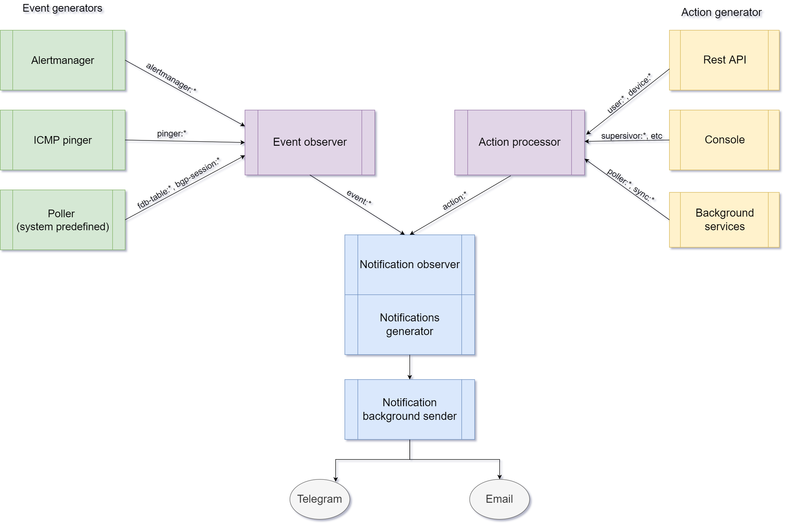
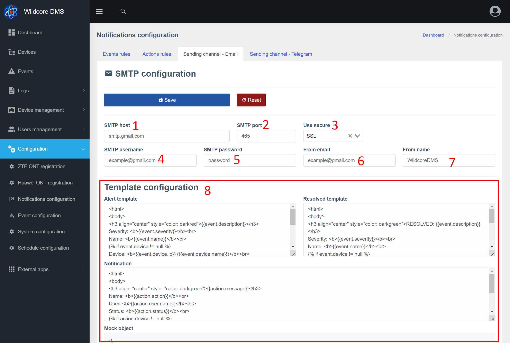
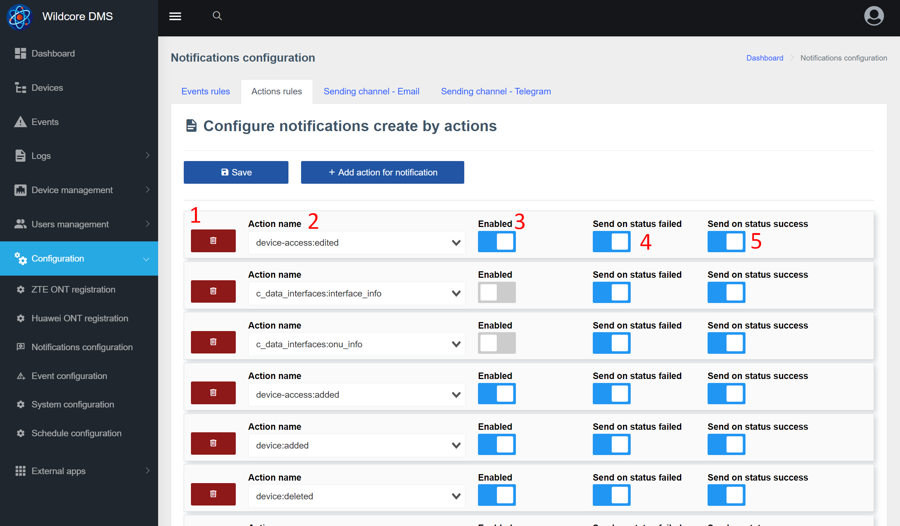
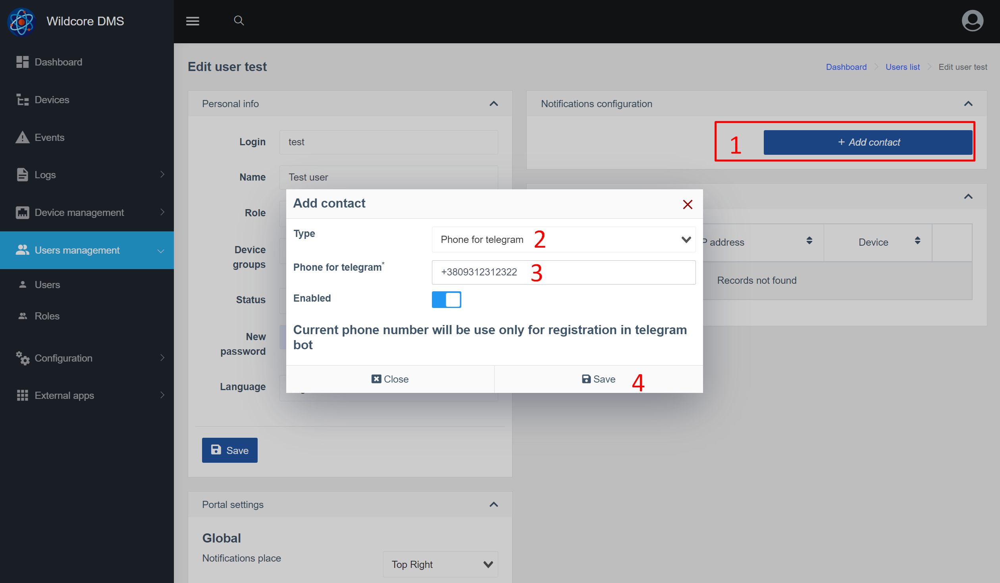

# Известия
## За компонента
Компонентът **Известия** ви позволява да изпращате индивидуални известия до потребителите на системата чрез Telegram и имейл.
Уведомленията могат да бъдат два вида - събития (Events) и известия (логове на действията в системата).


Една от характеристиките на този компонент е възможността за изпращане на известия до конкретен потребител (а не до група).
Потребителят може също да конфигурира кои известия и през кой канал (имейл/телеграма) да се получават.

### Обща схема на взаимодействие


Бележки:

* Събитията имат две дати - начало и край (предупреждение и разрешаване)
* Действията (известията) имат една дата - часа на действието.

Поради тази причина те са разделени на различни групи и имат различни настройки.

## Известия в уеб интерфейса
### Настройка на канал за изпращане - Telegram


1. Избор на раздел
2. Име на бот - тук трябва да въведете името на вашия бот, което е въведено при регистрацията в [@BotFather](https://t.me/BotFather)
3. API ключ - получен ключ от @BotFather
4. Сигнал за шаблон (създаване на събитие)*
5. Шаблонът е решен (завършване на събитие)*
6. Уведомление за шаблон (действие)*
7. Пример за обект, генериран за известие. Ако това е действие (известие), параметърът event = null. В случай, че това събитие е action = null.
Тези променливи могат да се използват за генериране на текст на известие.

_*Използвайте [клонка](https://twig.symfony.com/)_

### Настройка на канала за изпращане - имейл


1. Адрес на вашия SMTP сървър (IP или домейн)
2. SMTP порт
3. Какво криптиране да използвате (обикновено портът също зависи от вида на криптирането)
4. Вашето потребителско име за оторизация на SMTP сървъра. Обикновено това е вашият имейл
5. Парола за авторизация на SMTP сървъра
6. От кой имейл да изпратите (заглавка From в тялото на имейла). Обикновено това е вашият имейл
7. Какво име да посочите при изпращане (От заглавката)
8. Настройка на шаблони (по-подробно описание в блока на телеграмата)


### Конфигуриране на правила за изпращане чрез действия (известия) <a id="action_rules_conf"></a>
На страницата за настройка на действия за изпращане можете да посочите кои действия да генерират известие.
Можете също да добавите някои условия, например изпращане само ако действието е завършило с грешка.


1. Премахнете правилото
2. Името на действието. Това е поле за въвеждане с подсказка (системата подсказва въз основа на вече извършени действия)
3. Активирайте/деактивирайте правилото
4. Изпратете, ако действието е неуспешно
5. Изпратете, ако действието е било успешно

### Конфигуриране на правила за изпращане на събития <a id="event_rules_conf"></a>


1. Премахнете правилото
2. Име на събитието. Това е поле за въвеждане с подсказка (системата подсказва въз основа на вече настъпили събития)
3. Активирайте/деактивирайте правилото
4. Дали да се генерира известие, когато събитието приключи. Уместно, например, когато създавате събитие за рестартиране на хардуера.
5. Колко секунди да изчакате, преди да изпратите известие. Ако събитието приключи по-рано, известието ще бъде отменено. Тази настройка се прилага само за предупредителни известия, разрешените винаги се изпращат незабавно.

### Конфигуриране на контакти и правила за изпращане в потребителски акаунт <a id="config_contact"></a>


1. Щракнете върху редактиране на контакт в настройките на акаунта / редактиране на потребител, за да получите изскачащ прозорец с настройки за контакт
2. Можете да деактивирате контакт, ако не искате да получавате известия известно време
3. На какви нива да изпращате известия чрез този контакт. Има и _Notify_ за нива - това са известия (действия)
4. Списък със събития, които НЕ се изпращат през този контакт
5. Списък с действия, които НЕ се изпращат през този контакт


## Настройване на известия чрез телеграма
### Настройка на канала
1. Отидете в настройките на канала за изпращане на телеграма
2. Посочете името на бота, ключа и запазете
3. Рестартирайте бота с командата ```wca supervisor:control telegram-bot restart``` (така че манипулаторът на входящи съобщения да получи нови настройки)

### Добавете контакти
1. Отидете в настройките на акаунта / промяна на потребителя и добавете телефонния номер, използван в телеграмата.

2. След като добавите контакт - отидете на вашия бот и изпратете /start или друго съобщение.
В отговор ботът трябва да поиска прехвърляне на номер за контакт. След като изпрати номера за контакт, ботът трябва да отговори със следното:

3. Презаредете страницата с настройки на акаунта - трябва да се появи нов контакт с типа Telegram.

**Изпращането на известия чрез Telegram е конфигурирано!**
Освен това можете да настроите фино [кои известия искате да получавате за този контакт](#config_contact),
[какви събития](#event_rules_conf) и [какви действия](#action_rules_conf)


