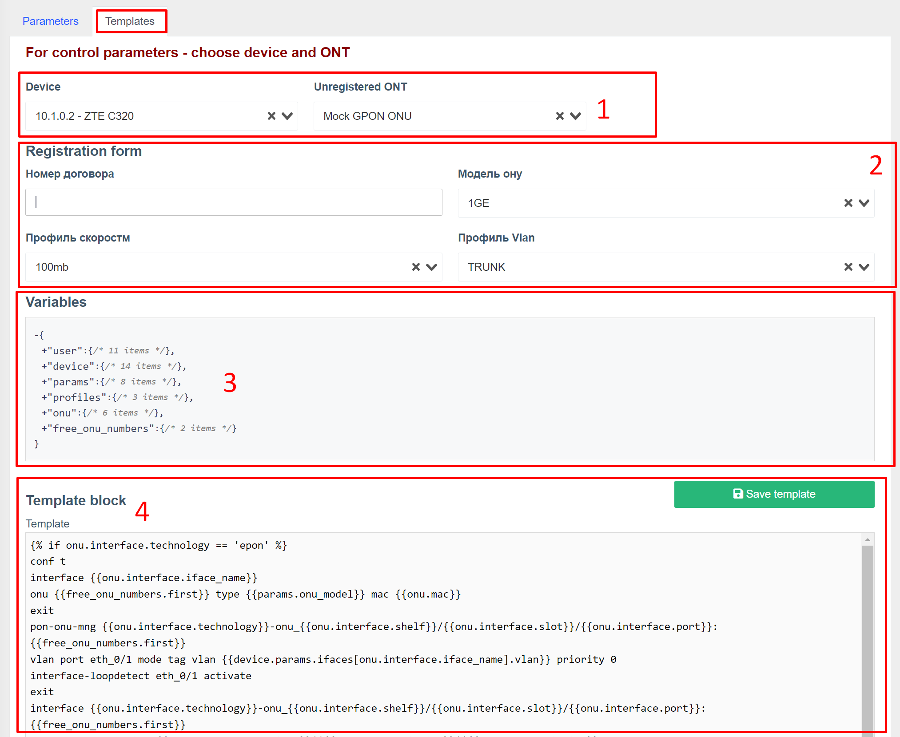
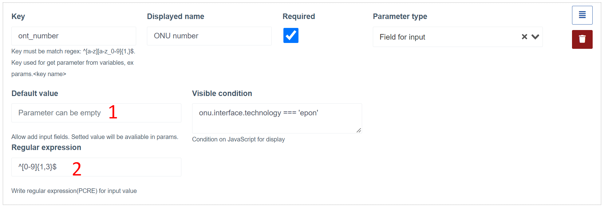

# Регистрация на ONU на OLTs ZTE
Този компонент проверява за нерегистрирани ONU на ZTE OLT.
Той също така позволява регистрация на нови/нерегистрирани ONU чрез попълване на кратък формуляр.

## Как работи?
След като бъде открит нерегистриран ONU, той започва да се показва в списъка (на таблото, за всички устройства и в самото устройство).
При натискане на бутона "Регистрация" се отваря форма за регистрация.
Полетата на формуляра за попълване се генерират динамично въз основа на параметри, подготвени от инженера.
След попълване на полетата на формуляра и натискане на бутона за регистрация се съставя списък с команди за регистриране на ONU на базата на шаблон, въведени параметри и параметри, получени от устройството и нерегистриран ONU.
Ако компилирането на шаблона е успешно, командите ще бъдат изпълнени на OLT.
При успешна регистрация - ще се покаже известие за успешна регистрация и автоматично ще бъде пренасочено към ново ONU.

### Бележки

* Целият изход на конзолата при регистрация може да се види в регистрите на повикванията на оборудването (multi_console_command module), както за успешна регистрация, така и в случай на грешка;
* В случай на грешка на някоя от командите, изпълнението на командите ще бъде спряно.
Изпълнението може да бъде спряно още след въведените команди за самата ONU регистрация.
В този случай трябва да намерите под ONU под кой номер е регистриран и да го конфигурирате ръчно чрез инженера на OLT (или да го изтриете и опитайте да се регистрирате отново);
* За да генерирате шаблона, използвайте [клонка](https://twig.symfony.com/). Използвайте официалната документация за машината за шаблони, за да разберете какви функции са налични. Например разклоняване(if-else);
* Ако имате някои уникални настройки на всеки отделен OLT - можете да ги посочите в допълнителните параметри на устройството и да ги използвате в шаблона или параметрите. Често срещана практика е да се определят персонализирани vlan (за отделни портове или цялото устройство). Такива параметри ще бъдат налични в обекта `device.params`

## Компонент в уеб интерфейса
### Регистрация на нерегистриран ONU
**Списък с нерегистрирани ONU на устройството**

** Формуляр за регистрация на ONU **

### Конфигурация за регистрация
**Страница за конфигурация**

**Раздел за настройки на параметри**

1. Блок за избор на устройство и ONU. В списъка с устройства се показват само ZTE OLT. Трябва да изберете устройство и нерегистриран ONU, за да получите списък с динамични параметри.
2. Променливи, достъпни след избор на устройството и ONU, които могат да се използват в настройките на полетата на регистрационния формуляр
3. Поле за регистрационна форма

**Раздел за настройки на шаблона**

1. Блок за избор на устройство и ONU. В списъка с устройства се показват само ZTE OLT. Трябва да изберете устройство и нерегистриран ONU, за да получите списък с динамични параметри.
2. Формуляр за регистрация, подготвен в [раздел с опции](#config_params)
3. Променливи, налични след избор на устройство, ONU и попълване на параметрите на формуляра, които могат да се използват за съставяне на шаблон
4. Блок за промяна на шаблона (под шаблона можете да видите и генерирания набор от команди)

## Променливи
Променливите са вложени обекти с полета.
Стойността на обектните полета се генерира автоматично въз основа на текущия потребител, оборудването, на което се намира нерегистрираното ONU.

Можете да използвате тези променливи, за да генерирате шаблона, както и поведението на регистрационния формуляр.

**Коренният обект съдържа следните полета**:

* **user** - текущият потребител в системата
* **устройство** - устройство, на което се извършва регистрацията
* **params** - стойности въведени в регистрационната форма
* **профили** - списък с линейни и отдалечени профили, получени от OLT
* **onu** - ONU, което се регистрира
* **free_onu_numbers** - съдържа две полета (първото свободно onu) и списък на всички свободни onu на порта, където се намира нерегистрираният ONU.

## Параметри на формуляра за регистрация
### В системата са налични следните типове параметри:
* Избор (падащо меню) от предварително зададени стойности
* Избор (падащо меню) на променливи
* Полето за въвеждане със стойност по подразбиране от променлива
* Поле за въвеждане

### Типичен блок за конфигуриране на параметри (например типът е избор от предварително зададени стойности)

1. **Key(key)*** - Чрез името на ключа ще бъде възможен достъп до стойността на параметъра в шаблона, който ще бъде достъпен от params.KEY_NAME. Препоръчително е да въвеждате ключове само на латиница и, ако е необходимо, да използвате долна черта;
2. **Показвано име*** - Името на полето, което ще се показва в регистрационната форма;
3. **Флаг "задължително"** - показва, че при регистрация това поле трябва да бъде попълнено (или избрано при отпадане);
4. **Parameter type*** - Тип параметър. Трябва да изберете едно от следните;
5. **Видимо условие** - javascript условие за показване на полето. Трябва да върне true или false в зависимост от променливите.
6. **Бутон за сортиране** - със задържане на бутона можете да плъзгате параметъра нагоре/надолу. Това ще промени реда на полетата във формуляра за регистрация
7. **Бутон за изтриване на параметър**

_* - задължително поле_

### Параметри по типове полета
**Изберете от предварително зададени опции**

1. Тук можете да изведете списък с опции (от нов ред) за избор при регистрация

**Изберете от променлива**

1. Източник на стойности (в списъка се показват само масиви, съдържащи примитивни стойности)
2. След избор - показва се списък със стойности

**Поле за въвеждане със стойност по подразбиране от променлива**

1. Източникът на стойността (в списъка се показват само променливи с примитивен тип)
2. Стойност по подразбиране, ако няма променлива или е празна
3. Регулярен израз за входна стойност

**Поле за въвеждане със стойност по подразбиране от променлива**

1. Стойност по подразбиране
2. Регулярен израз за входна стойност

## Команден модел
Шаблонът се използва за създаване на списък с команди, които да бъдат изпълнени на OLT по време на ONU регистрация.
Когато съставяте шаблон, трябва да използвате променливи.
Под блока на шаблона има друг блок, който компилира шаблона и ви позволява да видите окончателния списък с команди, които ще бъдат изпълнени на хардуера.
Съставянето на окончателния списък с команди ще работи само при избор на оборудване, ONU. Също така се препоръчва да попълните формуляра.

1. Шаблонен блок
2. Блок с резултати на живо (окончателен списък с команди)

## Указания за настройка на регистриране
* Добавете ZTE OLT
* Добавете нерегистриран ONU в мрежата на този OLT

Това ще ви позволи да разберете по-подробно какво представляват променливите и как се попълват.

