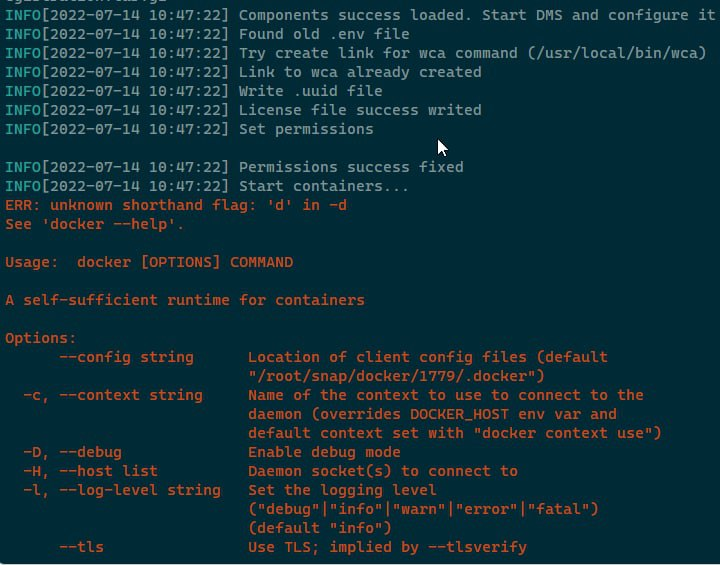

*В момента единственият начин за инсталиране и работа е осигурен в докера с инсталация чрез wca-tool.*

## Инсталация
Изпълнете командата
```shell
sudo wca-tool --key=YOUR_AGENT_KEY install 
```
*YOUR_AGENT_KEY - ключът на агента, който сте получили при контакт (вижте изискванията)*
Процесът на инсталиране отнема известно време (обикновено 10-15 минути).

Ако инсталацията е успешна, ще се покаже съобщение
```shell
WildcoreDMS success installed!
Now, you can use wildcoreDMS by URL: http://<service ip|domain>:8088
Default login/password - admin/admin

You can change some parameters in /opt/wildcore-dms/.env file, as listen ports for example
```

След инсталирането отидете на уеб панела.
По подразбиране панелът е достъпен на порт `8088`, а потребителското име/паролата по подразбиране е admin/admin.


## Чести проблеми с инсталацията
### docker-compose-plugin не е инсталиран
Обикновено грешката изглежда така:


Изисква се docker-compose да бъде инсталиран в системата като плъгин за докер, а не като отделна помощна програма.

За да коригирате проблема:

1. Инсталирайте пакета `docker-compose-plugin` за вашата операционна система (вижте инструкциите за инсталиране в официалната докер документация - [docs.docker.com](https://docs.docker.com/engine/install/))
2. Проверете дали наистина работи - командата `docker compose version` трябва да върне версията на плъгина.
3. Продължете да инсталирате wildcoreDMS с командата ```sudo wca-tool update```

### Агентът е деактивиран
След успешна инсталация, когато се опитате да влезете - се показва съобщение

Този проблем може да е свързан с инсталирането на системата на "слаби" сървъри (по-малко от посоченото в препоръките)
Решено по следния начин:

1. Чакаме 5-10 минути (СУБД трябва да стартира. Можете също да проследите стартирането с командата `docker logs -f wca-db`)
2. Изпълнете командата `docker exec -it wca composer install`
3. Изпълнете командата `wca migration:migrate --up *:*`
1. Ако по време на изпълнение на командата сме получили връзка с базата данни (например Connection rejected) - върнете се към точка 1.
4. Изпълнете командата `wca system:check`
5. Опит за повторно влизане през уеб интерфейса


### Грешки, свързани с мрежата
Може да се прояви чрез записи в регистрационни файлове като: `Connection refused`, `Connection timeout`, `Forbidden`

Препоръчителни действия:

1. Прочетете от логовете къде точно се прави опит за свързване
2. Уверете се, че този адрес е достъпен от сървъра (проверете наличността със същия curl в случай на HTTP)
3. Ако всичко е наред с отговора - проверете дали всичко е наред с докера (инсталиран според официалния док, нямаше стари версии и версията беше инсталирана специално за вашата система)

След като проблемът бъде отстранен, преинсталирането може да се извърши с командата `wca-tool update`.


