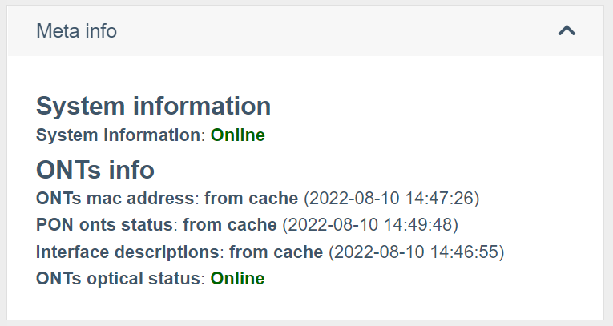

# Работа с оборудване

## Взаимодействие с оборудване
Wildcore системата може да комуникира с хардуера чрез **snmp версия 2c**,
чрез **конзола**(ssh/telnet), както и чрез **API** (за RouterOS).

Възможно е да посочите портове в достъпа до оборудването, ако вашата мрежа използва нестандартни портове


## Настройка на параметрите за работа с оборудване

## Анкета оборудване
### Получаване на стандартизиран изход чрез модули за превключване
Всяко взаимодействие със системата се осъществява чрез извикване на определени модули switcher-core.
Всеки доставчик и модел има свой собствен набор от модули.
Списъкът на поддържаните модули по хардуер може да бъде получен с командата
```
wca switcher-core:modules DEVICE_IP
```

### Показване на информация в уеб интерфейса
Системата е насочена към показване на "жива" информация от оборудването.

Но като се има предвид, че е необходима и приемлива скорост на зареждане на страницата, направихме компромис под формата на кеширане на отговорите.
За да видите каква информация е получена от системния кеш и каква от оборудването - разгънете блока "Мета информация" (Status-info) на страницата на оборудването с интерфейси / в ONU.

Екранната снимка по-горе показва името на модула, както и източника, от който са получени данните:

* **от кеша (ДАТА)** - данни, получени от кеша, а ДАТА показва датата, на която тези данни са добавени към кеша
* **онлайн** - получени данни от оборудването.

Ако трябва да получите "живи" данни - щракнете върху бутона "Презареди информация" (опресняването на страницата може да отнеме известно време. Обикновено 15-30 секунди)

Също така си струва да се има предвид, че някои от данните могат да се показват с Prometheus (например нива на сигнала) и бутонът „Презареждане на информация“ няма да актуализира тази информация.
_За повече подробности какви данни и какво оборудване са взети от Prometheus, вижте описанието на компонентите, според вида на оборудването, от което се нуждаете_

## Глобални настройки


