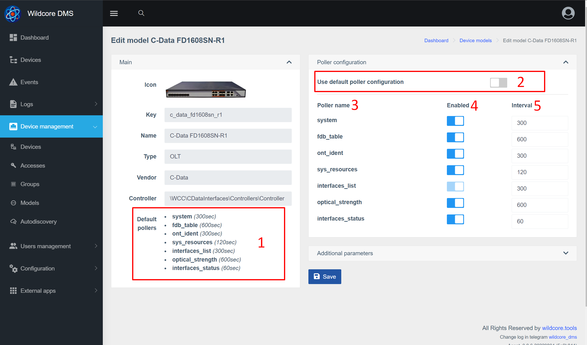
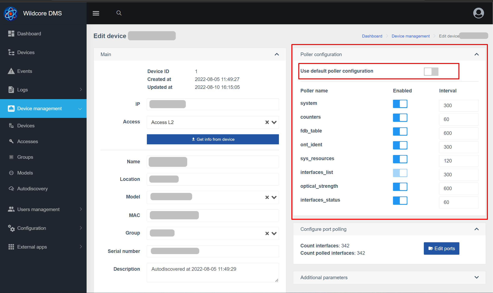
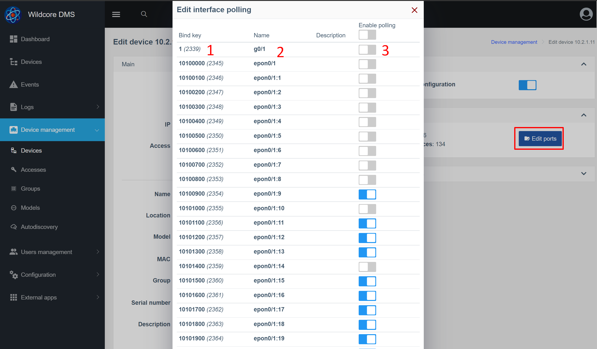

# Анкетьор на оборудване
Хардуерният анкетьор работи във фонов режим и събира известна информация от хардуера.
По подразбиране работят 10 екземпляра на колектора. Това означава, че данните могат да се събират от до 10 различни устройства едновременно.

## За какво е необходимо?
Данните, получени от оборудването чрез въпросника, се използват за:

* Актуализиране на кеша - за по-бързо зареждане на страницата
* Събиране на исторически данни - например начертаване на сигнал
* Генериране на събития и известия въз основа на тях
* Изпращане на показатели към Prometheus

## Списък на анкетьорите
* **arp_table** - ARP таблица
* **bgp_sessions** - списък на BGP сесии
* **counters** - броячи от интерфейси (грешки, трафик)
* **fdb_table** - FDB таблица
* **interfaces_list** - списък с интерфейси с техните имена и описания
* **interfaces_status** - статус на администратор/текущо състояние
* **ont_ident** - ONU идентификатори (серийни номера/MAC адреси)
* **optical_strength** - нива на сигнала от ONU (RX,TX,OLT-RX, разстояние до ONU, температура)
* **система** - в момента се събира само времето за работа на устройството
* **sys_resources** - Използване на процесора/използване на паметта

## Настройка на Poller
### Промяна на интервали на анкети и анкети по модел на устройство
Системата има възможност да променя интервалите на анкетиране (в секунди), както и да деактивира някои анкетьори.

1. Настройки на анкетата по подразбиране
2. Деактивирайте тази опция, за да промените избирателите
3. Име на анкетьор
4. Активиране/деактивиране на анкета
5. Интервал в секунди

След промените запазете промените в системата.

### Промяна на интервали на анкети и анкети по устройство
Също така е възможно да пренапишете настройките на анкетата за конкретно устройство. Логично е, например, ако имате няколко олта с малък брой ONU и един, от същия модел, "натъпкан" до дупката.

Настройката на блока за анкетиране е подобна на настройката по модел на устройството.

### Изключете събирането на данни на определени портове
Промяната засяга запазването на данни от анкетьора:

* броячи
* interfaces_status (за някои модели)
* оптична_сила

1. ID на интерфейсите в системата
2. Име на интерфейса
3. Активирайте / деактивирайте запазването на показатели чрез интерфейс

_Трябва да се има предвид, че деактивирането на портове засяга само запазването на показателите, но не и събирането им от оборудването (всъщност събирането така или иначе се извършва от всички интерфейси)_

### Промяна на броя на работещите потребителски инстанции
Можете да посочите необходимия брой работещи екземпляри чрез параметъра **POLLER_COUNT_PROCS** (във файла /opt/wildcore-dms/.env или чрез уеб интерфейса, в системните настройки).

Има смисъл да увеличите броя на случаите, ако забележите, че интервалът за събиране на данни от оборудването е много по-голям от определения интервал за модела/устройството.

Препоръки за задаване на максимален брой инстанции:

* _Въз основа на RAM:_ (обща памет - 3,5 Gb) / 0,25 Gb = максимално количество
* _Въз основа на процесора:_ 2,5 * брой ядра = максимален брой

### Деактивирайте опитите за събиране от недостъпен хардуер
Ако параметърът **POLLER_IGNORE_DOWN** е настроен на _true_ - преди започване на работа с оборудването ще се проверява наличността му чрез ICMP.

