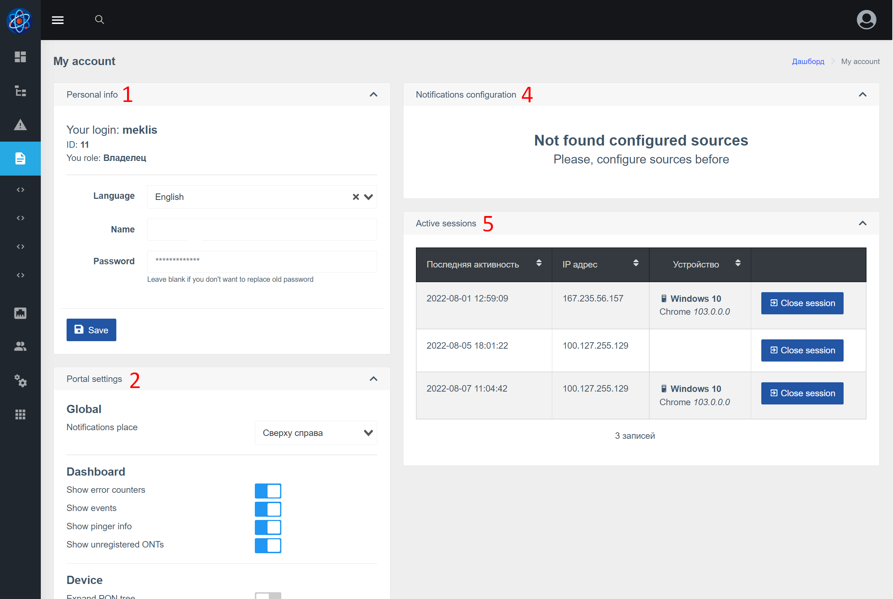

Уеб интерфейсът е SPA приложение([wiki](https://ru.wikipedia.org/wiki/%D0%9E%D0%B4%D0%BD%D0%BE%D1%81%D1%82%D1%80%D0%B0%D0%BD%D0%B8%D1%87%D0%BD%D0%BE%D0%B5_%D0%BF%D1%80%D0%B8%D0%BB%D0%BE%D0%B6%D0%B5%D0%BD%D0%B8%D0%B5))),
който работи с Wildcore DMS API.

## Описание на основните елементи
### Страница за вход

### Основни елементи, табло

1. Блок меню
2. Бутон за меню
3. Глобално търсене (позволява ви да търсите устройства, интерфейси, ONU)
4. Настройки на акаунта (промяна на име, парола, език, контакти и др.)
5. Блок от събития
6. Block pinger
7. Блокиране на грешки при сглобяване / Справяне с грешки

### Табло за управление на устройството

1. Група устройства (име и описание)
2. Брой устройства (онлайн/общо)
3. Брой интерфейси (онлайн/общо)
4. Показване на контролни бутони (разгъване на всички групи / скриване на всички групи / презареждане на списъка от сървъра)
5. Филтър на устройството (съхраняван в браузъра)
6. Име на устройството
7. Брой интерфейси (онлайн/офлайн/общо)
8. Икона, показваща, че устройството е офлайн (ако иконата е сива, все още няма данни за състоянието)

### Настройки на акаунта

1. Основна информация за акаунта
2. Настройки на портала (позволява ви да конфигурирате някои настройки чрез уеб интерфейса)
3. Бутон за запазване
4. Настройка на известия (показва се, ако компонентът за известия е наличен). Позволява ви да добавяте контакти и да конфигурирате настройките за уведомяване.
5. Блокирайте сесиите. Позволява ви да видите вашите активни сесии, откъде сте влезли, от кое устройство и кога последно сте го използвали.

