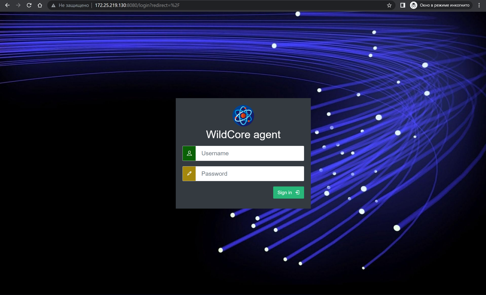
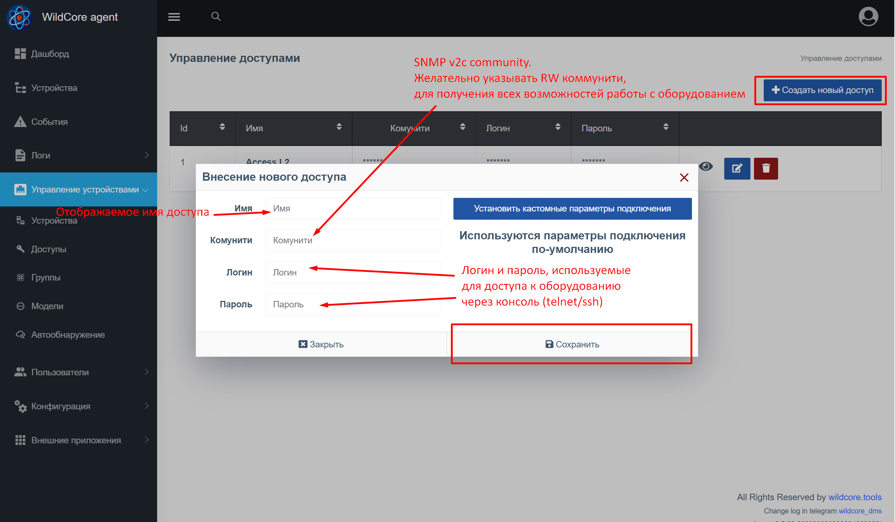
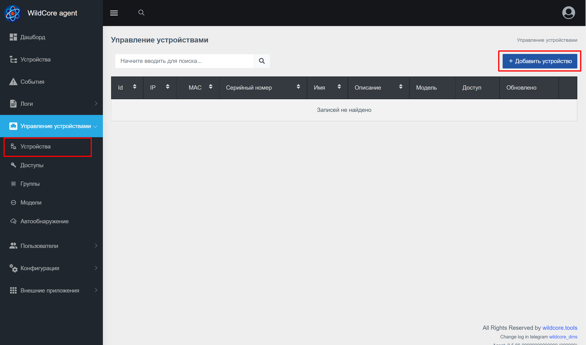
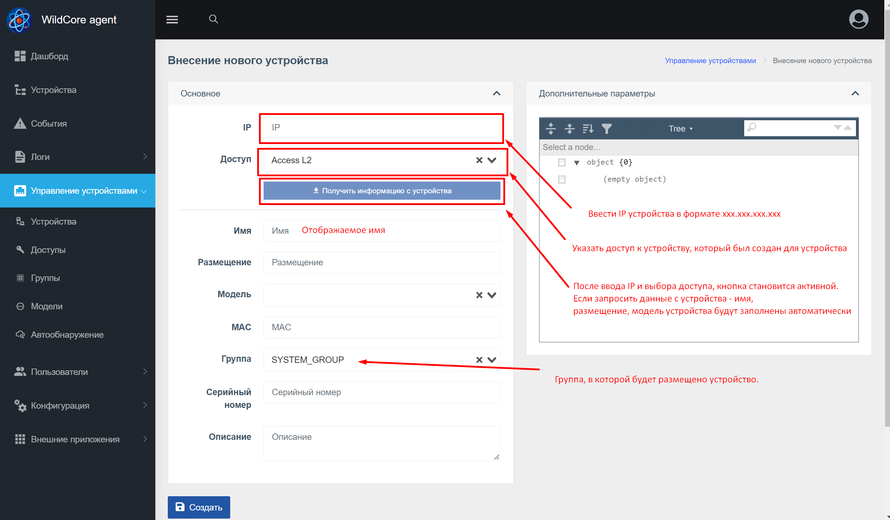

## Login to the web interface
**http://YOUR_IP_SERVER:8088**

Enter login/password by default - **admin/admin**
After a successful login, you will be redirected to the main page

## Set up your account
**Install the required language and change the default login password**

## Adding hardware access

## Adding the first device

After adding a device - it will begin to be displayed in the "Devices" and you can go to it

