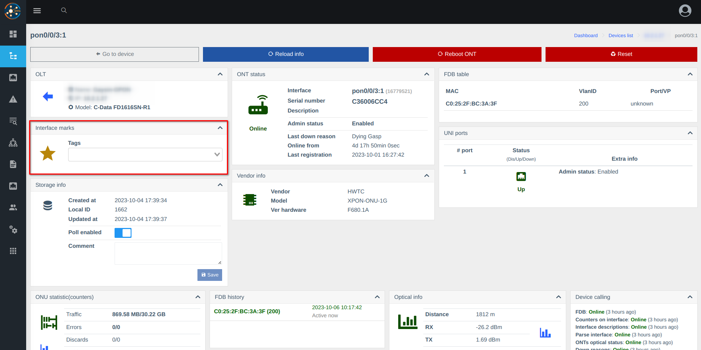
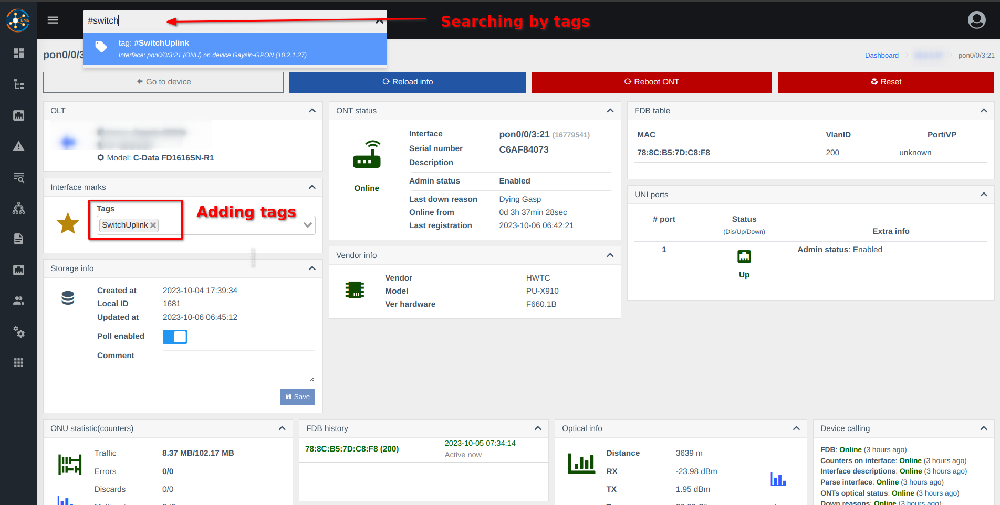
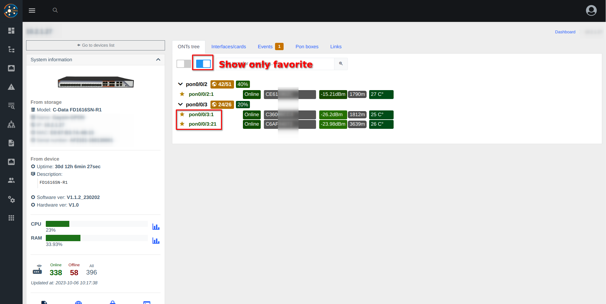
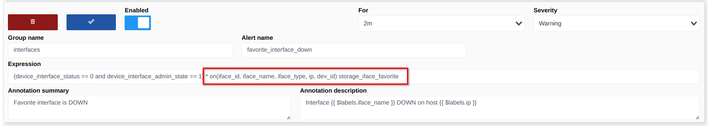
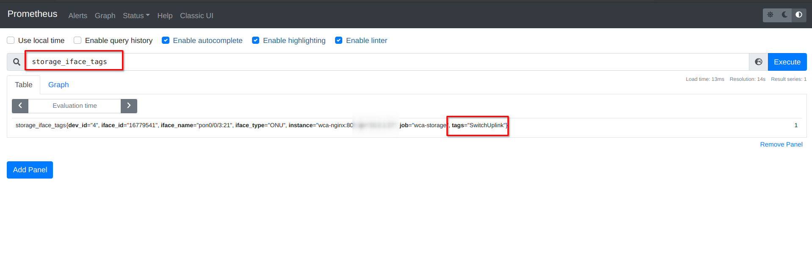
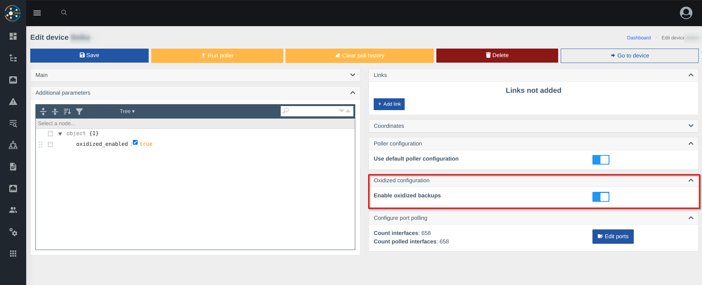
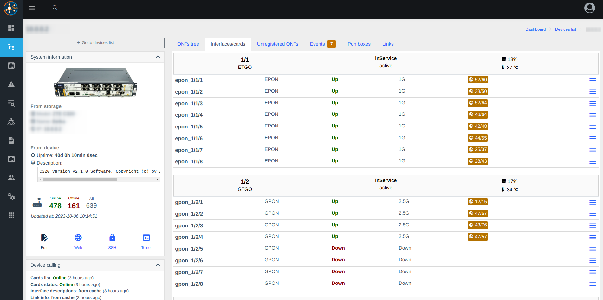

# Version 0.18 (pre-release, 0.18.019)
 
* **Added components**
    - [oxidized](../components/oxidized.md) - Backup device configuration
    - [nodeny_plus](../components/nodeny_plus.md) - Integration with Nodeny Plus billing
    - [diagnostic](../components/diagnostic.md) - API methods for integrate diagnostics 

* **New functionally**
    - Favorite interfaces 
    - Tagged interfaces
    - Strict access to web panel by IP(cidr)
    - Physical ports on OLTs (ZTE/Huawei/C-Data)
    - System information in configuration
    - Device accesses hidden now (see over console - `wca device-access:list`)
    - Store physical ports(OLTs) in prometheus (for alerting)
 
* **Fixed bugs**
    - Excluded polling FDB from uplink ports (based on tagged ports and links)

### Screenshots 








### Installing pre-release
1. Update wca-tool to latest version
2. Run update command with specific version 
```shell
sudo wca-tool update --dev --version=0.18.019
```

### ❗Cautions
1. Delete some incorrect row from fdb history(switches has a bug with store FDB from transport ports), fixed from 0.18.0.     
   Run it command after 1-2 hours, after update to 0.18
``` 
docker exec -it wca-db mysql -uroot -psuperpassword wildcore_agent -e "DELETE FROM poll_fdb_history WHERE stop_at is not null and device_id in (SELECT d.id FROM devices d JOIN device_models m on m.id = d.model_id WHERE m.type = 'SWITCH');"
```