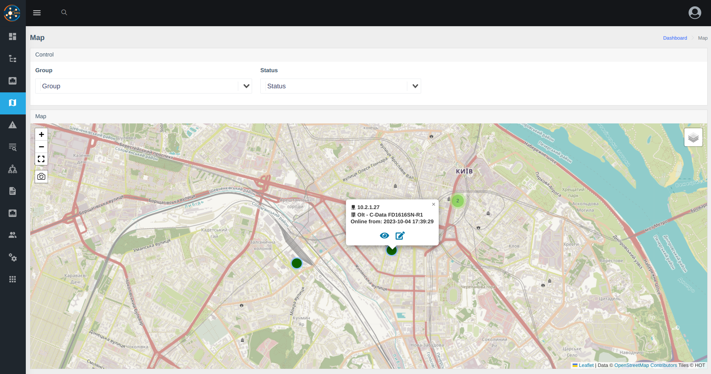

# Version 0.18

* **Added Components**
    - [oxidized](../components/oxidized.md) - Configuration backup for the device
    - [nodeny_plus](../components/nodeny_plus.md) - Integration with Nodeny Plus billing

* **New Features**
    - Selected (favorite) interfaces (events are also created for selected interfaces)
    - Tagged interfaces
    - [Description of API methods](../api/examples.md) for integration into your systems
    - Ability to restrict login from specific IPs for a user
    - Physical ports on OLTs (ZTE/Huawei/C-Data)
    - Map with devices and their software state via ICMP
    - System information in the configuration
    - Saving physical ports (OLTs) in Prometheus (for notifications)
    - Ability to reset the administrator password with the command `wca user:reset-admin-password` to the default - admin
    - Ability to reset IP restrictions for a user with `wca user:reset-ip-strict <LOGIN>`
    - Added the ability to change the port description on Huawei, Edgecore, Alcatel, Eltex switches (works through snmpset, ifAlias)

* **Changes**
    - Device access is now hidden (check through the console - `wca device-access:list`)
    - Switch port now has its "card" (like with ONUs), port management is moved to the card
    - The list of ONUs has been moved to the "Interfaces" menu and now works with user restrictions by device groups
    - The arrangement of blocks in ONU information has been changed so that information about the ONU state comes first when viewed from a mobile phone

* **Fixed Bugs**
    - Excluded FDB polling from outgoing ports (based on marked ports and connections)
    - PON boxes, displaying boxes in the equipment tab 


### Screenshots 



 
### ❗Cautions
1. Delete some incorrect row from fdb history(switches has a bug with store FDB from transport ports), fixed from 0.18.0.     
   Run it command after 1-2 hours, after update to 0.18
``` 
docker exec -it wca-db mysql -uroot -psuperpassword wildcore_agent -e "DELETE FROM poll_fdb_history WHERE stop_at is not null and device_id in (SELECT d.id FROM devices d JOIN device_models m on m.id = d.model_id WHERE m.type = 'SWITCH');"
```