# Version 0.20 (12.2023)

## New Features
- **New Prometheus Metrics**
  - **analytics_duplicated_ont_ident_ifaces** - displays ONUs with interfaces
  - **analytics_duplicated_ont_ident** - displays ONUs with a count of duplicates
  - **analytics_duplicated_mac_addresses_ifaces** - displays MACs with interfaces
  - **analytics_duplicated_mac_addresses** - displays MACs with a count of duplicates
  - **card_status_admin_status** - displays the admin status of the card (ZTE/Huawei)
  - **card_status_cpu_load** - displays the CPU load of the card (ZTE/Huawei)
  - **card_status_memory_usage** - displays the RAM usage of the card (ZTE/Huawei)
  - **card_status_oper_status** - displays the operational status of the card (ZTE/Huawei)
  - **card_status_temperature** - displays the temperature of the card (ZTE/Huawei)
  - **unregistered_ont** - displays unregistered ONUs

- **Ability to Receive Internal System Events** - see examples in `/opt/wildcore-dms/examples`
- **For ZTE EPON, added the ability to choose a description from the $$ block** - parameter `"epon_description_block_index": 1`, allowing you to change the block for display between '$$' (options - 1 or 2)
- **Analytics: Duplicate MAC Addresses**
- **Analytics: Duplicate ONUs**
- **Analytics: ONU Signal Levels + Widget**
- **Ability to Separate Interface Statistics in terms of Physical Port/ONU**, a new parameter appeared in user settings
- **System settings now include a table with detailed statistics by interface type in the system**
- **Map: added ONU display**
- **Map: added link display with the ability to edit link paths**
- **Clearing counters and switch reboot (Huawei/Edgecore)**
- **Changing the description of ONUs on C-Data FD12xx/FD16xx**
- **Added a block with information about equipment access issues**
- **Display of traffic and errors on physical ports (C-Data/ZTE/BDcom)**

## Changes

- RoadRunner version v2023.3.0-rc.1
- Automatic cable diagnostics disabled by default. To enable (as it was before), add the parameter `"enable_auto_cable_diag": true` to the model or device
- User role permissions changed
- When deleting an ONU - now the interface is also removed from the wildcore database
- Huawei MAxxxx - accelerated polling speed
- Improved performance with console commands
- BDcom P3600 series added to Oxidized
- Huawei SmartAX series added to Oxidized

## Fixed Bugs
- MikBill: when synchronizing subscribers, if several subscribers fall on one interface, now it does not save records (previously saved someone)
- Fixed ONU downtime on BDcom
- Component management fixed
- Display of the number of interfaces on device dashboards fixed
- Equipment call error statistics widget
- Fixed obtaining cached results for onts_serial, unregistered_onts modules (when using the "hack" sn_as_ascii)
- Fixed display of the signal level block on offline ONUs
- Notification sending fix (resolved could be earlier than alert)
- FD12xx/FD16xx - fixed FDB polling
- Dlink DGS-31xx - fixed interface retrieval
- Fixed transition between devices via link or search (not all information was updated)

### Screenshots
#### Map
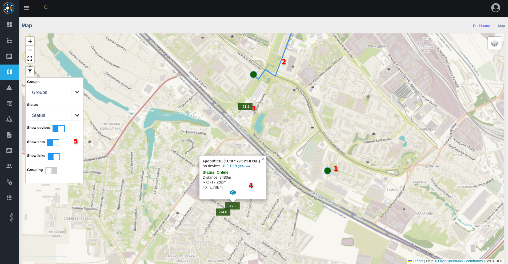

* 1 - device (switch/OLT)
* 2 - link
* 3 - ONU
* 4 - popup with additional information
* 5 - filters

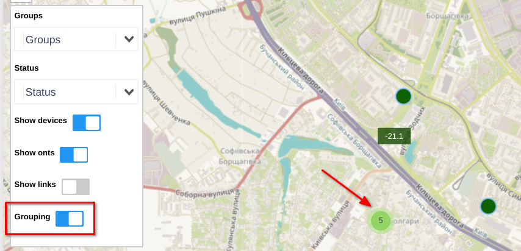    
_* links are not grouped_    
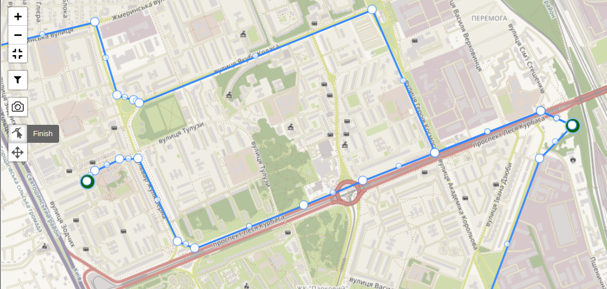
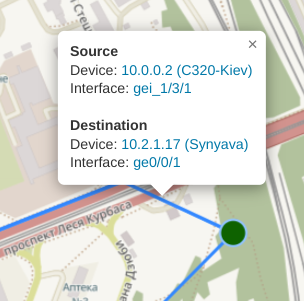

#### Traffic and Errors on Physical Ports
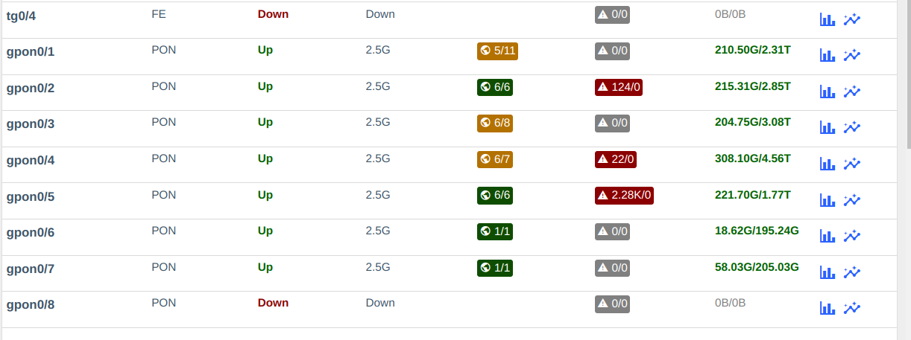
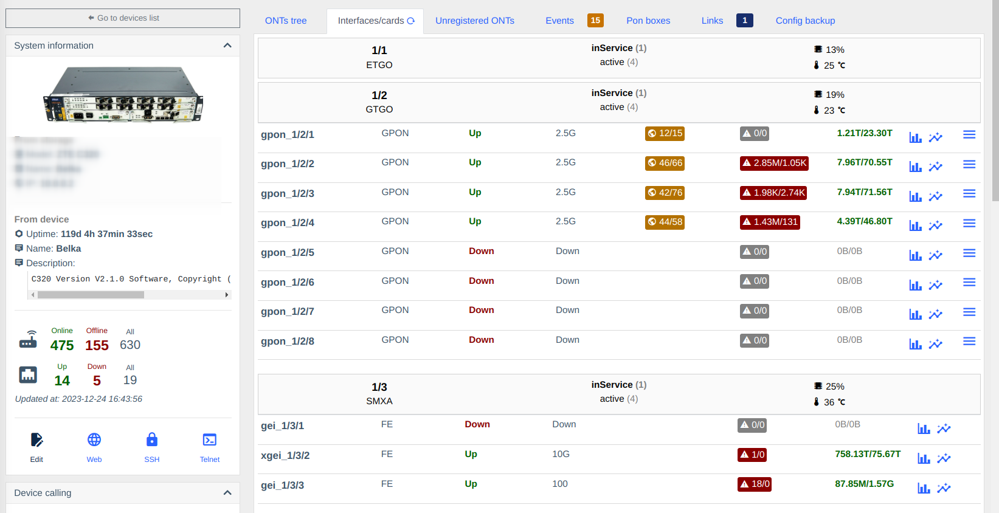

#### Interface Statistics
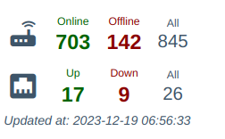
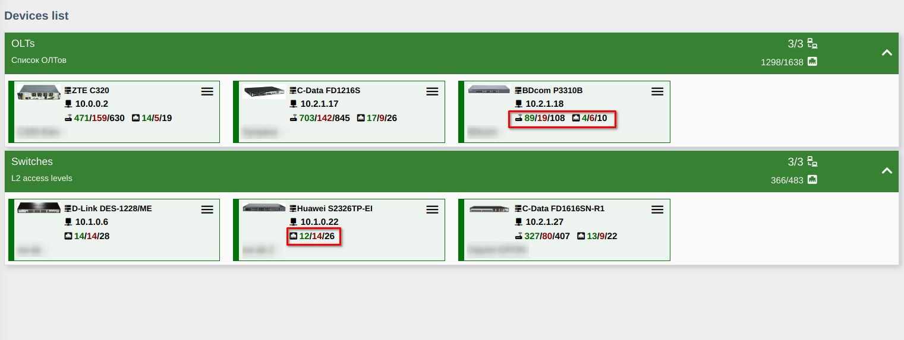
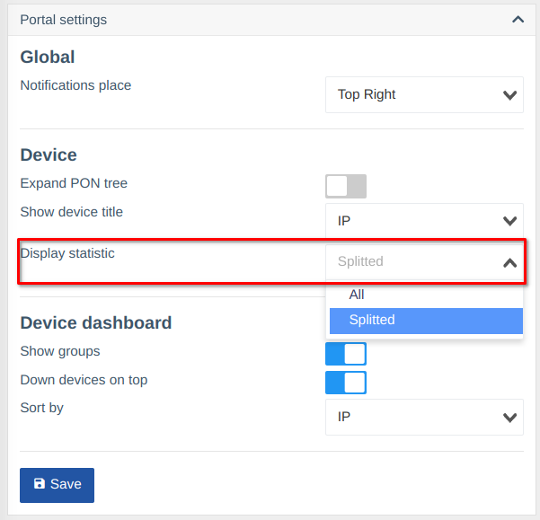

#### Detailed Interface Statistics
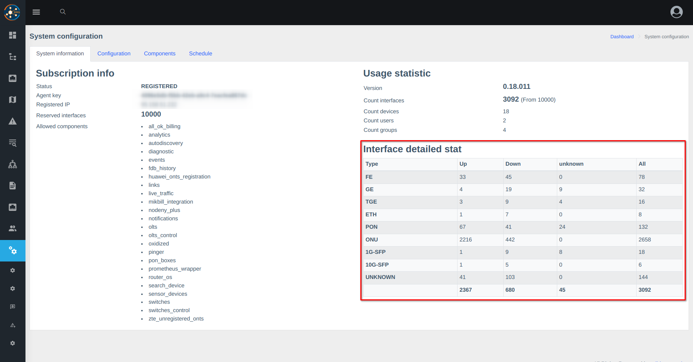

#### Signal Levels Widget
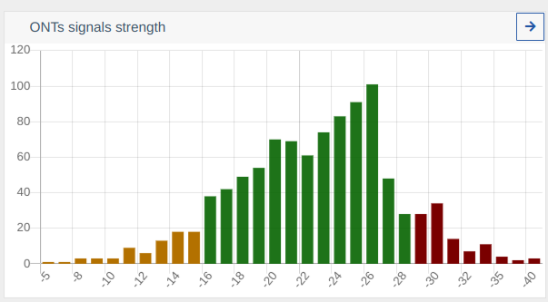

#### Signal Levels Page
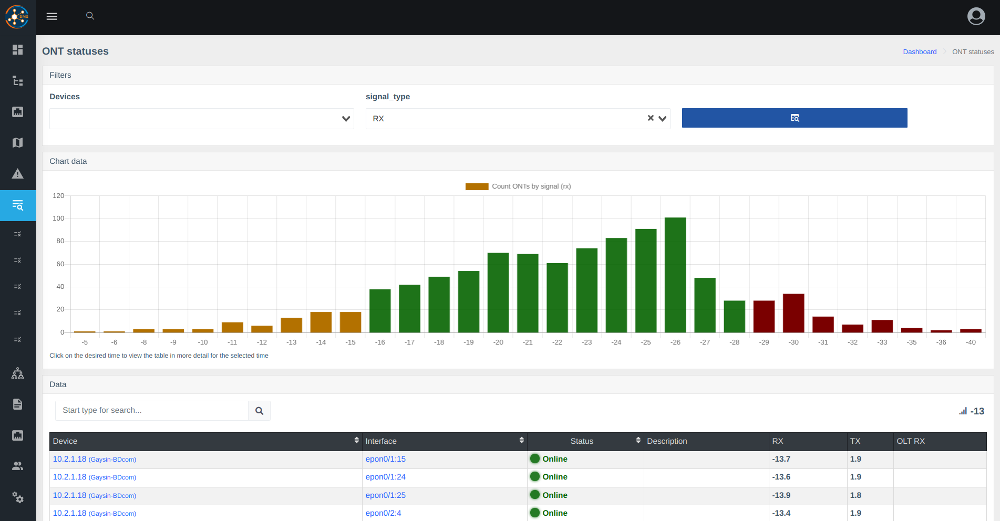

#### Prometheus Metrics
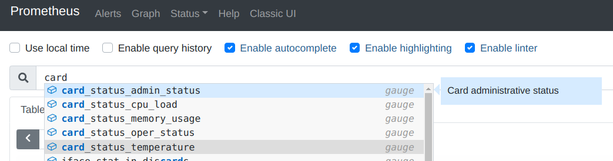
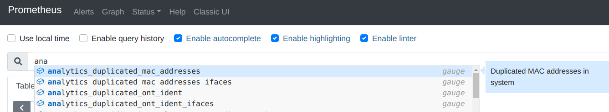
