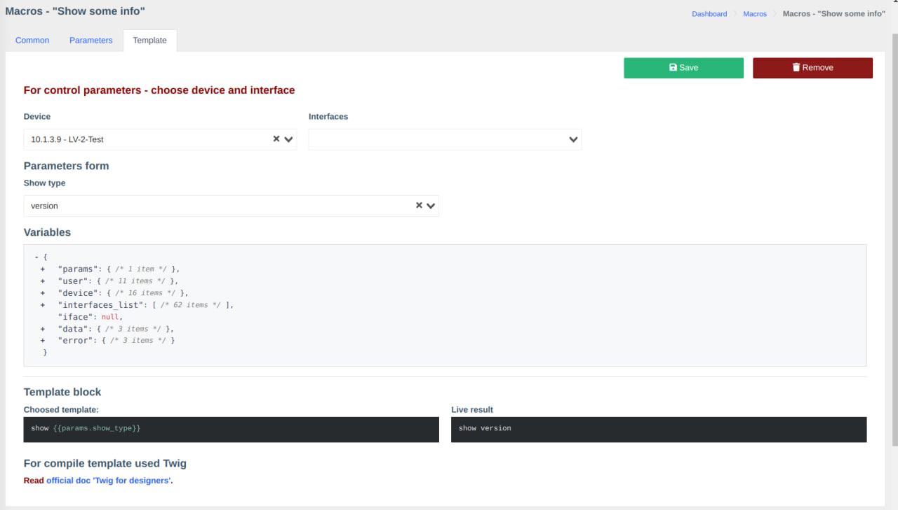
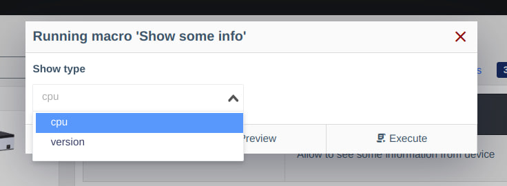
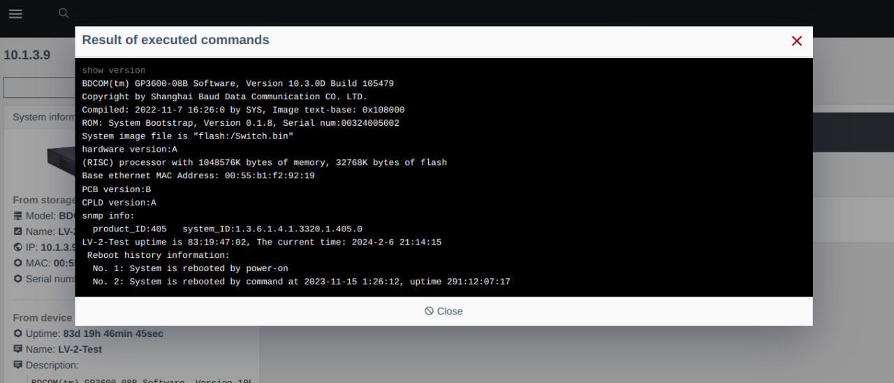

# Version 0.21 (pre-release)

## About the Update

### Added Components

- [Macros](./components/macros/getting-started.md) - allow expanding the system's functionality (beta testing, payment will be introduced in the future)

!!! info "Component 'Macros' is conditionally free"
    Currently, the component is in the testing phase and is shipped with the agent.
    Expected payment introduction - **09.2024**

### New Features

- Integrated PWA support
- Added a page for PON port
- Optimized loading speed of ONU/interface
- Allows viewing and modifying the description of the physical port on OLT
- Added reception signal of OLT on C-Data FD16xx*
- Added detailed ONU status in the system and Prometheus (-2 - LOS/-1 - PowerOff/0 - Offline/1 - Online)

!!! question "More about PWA"
    * What is it? - [wikipedia.org](https://en.wikipedia.org/wiki/Progressive_web_application)
    * How to install? - [support.google.com](https://support.google.com/chrome/answer/9658361?hl=en&co=GENIE.Platform%3DDesktop)

!!! info "Optimization of ONU/interface loading speed"
    Optimization is achieved through caching survey results in interface slices.
    Therefore, when opening ONU, some data will be taken from the cache, and some from the equipment.
    To see which methods are from cache and which are from equipment, check in the "Hardware Calls" block.

### Changes

- Optimized user interface for mobile devices

## Screenshots
### PWA

### Macros

