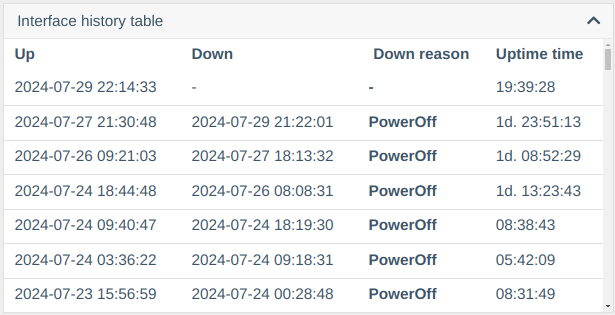
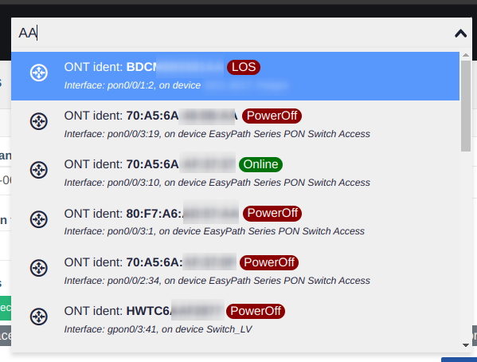

# Version 0.24 (07.2024)

!!! warning "Attention"
    **ONU registration components (huawei_onts_registration/zte_onts_registration) are no longer available!**

### Main Changes
- 📜 Added history of interface status changes
- 🔄 Implemented trap capture (currently only collects link/status changes of ONU across all switches and BDcom GP36xx)
- 📊 Added export to Excel for selections from analytics and interfaces
- 📅 Added date of last link status change
- 🚫 Removed support for old ONU registration components (huawei_onts_registration/zte_onts_registration)
- 🛠 Fixed ONU reset on FD16xx FW v3
- 📶 Fixed incorrect signal levels on FD16xx FW v3
- 📋 Current profiles (line, srv) are now displayed on C-Data ONU
- 🔍 Changed global search logic - interface/ONU descriptions now appear first in results
- 🔧 Updated Oxidized to the latest version
- 📑 Added display settings (sorting/grouping) in the device list
- 📝 Added page for received traps (logs)
- 🌟 Slightly refined web interface elements (margins, height, element icons)

### Screenshots
Interface/ONU Down History     

Search with Status    

Trap Table    

