# Version 0.25

!!! info "This version has not been released yet"
    To update and test, use the following command:
    ```shell
    sudo wca-tool update
    ```

!!! danger "The update will break the configured dashboard"
    **Due to grid size changes, after the update, you will need to reconfigure the placement and sizes of widgets.**

!!! warning "The update may change event generation rules"
    If you have events with the names `bad_optical_level_olt_rx`, `bad_optical_level_rx`, or `high_link_utilization`, their configurations will be updated to the system defaults.

!!! warning "The update may take longer than usual"
    Due to the MySQL version upgrade, the update process may take more time, depending on the size of your database.

---

## **New Features** ✨
- **Network Analytics:**
    - 🌐 **Autotopology:** Automatically determines and records connections between devices using LLDP and FDB.
    - 📈 Collection of current interface speeds for link/port utilization analysis.
    - ⚙️ New analytics parameters in the configuration: allows setting acceptable ONU signal levels.

- **Access Management:**
    - 🔒 Password complexity check (configurable).
    - 🛡️ Encryption of device access (instructions included).  

!!! warning "Access encryption is enabled by default for new installations."

---

## **Bug Fixes** 🐛
- **General Improvements:**
    - 🛠️ Fixed a bug in the pinger where status updates were incorrect when transitioning devices between TCP and ICMP availability.
    - 📝 Resolved logging issues for interface drops on combo ports.
    - 🗺️ Fixed default map loading behavior.
    - 🎛️ Corrected interface and filter display issues on the map.
    - 📤 Device list export to Excel now supports more than 50 entries.

- **UI/UX:**
    - 📱 Fixed display issues for macros and configurations on mobile devices.
    - 🔍 The filter block on the map no longer disappears when values are changed.

- **ICMP Pinger:**
    - ❌ Disabled IPv6 support (prevents launch errors when IPv6 is disabled on the server).

---

## **Backend** ⚙️
- **Events and Alerting:**
    - 🛑 Introduced a new event type: **"internal"** (system-generated with some customization options).
    - 🔄 Rebuild Alertmanager rules upon every configuration save.

- **Database:**
    - 📊 Upgraded MySQL to version **8.0.40**.
    - 🛠️ New `.env` parameters for MySQL:
        - `MYSQL_INNODB_BUFFER_POOL_SIZE`
        - `MYSQL_KEY_BUFFER_SIZE`
        - Recommended to increase for better performance.

- **Monitoring and Polling:**
    - ⏱️ Adjusted Prometheus exporter polling frequency for interface counters (allows intervals of 5 minutes).

---

## **Frontend** 🖥️
- **Widgets and Dashboard:**
    - ➕ Added new widgets:
        - Number of ONUs with poor signal levels.
        - Number of connections with high load.
    - 🖼️ Dashboard improvements:
        - Updated grid from 12 to 24 columns.
        - Reduced row height from 20px to 10px (dashboard reconfiguration required).
        - Graphs and circles in widgets now resize dynamically.
        - Labels in circle widgets are now clickable and redirect to the filter settings page.

- **Pages and Interface Features:**
    - 📜 New page **"Connections"**: Displays connection lists, their load, and filtering options.
    - 🗺️ New page **"Topology"**: Visualizes the network with connections in a tree format.
    - 🔄 Added **"Upstream Topology"** block to the interface.
    - 📋 Added **"Interface Logs"** tab in devices: displays interface state change logs.

- **Mobile Devices:**
    - 📱 Automatic focus on the search bar when opening the search function.
    - 🧹 Adjusted spacing and minor interface elements for improved mobile experience.

- **Page Enhancements:**
    - 🖥️ Redesigned ONU list (page **"Interfaces → ONU List"**).
    - 🔍 Added separate filters: "Only with poor signal" and "Status."

---

## **Device Support** ⚡
- 🆕 Added support for:
    - **Console macros** for Eltex.
    - Dell Networking OS (L2).
    - Dell EMC.
- ✅ Fixed signal level check for BDcom (eliminated -65000 values).

---

## **Screenshots** 🖼️
### Topology
* **Topology Visualization**       
  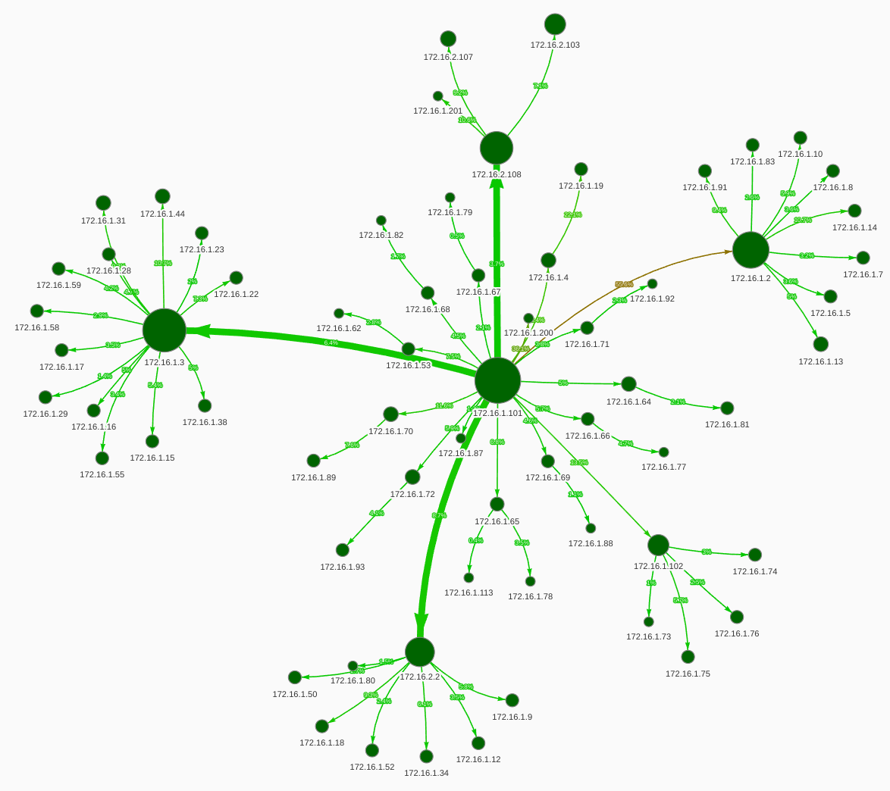

* **Device Information**       
  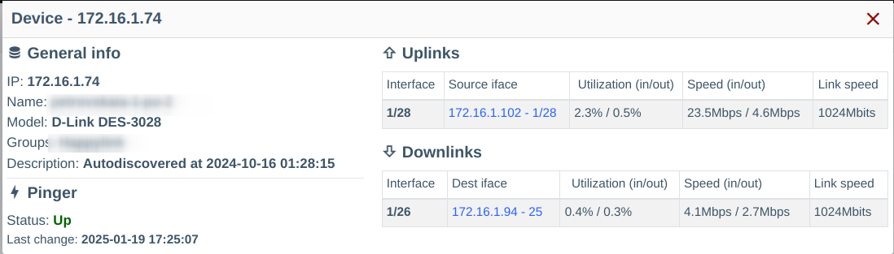

* **Link Information and Load**     
  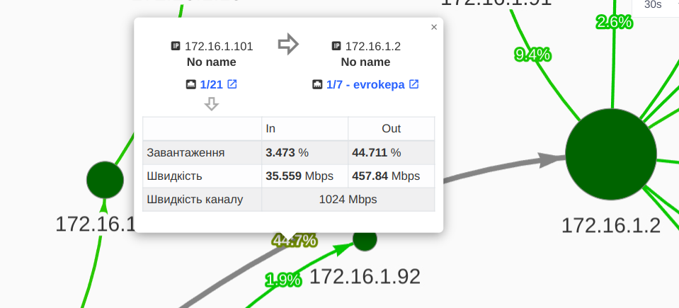

* **Visualization Configuration**     
  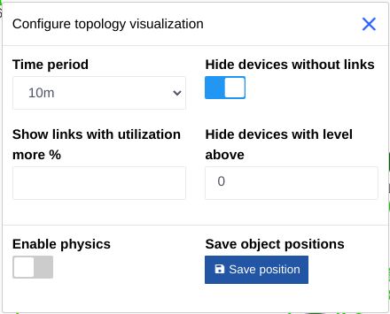

### Connections
* **Connections List**    
  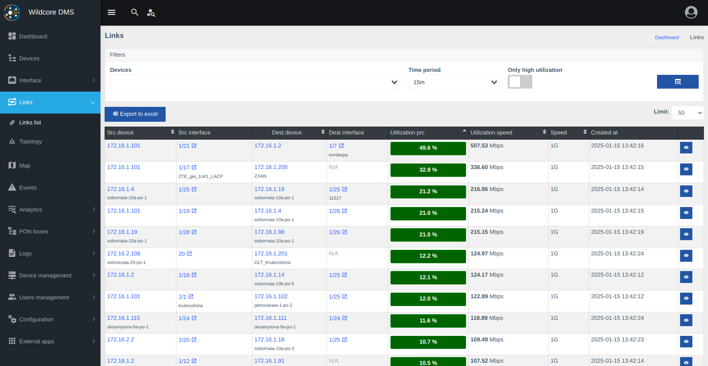

* **Upstream Topology (to uplink)**    
  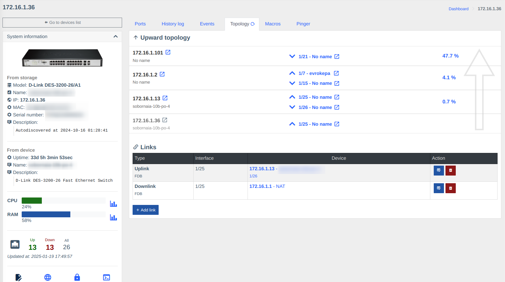

* **Upstream Topology in Device Card**    
  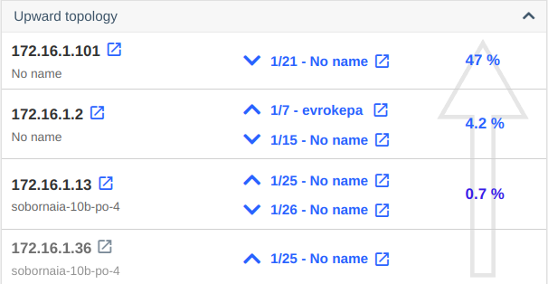

### Settings

* **Load Event Generation Settings**    
  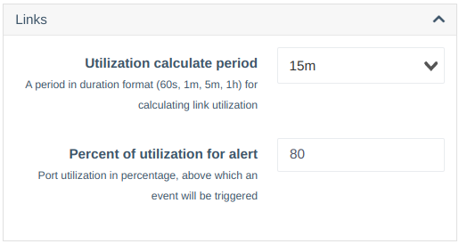

* **Bad Signal Event Generation Settings**    
  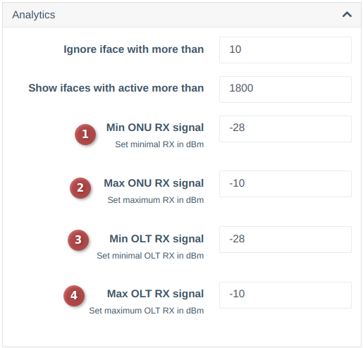

* **Password Complexity Check**    
  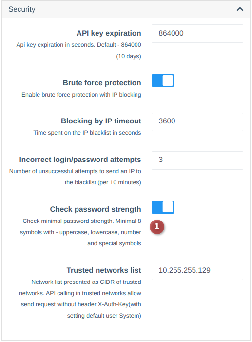

### History
* **Interface State Change Logs**
  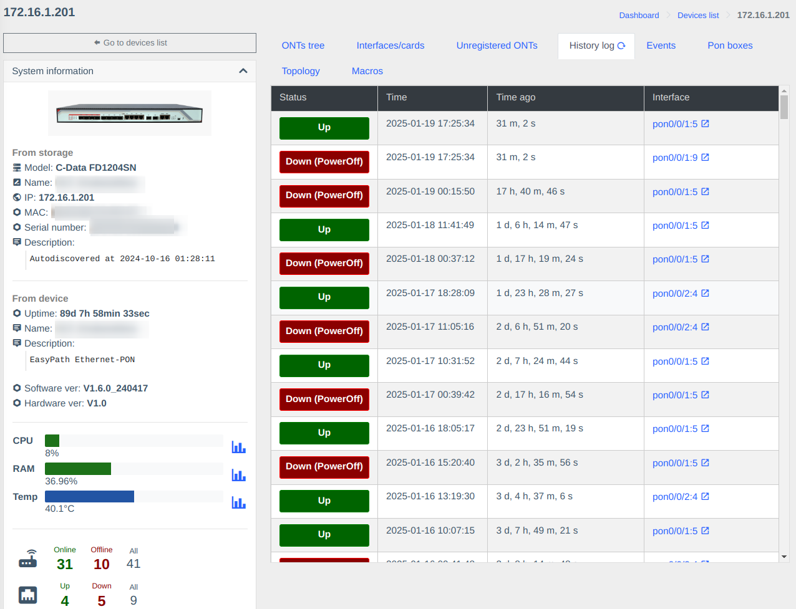


### ONU List
* **New Filters in ONU List**
  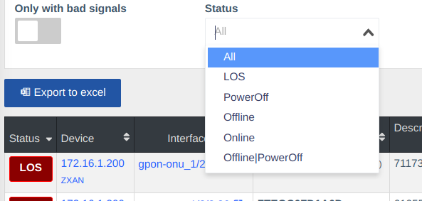

### New widgets 
  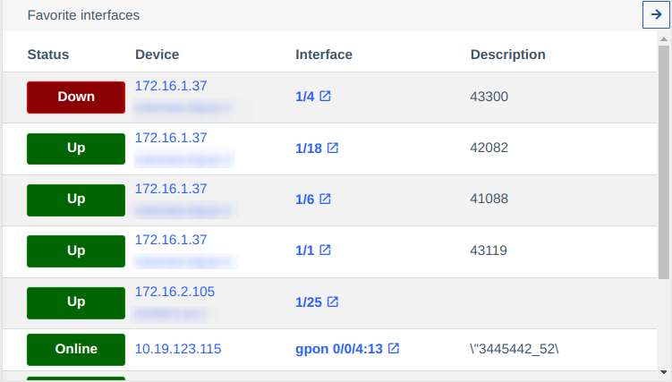
  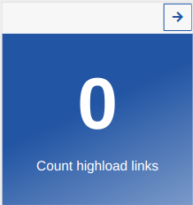
  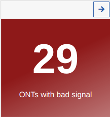
  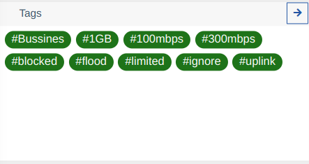

---
