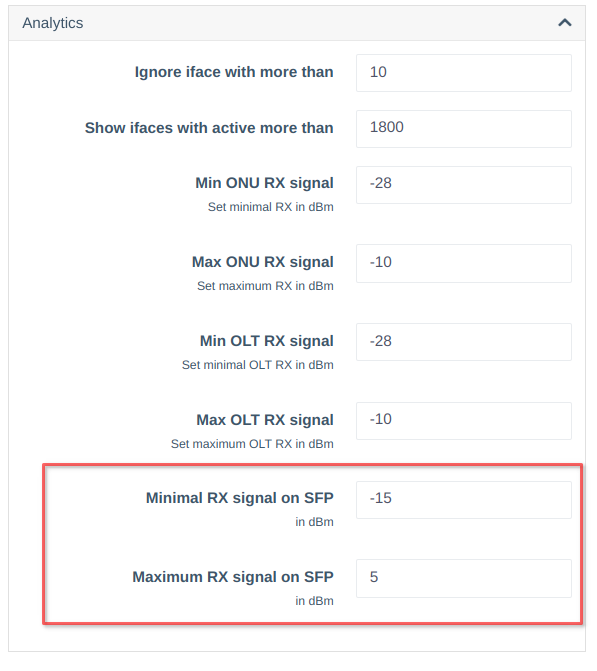
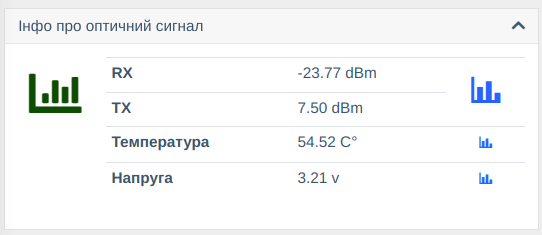
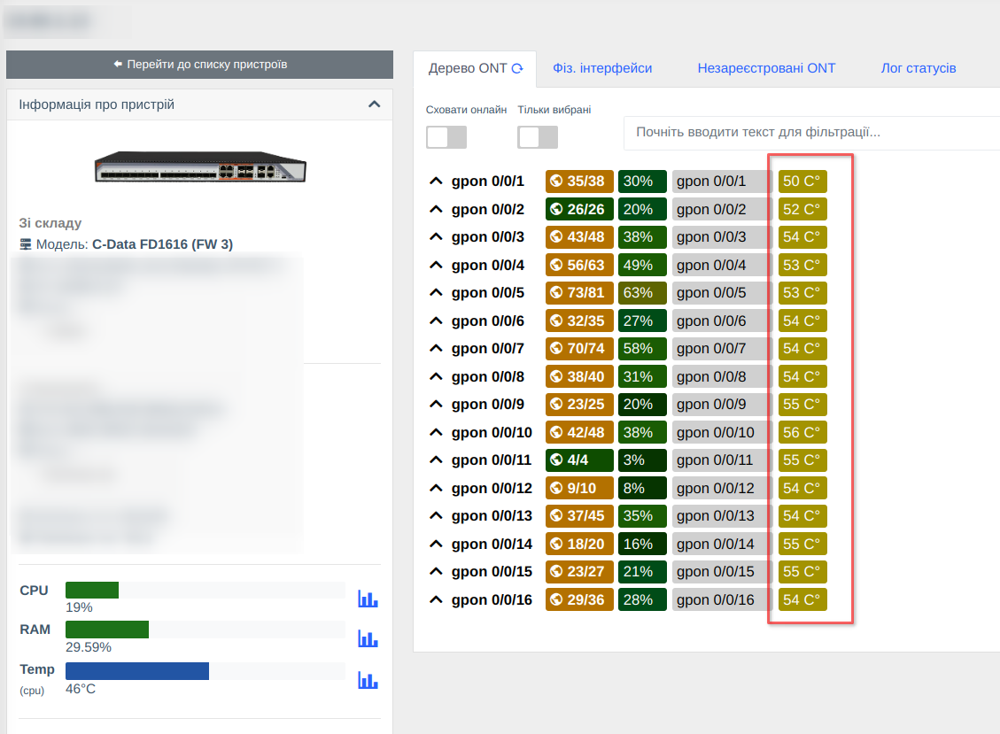
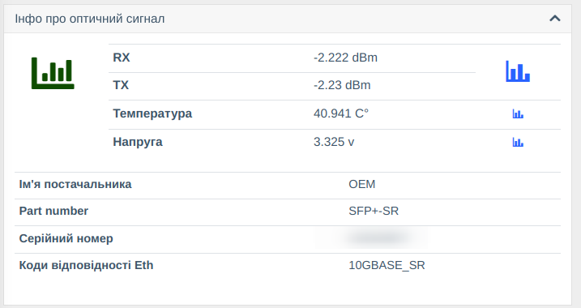
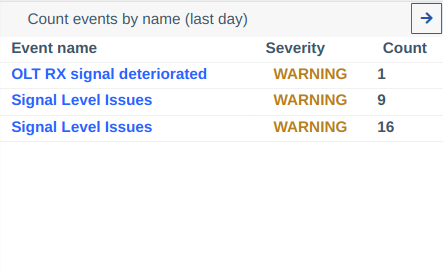
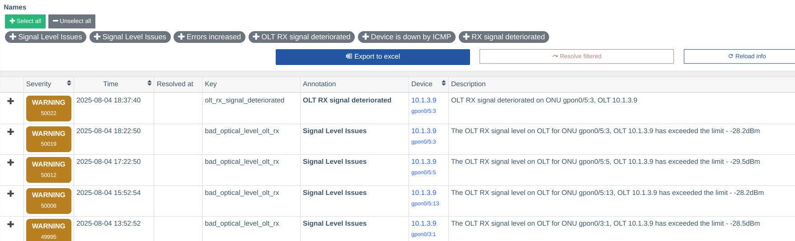
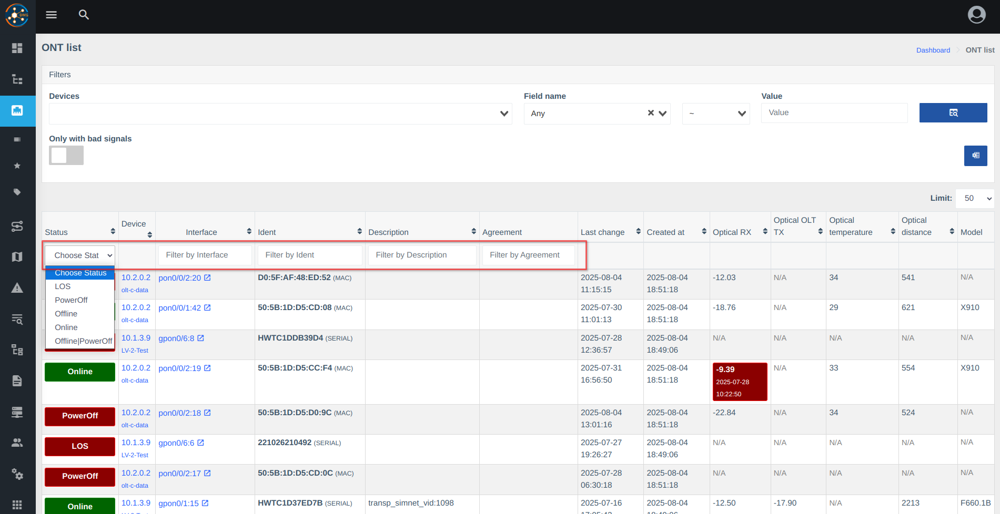
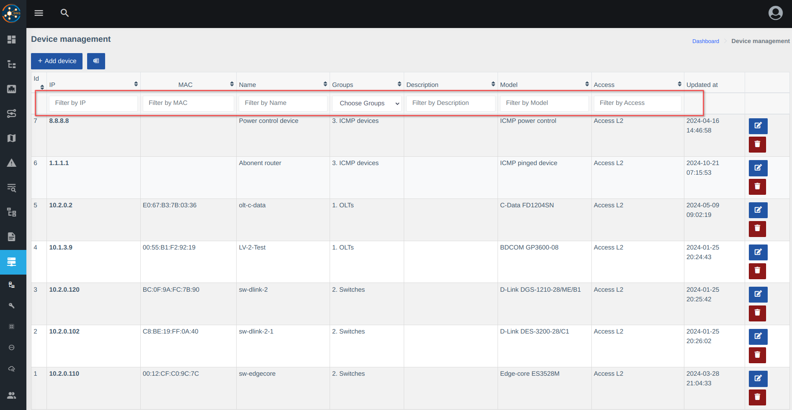
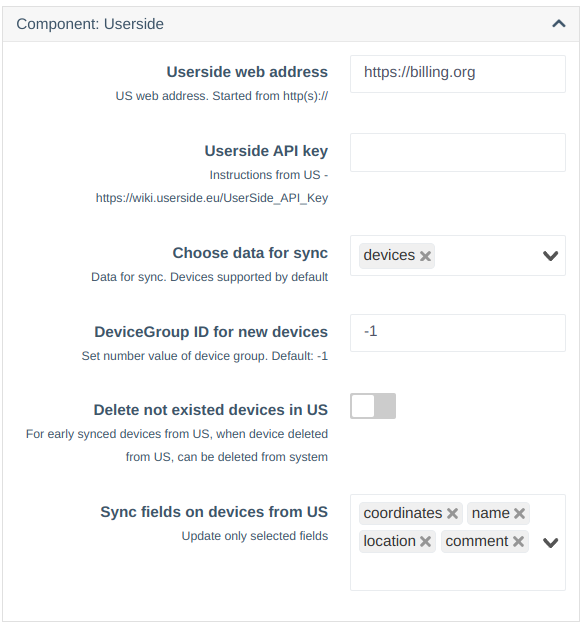
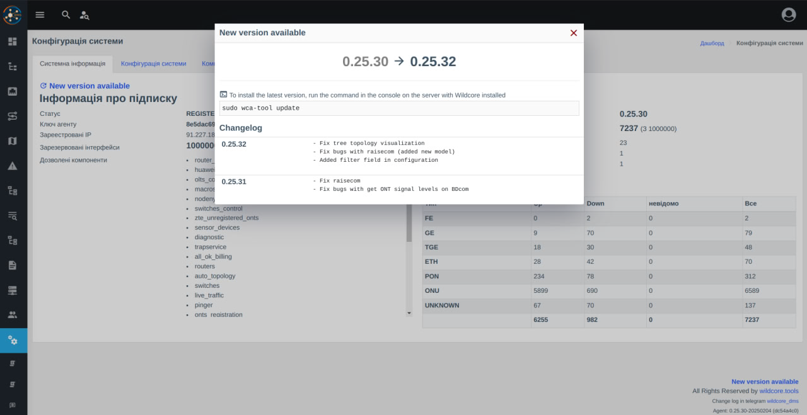

# Version 0.26
_Release Date: 2025-08_

### 🛠️ Hardware Support
_This section covers updates related to WildcoreDMS interaction with hardware._

*   **SFP Information (`sfp_diag`) for:**

    | Key                       | Name                        | Type     |
    |---------------------------|-----------------------------|----------|
    | arista_default            | Arista                      | SWITCH   |
    | bdcom_gp3600_04           | BDCOM GP3600-04             | OLT      |
    | bdcom_gp3600_08           | BDCOM GP3600-08             | OLT      |
    | bdcom_gp3600_16           | BDCOM GP3600-16             | OLT      |
    | bdcom_gp3600_series       | BDCOM GP3600 series         | OLT      |
    | bdcom_p3310b              | BDCOM P3310B                | OLT      |
    | bdcom_p3310c              | BDCOM P3310C                | OLT      |
    | bdcom_p3310d              | BDCOM P3310D                | OLT      |
    | bdcom_p3608b              | BDCOM P3608B                | OLT      |
    | bdcom_p3612_2te           | BDCOM P3612-2TE             | OLT      |
    | bdcom_p3616_2te           | BDCOM P3616-2TE             | OLT      |
    | bdcom_p36xx_series        | BDCOM P36xx series          | OLT      |
    | c_data_fd1601             | C-Data FD1601               | OLT      |
    | c_data_fd1601_fw3         | C-Data FD1601 (FW 3)        | OLT      |
    | dcn_default               | DCN                         | SWITCH   |
    | dell_general_switch       | Dell Powerconnect Switch    | SWITCH   |
    | dell_networking_os        | Dell Networking OS          | SWITCH   |
    | edgecore_ecs4120_28f      | Edge-core ECS4120-28F       | SWITCH   |
    | edgecore_ecs4120_28fv2    | Edge-core ECS4120-28Fv2     | SWITCH   |
    | edgecore_ecs4510_28f      | Edge-core ECS4510-28F       | SWITCH   |
    | edgecore_es4612           | Edge-core ES4612            | SWITCH   |
    | huawei_ma5603t            | Huawei MA5603T              | OLT      |
    | huawei_ma5608t            | Huawei MA5608T              | OLT      |
    | huawei_ma5680t            | Huawei MA5680T              | OLT      |
    | huawei_ma5683t            | Huawei MA5683T              | OLT      |
    | huawei_ma5801             | Huawei MA5801               | OLT      |
    | huawei_smart_ax           | Huawei MA56xx/MA58xx series | OLT      |
    | juniper_jnp204_series     | Juniper JNP204 series       | ROUTER   |
    | juniper_qfx51xx_series    | Juniper QFX5100 series      | SWITCH   |
    | mikrotik_ccr1009          | Mikrotik CCR1009            | ROUTEROS |
    | mikrotik_ccr1016          | Mikrotik CCR1016            | ROUTEROS |
    | mikrotik_ccr1036          | Mikrotik CCR1036            | ROUTEROS |
    | mikrotik_crs              | Mikrotik CRS                | SWITCH   |
    | mikrotik_crs317_1g_16s    | Mikrotik CRS317-1G-16S+     | ROUTEROS |
    | mikrotik_crs328_4c_20s_4s | Mikrotik CRS328-4C-20S-4S+  | ROUTEROS |
    | mikrotik_rb2011uias_2hnd  | Mikrotik RB2011UiAS         | ROUTEROS |
    | mikrotik_rb3011uias       | Mikrotik RB3011UiAS         | ROUTEROS |
    | mikrotik_rb4011           | Mikrotik RB4011             | ROUTEROS |
    | mikrotik_rb750            | Mikrotik RB750              | ROUTEROS |
    | mikrotik_rb750gr3         | Mikrotik RB750Gr3           | ROUTEROS |
    | mikrotik_router_os        | Mikrotik RouterOS           | ROUTEROS |
    | raisecom_iscom            | Raisecom ISCOM              | SWITCH   |
    | raisecom_rax721           | Raisecom RAX721             | SWITCH   |
    | zte_c600_fw_12            | ZTE 600 (FW 1.2)            | OLT      |
    | zte_c610_fw_12            | ZTE 610 (FW 1.2)            | OLT      |
    | zte_zxpon_olt_series      | ZTE C600 series             | OLT      | 

     
*   **Extended Temperature Collection (module `sys_temp`):**  

    | Key                       | Name                             | Type     |
    |---------------------------|----------------------------------|----------|
    | alcatel_general_switch    | Alcatel Switch                   | SWITCH   |
    | arista_default            | Arista                           | SWITCH   |
    | bdcom_gp3600_04           | BDCOM GP3600-04                  | OLT      |
    | bdcom_gp3600_08           | BDCOM GP3600-08                  | OLT      |
    | bdcom_gp3600_16           | BDCOM GP3600-16                  | OLT      |
    | bdcom_gp3600_series       | BDCOM GP3600 series              | OLT      |
    | bdcom_p3310b              | BDCOM P3310B                     | OLT      |
    | bdcom_p3310c              | BDCOM P3310C                     | OLT      |
    | bdcom_p3310d              | BDCOM P3310D                     | OLT      |
    | bdcom_p3608b              | BDCOM P3608B                     | OLT      |
    | bdcom_p3612_2te           | BDCOM P3612-2TE                  | OLT      |
    | bdcom_p3616_2te           | BDCOM P3616-2TE                  | OLT      |
    | bdcom_p36xx_series        | BDCOM P36xx series               | OLT      |
    | c_data_fd1104sn           | C-Data FD1104SN                  | OLT      |
    | c_data_fd1108s            | C-Data FD1108S                   | OLT      |
    | c_data_fd1204sn           | C-Data FD1204SN                  | OLT      |
    | c_data_fd1208s            | C-Data FD1208S                   | OLT      |
    | c_data_fd1216s_r1         | C-Data FD1216S-R1                | OLT      |
    | c_data_fd1601             | C-Data FD1601                    | OLT      |
    | c_data_fd1601_fw3         | C-Data FD1601 (FW 3)             | OLT      |
    | c_data_fd1604             | C-Data FD1604                    | OLT      |
    | c_data_fd1604_fw3         | C-Data FD1604 (FW 3)             | OLT      |
    | c_data_fd1608             | C-Data FD1608                    | OLT      |
    | c_data_fd1608_fw3         | C-Data FD1608 (FW 3)             | OLT      |
    | c_data_fd1616             | C-Data FD1616                    | OLT      |
    | c_data_fd1616_fw3         | C-Data FD1616 (FW 3)             | OLT      |
    | dell_emc_networking_os    | Dell EMC Networking OS10         | L3       |
    | dell_general_switch       | Dell Powerconnect Switch         | SWITCH   |
    | dell_networking_os        | Dell Networking OS               | SWITCH   |
    | dlink_des_1210_28_me_b2   | D-link DES-1210-28/ME/B2         | SWITCH   |
    | dlink_des_3026            | D-link DES-3026                  | SWITCH   |
    | dlink_des_3052g           | D-link DES-3052                  | SWITCH   |
    | dlink_des_3200_10_c1      | D-link DES-3200-10/C1            | SWITCH   |
    | dlink_des_3200_18_c1      | D-link DES-3200-18/C1            | SWITCH   |
    | dlink_des_3200_26_c1      | D-link DES-3200-26/C1            | SWITCH   |
    | dlink_des_3200_28_c1      | D-link DES-3200-28/C1            | SWITCH   |
    | dlink_des_3200_28f_a1     | D-link DES-3200-28F/A1           | SWITCH   |
    | dlink_des_3200_28f_c1     | D-link DES-3200-28F/C1           | SWITCH   |
    | dlink_des_3200_52_c1      | D-link DES-3200-52/C1            | SWITCH   |
    | dlink_des_3528            | D-link DES-3528                  | SWITCH   |
    | dlink_dgs_1100_06_me_a1   | D-link DGS-1100-06/ME/A1         | SWITCH   |
    | dlink_dgs_1100_10_me_a1   | D-link DGS-1100-10/ME            | SWITCH   |
    | dlink_dgs_1210_10_me_a1   | D-link DGS-1210-10/ME/A1         | SWITCH   |
    | dlink_dgs_1210_12ts_me_b1 | D-link DGS-1210-12TS/ME/B1       | SWITCH   |
    | dlink_dgs_1210_20_me_a1   | D-link DGS-1210-20/ME/A1         | SWITCH   |
    | dlink_dgs_1210_28_me_b1   | D-link DGS-1210-28/ME/B1         | SWITCH   |
    | dlink_dgs_1210_28_me_b2   | D-link Switch                    | SWITCH   |
    | dlink_dgs_1210_28x_me_b1  | D-link DGS-1210-28X/ME/B1        | SWITCH   |
    | dlink_dgs_1510_20l_me     | D-link DGS-1510-20L/ME           | SWITCH   |
    | dlink_dgs_3000_10tc       | D-link DGS-3000-10TC             | SWITCH   |
    | dlink_dgs_3000_26tc_a1    | D-link DGS-3000-26TC             | SWITCH   |
    | dlink_dgs_3000_28l_b1     | D-link DGS-3000-28L              | SWITCH   |
    | dlink_dgs_3100_24tg       | D-link DGS-3100-24TG             | SWITCH   |
    | dlink_dgs_3120_24sc_a2    | D-link DGS-3120-24SC/A2          | SWITCH   |
    | dlink_dgs_3120_24sc_bx    | D-link DGS-3120-24SC/B           | SWITCH   |
    | dlink_dgs_3420_26sc_b1    | D-link DGS-3420-26SC             | SWITCH   |
    | dlink_dgs_3420_28sc_b1    | D-link DGS-3420-28SC             | SWITCH   |
    | dlink_dgs_3612g           | D-link DGS-3612G                 | SWITCH   |
    | edgecore_ecs3510_28t      | Edge-core ECS3510-28T            | SWITCH   |
    | edgecore_ecs4120_28f      | Edge-core ECS4120-28F            | SWITCH   |
    | edgecore_ecs4120_28fv2    | Edge-core ECS4120-28Fv2          | SWITCH   |
    | edgecore_ecs4510_28f      | Edge-core ECS4510-28F            | SWITCH   |
    | edgecore_es3510           | Edge-core ES3510                 | SWITCH   |
    | edgecore_es3510ma         | Edge-core ES3510MA               | SWITCH   |
    | edgecore_es3510ma_v2      | Edge-core ES3510MAv2             | SWITCH   |
    | edgecore_es3528m          | Edge-core ES3528M                | SWITCH   |
    | edgecore_es3552m          | Edge-core ES3552M                | SWITCH   |
    | edgecore_es4612           | Edge-core ES4612                 | SWITCH   |
    | edgecore_general_switch   | Edge-core General switch         | SWITCH   |
    | eltex_general_switch      | Eltex switch                     | SWITCH   |
    | extreme_xos               | ExtremeXOS                       | ROUTER   |
    | huawei_ma5603t            | Huawei MA5603T                   | OLT      |
    | huawei_ma5608t            | Huawei MA5608T                   | OLT      |
    | huawei_ma5680t            | Huawei MA5680T                   | OLT      |
    | huawei_ma5683t            | Huawei MA5683T                   | OLT      |
    | huawei_ma5801             | Huawei MA5801                    | OLT      |
    | huawei_smart_ax           | Huawei MA56xx/MA58xx series      | OLT      |
    | juniper_jnp204_series     | Juniper JNP204 series            | ROUTER   |
    | juniper_qfx51xx_series    | Juniper QFX5100 series           | SWITCH   |
    | mikrotik_ccr1009          | Mikrotik CCR1009                 | ROUTEROS |
    | mikrotik_ccr1016          | Mikrotik CCR1016                 | ROUTEROS |
    | mikrotik_ccr1036          | Mikrotik CCR1036                 | ROUTEROS |
    | mikrotik_crs              | Mikrotik CRS                     | SWITCH   |
    | mikrotik_crs317_1g_16s    | Mikrotik CRS317-1G-16S+          | ROUTEROS |
    | mikrotik_crs328_4c_20s_4s | Mikrotik CRS328-4C-20S-4S+       | ROUTEROS |
    | mikrotik_rb2011uias_2hnd  | Mikrotik RB2011UiAS              | ROUTEROS |
    | mikrotik_rb3011uias       | Mikrotik RB3011UiAS              | ROUTEROS |
    | mikrotik_rb4011           | Mikrotik RB4011                  | ROUTEROS |
    | mikrotik_rb750            | Mikrotik RB750                   | ROUTEROS |
    | mikrotik_rb750gr3         | Mikrotik RB750Gr3                | ROUTEROS |
    | mikrotik_router_os        | Mikrotik RouterOS                | ROUTEROS |
    | raisecom_default          | Raisecom Default                 | SWITCH   |
    | raisecom_iscom            | Raisecom ISCOM                   | SWITCH   |
    | raisecom_iscom_2600       | Raisecom ISCOM 2600              | SWITCH   |
    | v_solution_v1600d         | V-Solution OLT V1600 series      | OLT      |
    | v_solution_v1600d16       | V-Solution V1600D16              | OLT      |
    | v_solution_v1600d8        | V-Solution V1600D8               | OLT      |
    | v_solution_v1600g         | V-Solution GPON OLT V1600 series | OLT      |
    | v_solution_v1600g1b       | V-Solution V1600G1B              | OLT      | 

* **Fixes and Improvements:**
    * Fixed extended ONU status retrieval for C-Data FD16xx v3 during mass polling.
    * Resolved error when interface response was empty (unable to determine availability of information).
    * Improved retrieval of additional interface details.
    * Added support for SwOS Default and CData FD5008-FD5016.

### ⚙️ Backend and API
_This section describes changes in the server-side and API components of the system._

!!! warning "Added a new poller `sfp_optical_strength`, working with the `sfp_optical` (`sfp_diag`) module. If pollers are configured manually, you must disable and re-enable manual settings to see the new poller in the list."

* **New Features:**
    * Added equipment import from CSV via `wca device:import` command.
    * Added mass testing command: `wca test:switcher-core:call`.
    * Implemented system version check.
    * Integrated Userside component for importing equipment.

* **Improvements and Fixes:**
    * Fixed web server config application when changing settings or enabling/disabling components.
    * Improved system stability.

### 🖥️ Frontend (Web Panel)
_This section covers changes to the system's user interface._

* **New Features:**
    * Added SFP information display.
    * New filters for easier search.
    * Added filter in system settings.
    * Added multiselect support for configurations.

* **Fixes:**
    * Fixed Ping3 sensor settings modification.
    * Event display changed to annotations instead of technical keys.
    * UI improvements in filter and table rendering.
    * Updated table layouts.

### 🖼️ Update Screenshots
#### SFP Info Block
  
  
  

#### Event Names
  

#### Updated Filters
  

#### Integration with Userside

#### New Version Notification
