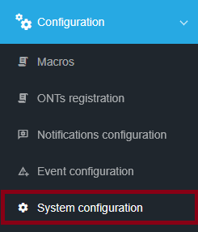
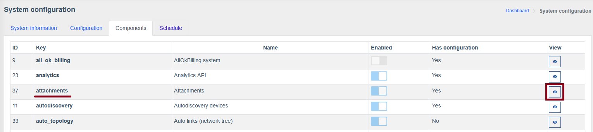
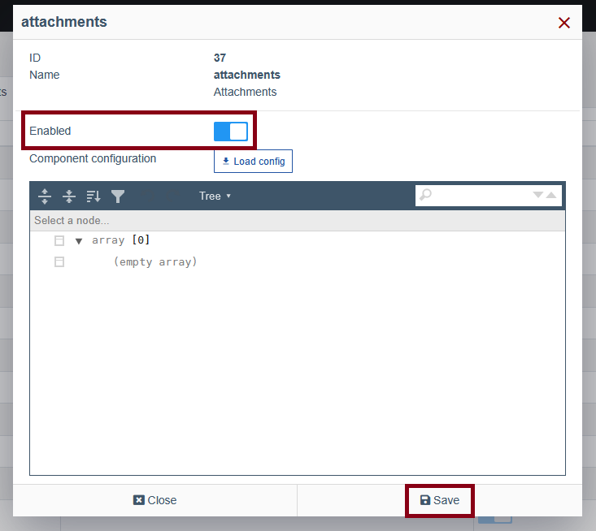
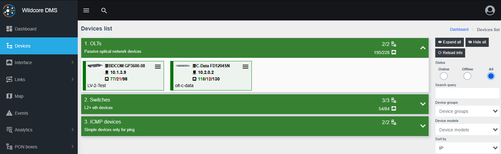
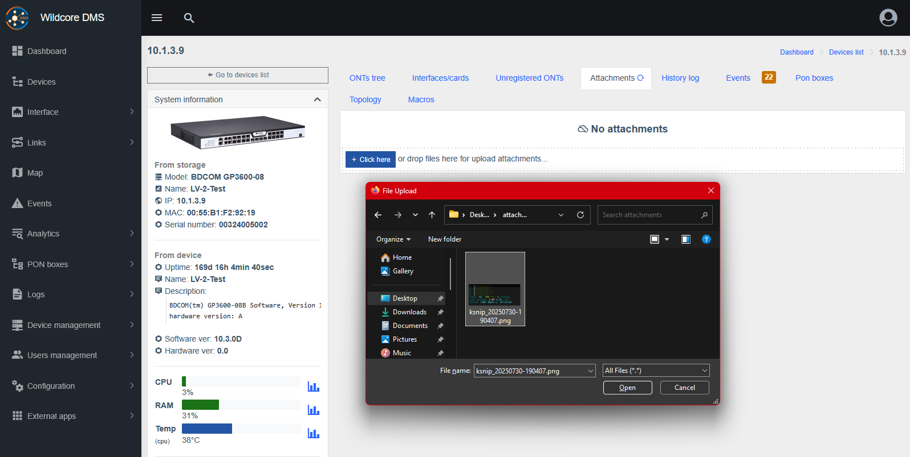
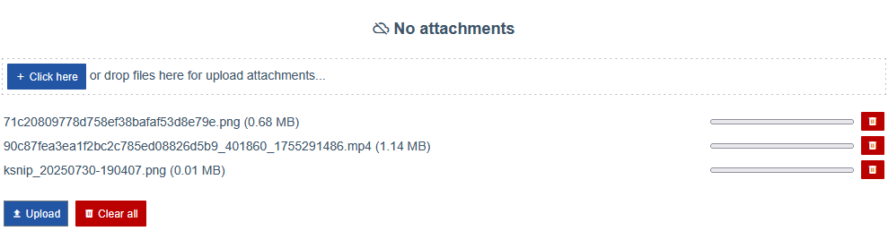
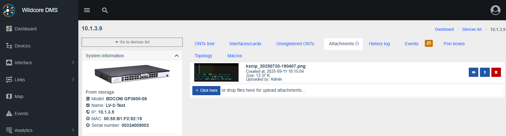
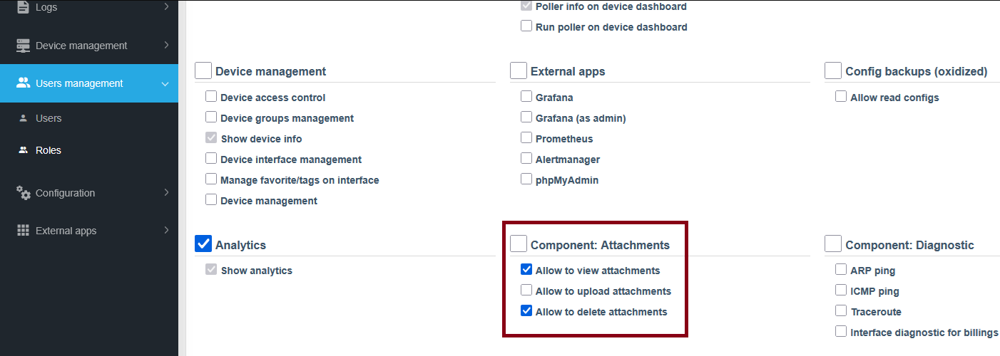

# Attachments

!!! abstract "Overview"
    
    **Attachments** is a component that allows you to upload various media (pictures, videos etc.) on the object dashboard (device/ONU/interface).

!!! warning
    **Attachments** require Wildcore version `>=0.28`. Update instructions can be found [here](../installation-and-updating/update.md).

!!! info
    To enable **Attachments** go to `Configuration > System configuration > Components`, find the `attachments` component and press `View` next to it, toggle the `Enabled` button in the new pop-up window, then press `Save`.

    ??? quote "Visual aid"
        
        
        

## Adding Attachments
1. Go to the dashboard of the object to which you want to upload a media attachment.

    ??? quote "Visual aid"
        

2. Select the **Attachments** tab and click the upload button or drag a file into the upload box.

    ??? quote "Visual aid"
        

3. The file will be added to the upload preview. At this point it's not uploaded yet and you can change the list of files you want to upload by removing unnecessary ones or adding more.

    Press `Upload`. Alternatively, press **`Clear all`** to abort the attachment upload process.

    ??? quote "Visual aid"
        

4. Selected files will be uploaded to your server and associated with the selected object, available for preview and download in its **Attachments** tab.

    ??? quote "Visual aid"
        

!!! warning
    If you're using a proxy server you might need to increase the upload size limit in it's settings, for example:

    ```cfg title="nginx.conf: server block"
    client_max_body_size 500M;
    ```

## Permissions

!!! info
    Separate View/Upload/Delete permissions are available for configuration for different roles.

1. Go to `Users management > Roles` and `Edit` an appropriate role.

    ??? quote "Visual aid"
        

2. Find the `Component: Attachments` section and toggle necessary checkboxes. 

    Don't forget to save the changes at the top of the page.

    ??? quote "Visual aid"
        