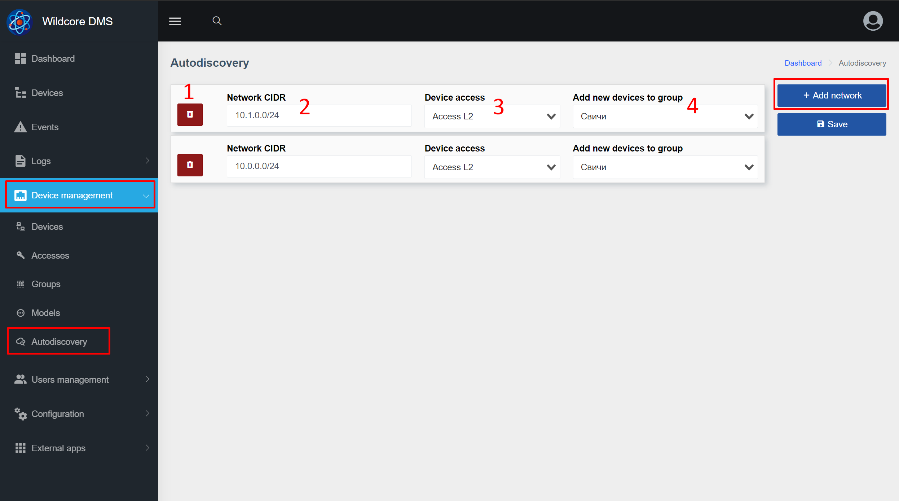

# Autodiscovery
## About the Component
The **Autodiscovery** component allows you to automatically add supported hardware by scanning predefined subnets.

## How is discovery done?
The specified subnet is scanned by snmp with the community specified in the access. Scanning is performed in a multi-thread (5k threads) with a short response time.
Further, the entire list of detected devices is transferred to the system for addition.
The system checks if this IP exists in the system.
If this is a new IP, an attempt is made to add equipment to the system, to the specified group.
Only supported hardware can be added to the system.

When adding, the following fields are taken from the device: device name, location + for some equipment mac-address and serial number.


## Set up autodiscovery
### Web interface


1. Delete discovery rule button
2. Subnet in CIDR format for finding equipment
3. Used device access
4. Group of devices to which you want to add the found device

### Setting
1. Add the necessary equipment accesses _(Device management -> Accesses page)_ - you must specify the community / login / password
2. Create the required device groups _(Device management -> Groups page)_
3. On the configuration page, add the necessary subnets, specify the accesses used and the group
4. Save discovery rules

The search for new equipment is made every half hour (*/30) from 6 am to 11 pm.
You can access these settings through the scheduler settings _(Configuration -> Schedule configuration page)_.


It is also possible to start scanning manually without waiting for the scheduler to start with the command - ```wca autodiscovery:scan```.


