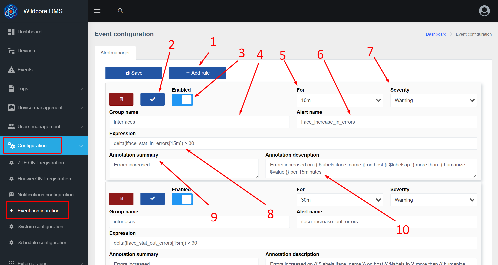

# Events
### About the Component
The **Events (events)** component receives notifications from the alertmanager and the poller, saves the notification in the history and, if possible, binds it to the equipment.

Events have the following key fields:

* Severity
* Name
* Event start date
* Closing (completion) date of the event
* Text description of the event

An event differs from an action in that it has an importance, as well as the end time of the event.
The component has no dependencies.

### Display in the web interface

1. Filters to display only certain events
2. Event table
3. Button to expand the event and see more detailed information on the event, for example labels

### Setting up event generation
[alertmanager](https://prometheus.io/docs/alerting/latest/alertmanager/) is used to generate events. The web interface has a configuration page that allows you to manage alertmanager rules.

1. Button for adding a new rule
2. A button that allows you to check the correctness of the rule
3. You can disable the rule so that events are not generated on it
4. A group of rules (read here - [alertmanager](https://prometheus.io/docs/alerting/latest/alertmanager/)). Usually, some logical group of rules is specified, for example, rules related to interfaces are assigned to the interfaces group.
5. Allows you to specify how long the condition must be met for the event to be generated
6. Alert name (actually - the name of the event)
7. The level of importance of the event
8. Expression (condition). promQL is used to write expressions
9. Annotation - a general description of the alert without the use of labels
10. Description - allows you to specify the text when generating an event. You can also use label values to generate text.

There are also some system events that cannot be configured (disabled or changed), as they are generated by the internal notification system, such as:

* crash of BGP sessions
* drop devices over ICMP

