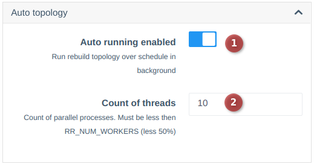

# Autotopology

!!! info "Available since version 0.25"

The autotopology component allows discovering connections between devices using FDB (priority) and LLDP.

The component builds connections while determining the direction toward the uplink.
The uplink is identified based on the MAC address obtained from the ARP table of the device (using the device's network gateway).

---

## Autotopology Configuration

Autotopology is disabled by default.
To enable it, navigate to the system settings (Configuration -> System configuration -> TAB Configuration -> BLOCK Autotopology).
??? "Block screenshot"
        

By default, topology is collected every 3 hours, but if necessary, you can change the polling frequency in the scheduler settings (task `auto_topology_scan`).

!!! warning "Autotopology uses cached responses from devices, so there is no point in setting the polling frequency higher than the cache update parameter."

---

## Manual Autotopology Trigger

You can also manually trigger topology collection by running the following command:
```shell
wca auto_topology:scan
```

---

## Features and Warnings

!!! warning "If an uplink interface is already manually specified on a device, the port will not be automatically updated, and an additional uplink will not be added even if discovered."
!!! warning "Automatic links are cleared after 3 days if they are no longer detected during this period."
!!! warning "Autotopology does not support multiple uplinks. If there are several uplinks, they must be specified manually."