# Connections
The `links` component is used for storing and displaying connections between devices.

It allows specifying the source and target devices with the respective connection ports using a web interface or API.

---

## Manual Connection Management
??? info "Set permissions for managing connections"
Make sure the user's role has permission to modify devices and links.
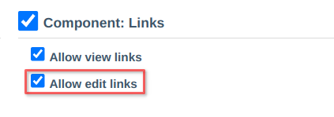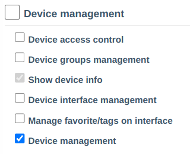

- View and manage through device editing.
  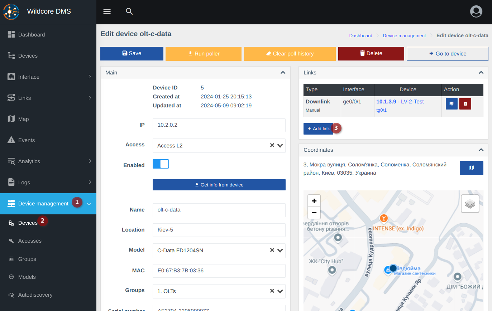
- View and manage in the device card, on the "Topology" tab.
  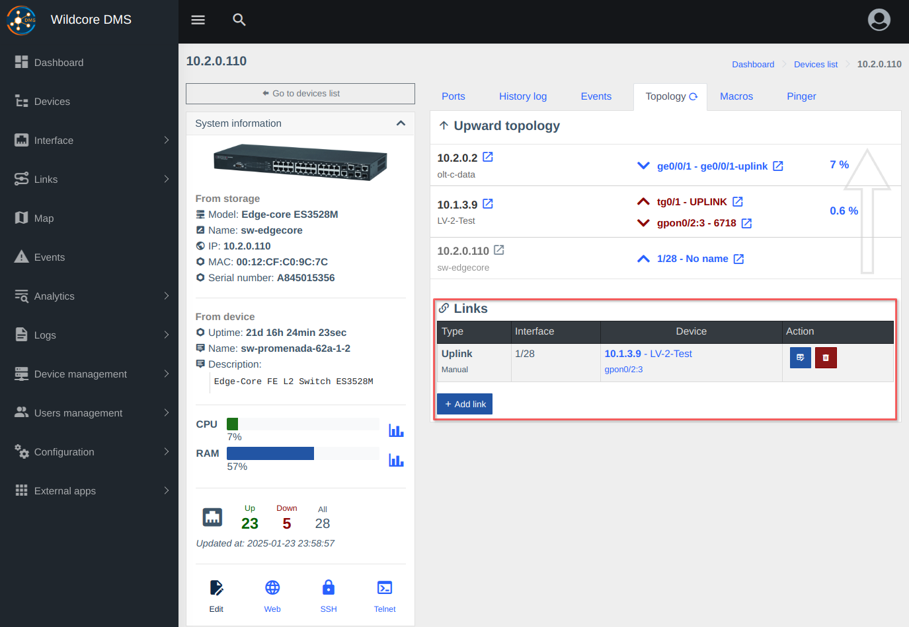

- Popup window for adding an interface.
  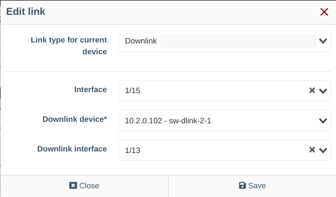   
  !!! note "It is not mandatory to set both interfaces if you do not know one of them."

---

## Viewing Connections
You can use management pages to view connections, but specialized pages and components, described below, are more convenient.

### "Upward" Topology (towards uplink) Based on Connections
In the device card, on the topology tab, you can see the connection to the uplink device (core).
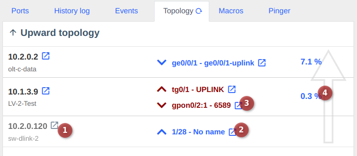
> 1. Current device (gray color).
> 2. Uplink interface on this device.
> 3. Downlink interface where the subordinate device is connected.
> 4. Connection load ([more details about utilization calculation](./utilization.md)).
>
> _Interfaces in Down/Offline status are highlighted in red (the screenshot demonstrates this)._

_This information is also displayed in the ONU interface, in a separate block._

### Network Topology Visualization
The topology visualization is a page displaying connections and devices as a graph.    
On this page, you can view the availability status of devices (data from the pinger) — nodes will be colored green if the device is available, and red if the device is unavailable (does not respond to ICMP/TCP).
Nodes have different sizes depending on the number of child elements.

Connections are gradient-colored depending on load.
Green — less load.
Red — more load.

Links also have a thickness that depends on the link speed.  
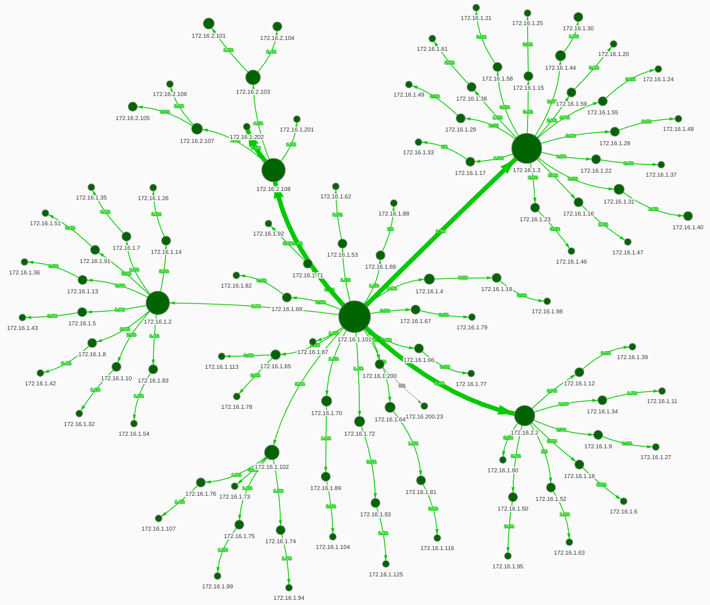
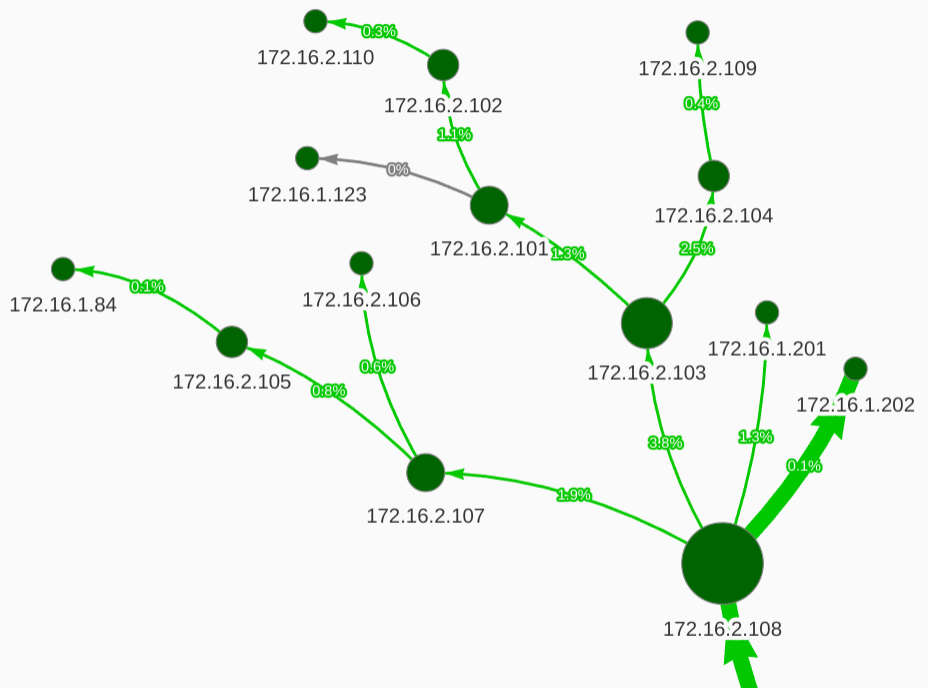

**Nodes and connections are clickable.**     
Clicking on an element shows a tooltip with information.
Clicking on a node also allows you to click on the "eye" icon to view more detailed device information.
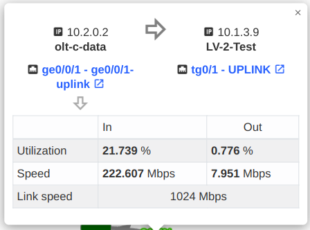
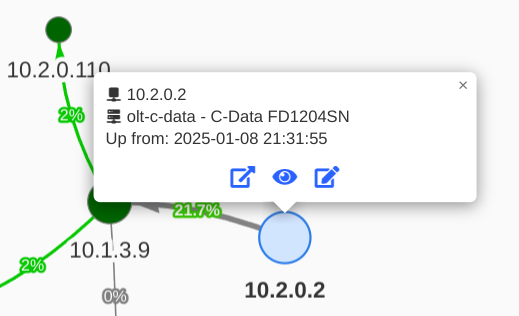

**There is a "menu" button in the corner that opens display settings.**  
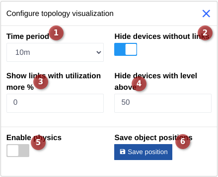    
In the settings, you can configure:

1. Time period (period for link utilization calculation).
2. Whether to display devices without connections.
3. Display links only with load above N%. If set to 0 — all links are displayed.
4. Display level from the parent node (to avoid displaying a large "web," show only root devices by setting this parameter to 1-3).
5. Enable physics (automatically arranges nodes at certain distances).
6. The save positions button also disables physics and allows you to place nodes in the desired position (nodes can be dragged).

!!! note "After moving elements, save the positions."
!!! note "If you need to move elements, disable auto-update, as it overwrites positions with previously saved ones."

!!! warning "Positions and settings are saved in your browser. Logging in from another browser will show different element placements and settings."   