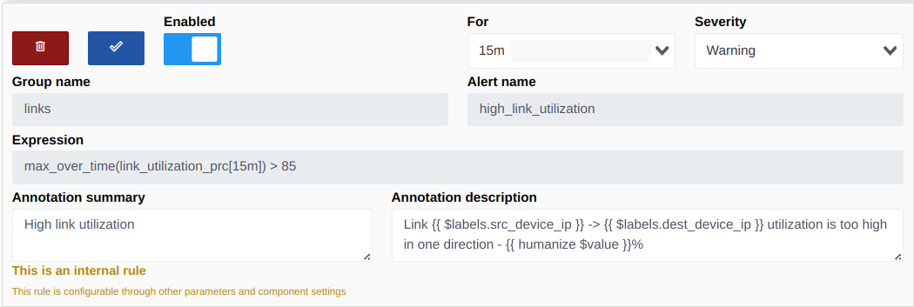
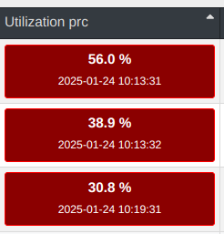
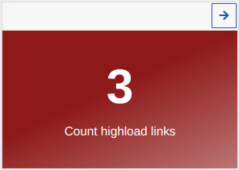
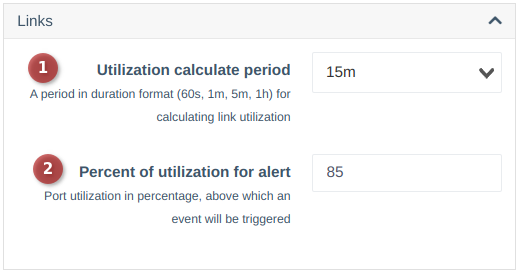

# Link Utilization

Link utilization is displayed in topology visualization and the connections list.

??? tip "Metrics for Load Calculations"
    
    You can calculate utilization for any interface that collects counter metrics and interface speed (metrics: `iface_stat_out_octets`, `iface_stat_in_octets`, `device_interface_speed`).
    Events can also be configured, or external metrics can be used, for example, in Grafana.

---

## Key Metrics

To highlight heavily loaded connections and display them in a widget, a special metric `link_utilization_prc` was added, along with an internal event `high_link_utilization`.


In the system configuration, in the `links` block, you can specify the desired calculation period and the load percentage threshold above which an event will be generated. Based on open events, the system calculates the number of overloaded links (displayed in the widget) and highlights them in red on the connections page.

??? info "Example Display"

    * On the connections list page     
    
    * Widget     
    

!!! warning "If you close such an event, the connection will no longer be considered overloaded, even if its load reaches 100%."
!!! note "After some time (approximately 1 hour), the event will be regenerated by AlertManager if the load remains high."

---

## Data Discrepancies

There may be discrepancies between current load and whether a link is considered overloaded because data comes from different sources and metrics. For example:    

- The load calculation period for event generation is set to 15 minutes, but you configured the display period for 1 hour. In this case, the load value may differ.

You can disable event generation in the event settings, and the system will no longer show overloaded links.

---

## Link Utilization Calculation

Link utilization is calculated based on traffic counters collected from devices and link speed.
Example PromQL query:
```promQL
(sum(rate(iface_stat_out_octets[15m])) by (dev_id, iface_id) / 1024 / 1024 * 8) / sum(device_interface_speed) by (dev_id, iface_id) * 100  

(sum(rate(iface_stat_in_octets[15m])) by (dev_id, iface_id) / 1024 / 1024 * 8) / sum(device_interface_speed) by (dev_id, iface_id) * 100  
```

The higher value from the selection (in/out) is displayed on the topology visualization page and the links page. By default, counters are taken from the upstream device's interface. If no counters are available on this interface, data is collected from the downstream interface.

---

## Period Configuration
The period (15 minutes in the above example) reflects the average load over the last 15 minutes. You can increase or decrease the period in the settings.


1. The period used for load calculation.
2. The maximum load percentage threshold after which an event will be generated.

### Recommendations:
!!! note "To ensure accurate load representation, the period should be at least twice the polling frequency of counters from devices (configured in poller settings, models, or devices)."
!!! note "Polling frequency should not exceed once per minute, as this is the minimum period Prometheus uses to collect metrics from exporters."

---
