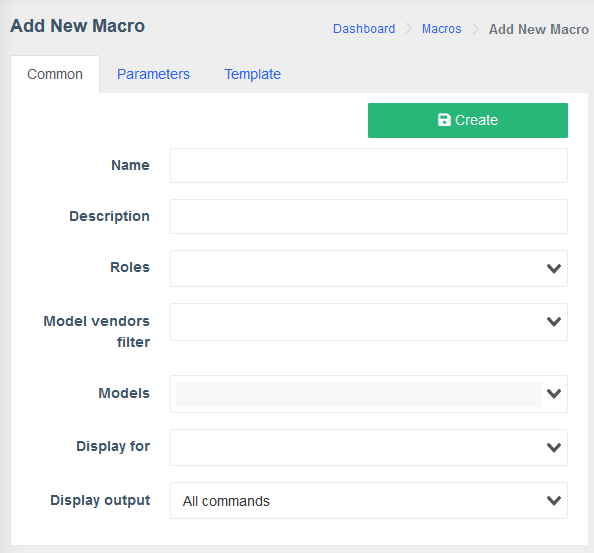

!!! abstract
    
    **Macros** is a component delivered separately, which allows the user to enhance System's functions by executing custom CLI commands on their devices, utilizing a simple graphical interface, i.e. viewing logs, snooping or even VLAN management on specified ports.

## A macro consists of 4 key elements:

#### Macro description:

> Here it's name, users and device models which are allowed to run it and visibility areas are specified. The latter allows greater customization and interface decluttering by hiding the macros that are not applicable to selected `Device`/`Port`/`ONU`.

#### Parameters:

> This is the body of the macro.
>
> `Device` here the device on which the macro is run is specified and `Variables` are loaded from cache as a JSON structure for ease of access. With `Interfaces` drop-down you can select an interface on which the macro would be executed and an additional parameter `iface` is loaded, which contains information about this interface. `Add parameter` button creates a new entry where the actual command to execute is specified.

#### Template

> Templates are built with [**Twig**](https://twig.symfony.com/) template engine, therefore it is possible to include `Variables` in the commands, create and assign custom variables, as well as branching and text permutations, inside the template. See [Documentation](https://twig.symfony.com/doc/3.x/templates.html) for reference.

# Workflow

**Here we will go through the macro creation process step-by-step.**

!!! note "" 
    
    The specific `Roles` and Device `Models` will vary depending on your setup.
    
    Macros can be found in **Configuration** drop-down in the left-side drawer.
    
    
    
    Press  button in top-left corner of the **Macros** screen to create a new one.

#### Fill out the **Common** tab

!!! info
    
    - Choose a **Name** that reflects the purpose of your macro from the first glance.
    - **Description** allows you to describe features or direct it's user.
    - In **Roles** drop-down you can select which user roles are permitted to execute this macro.
    - **Models** field allows you to select specific devices on which the macro can be run.
    - **Display for** allows you to customize where exactly this macro can be run, i.e. on a whole `Device` or a only on a `Port` or a `ONU`.
    - **Display output** defines whether you want to get feedback from all commands executed by the macro, just the last one or no output at all.

!!! example 
    
    

#### **Parameters** tab

!!! info 
    
    - **Device** drop-down allows you to select a device, on which this macro will be run and load it's **Parameters**. - **Interfaces** loads an additional parameter `iface`, which stores this port's description.
    
    After you select the desired device, you can press the **Add parameter** button.

#### Empty parameter card

!!! info

    -   **Property** is the `{{params}}` object property name, used to access its value in the **Template**, using `{{params.property}}`
    -   **Property display name** is a short description for your propery, displayed in the macro execution pop-up
    -   **Required** checkbox allows you to specify a **Parameter** which has to be selected during **Macro** execution
    -   From **Parameter type** you can select how the parameters for this command are specified:
        -   **Choose from predefined** allows you to manually specify a list of parameters to be selected from during macro execution
        -   **Choose from variables** is used to select a parameter from those provided by the select device, i.e. `{{user.name}}`
        -   **Field for input (with default value)** allows the user to manually enter the required parameters during macro execution

    -   **Visible condition** field defines whether a macro shown, i.e. `!iface` hides it from device's `Interface` panel 

!!! example 
    
    

!!! tip 
    
     button allows drag-and-drop reordering of the **Parameters**

#### Template tab

// add template tab description

#### Press Create button

> After this step, the macro is ready. It can be found in the **Macros** list, along with the **Edit**, **Delete** and **Clone** buttons.

# Macro usage

> To use the macro created in the **Workflow** section, navigate to the **Device**/**Port** you specified for it and select the **Macros** tab.

> When you click **Execute** button, a new dialogue will pop up.

> Here are the **Displayed name** and values we specified earlier in the **Parameters** tab.

!!! tip 
    
    **Preview** button allows you to see what the command will look like when it's executed on selected device

> By pressing **Execute** button, the macro is run and the result is displayed in a new pop-up, if the **Display output** was set to anything other than **Not display**.