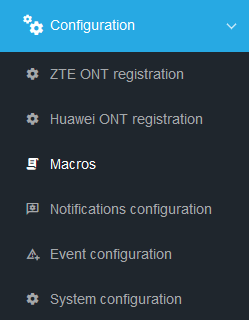
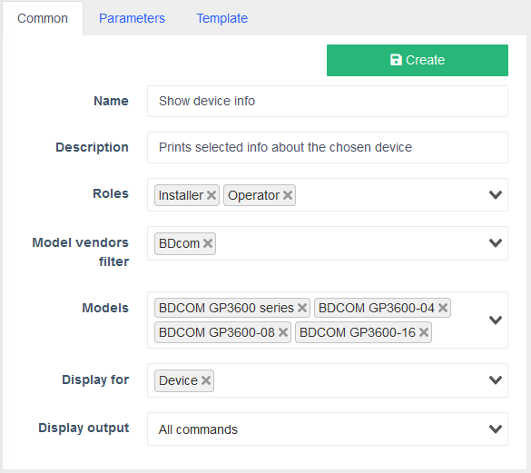
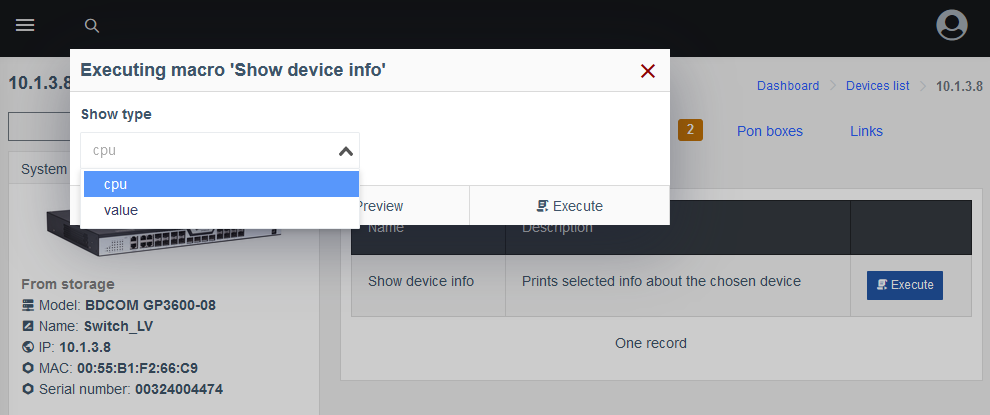

# Macros

!!! abstract "Overview"
    
    **Macros** is a component delivered separately, which allows the user to enhance System's functions by executing custom CLI commands on their devices, utilizing a simple graphical interface, i.e. viewing logs, snooping or even VLAN management on specified ports.

!!! warning "Attention"
    Creation and macro usage require specific **Role Permissions** settings.

    They can be found in **Users management** > **Roles menu** > **Component: Macros**.

    Pick and choose different combinations for different **User Roles** for additional security.

    

!!! danger "Warning"
    Macros only work on Devices that support `multi_console_command`, see [more](https://github.com/meklis/switcher-core/blob/master/docs/DEVICES.md).

## Macros menu

| Name    | Description                          |
| ----------- | ------------------------------------ |
| **Common**        | Here it's name, users and device models which are allowed to run it and visibility areas are specified. The latter allows greater customization and interface decluttering by hiding the macros that are not applicable to selected   |
| **Parameters**      | This is the body of the macro. In the **Device** field, the device on which the macro is run is specified and **Variables** are loaded from cache as a JSON structure for ease of access. With **Interfaces** drop-down you can select a specific interface on which the should be executed, after which an additional property `iface` is loaded. It contains information about this interface. **Add parameter** button creates a new entry where the `{{params}}` object properties can be specified, which can be accessed by the macro (see **Template** section).  |
| **Template**    | Templates are built with [**Twig**](https://twig.symfony.com/) template engine, therefore it is possible to include variables in the commands, create and assign custom variables, as well as branching and text permutations, inside the template. See [Twig Documentation](https://twig.symfony.com/doc/3.x/templates.html) for reference.|


## Creating a basic macro

Here we will go through the macro creation process step-by-step.

1. Use the **Configuration** drop-down menu in the left-side drawer to find the **Macros** menu. 


2. Macros screen opens. Press the **Add new** button to create a new one.


    **Add New Macro** screen opens.

3. Fill out the **Common** tab


    !!! info
        - Choose a **Name** that reflects the purpose of your macro from the first glance.
        - **Description** allows you to describe features or direct it's user.
        - In **Roles** drop-down you can select which user roles are permitted to execute this macro.
        - **Models** field allows you to select specific devices on which the macro can be run.
        - **Display for** allows you to customize where exactly this macro can be run, i.e. on a whole `Device` or only on a `Port` or a `ONU`.
        - **Display output** defines whether you want to get feedback from all commands executed by the macro, just the last one or no output at all.
    ??? example
        

4. Parameters

    
    !!! info 
        
        - **Device** drop-down allows you to select a device, on which this macro will be run and load it's **Parameters**. 
        - **Interfaces** loads an additional parameter `iface`, which stores this port's description.
        
        Selecting a **Device** at this stage is optional, you can press the **Add parameter** button right away.

    ??? example 
        

5. Press the **Add parameter** button. New **Parameter** card appears. Fill out the required fields in the **Parameter** card.
    {align = right}

    !!! info

        -   **Property** is the `{{params}}` object property name, used to access its value in the **Template**, using `{{params.property}}`
        -   **Property display name** is a short description for your propery, displayed in the macro execution pop-up
        -   **Required** checkbox allows you to specify a **Parameter** which has to be selected during **Macro** execution
        -   To help you choose the right **Parameter type** see [**Parameter type options**](./macros_paramater_types_options.md)
        -   **Visibility condition** field defines whether a macro shown, i.e. `!iface` hides it from device's `Interface` panel 

    ??? example
        
        

    !!! tip 
        
         button allows drag-and-drop reordering of the **Parameters**

6. Select a **Device** and an **Interface** in the **Template** tab.
    

    !!! info
        This step is optional and is required to get the cached variables from the device for ease of access.

        A new **Parameters form** block will appear, which shows the **Parameters** you've created in the *previous* step.

    ??? example
        

7. Create a **Twig**-style **Template** for your macro.
    

    !!! info
        You can create a **Template** from scratch or use one of the examples below.
        
        

        After you've filled out the **Chosen template** block **Live result** shows the result of your **Template** compilation and the exact command that will be executed on a selected **Device**.

        For syntax refer to [**Twig Documentation for Designers**](https://twig.symfony.com/doc/3.x/templates.html).

        Find more Template examples [**here**](./twig-examples.md)
    ??? example
        

        ```
        show {{params.show_type}}
        ```
    
8. Press **Create** button

    !!! tip
        Your macro will apear in the **Configuration** > **Macros** list, along with the **Edit**, **Delete**, **Clone** and **Import** buttons.
        

## Macro usage

To use the macro created in the **Creating a basic macro** section, navigate to the **Device**/**Port** you specified for it and select the **Macros** tab.


When you click **Execute** button, a new dialogue will pop up.



Here are the **Displayed name** and values we specified earlier in the **Parameters** tab.

!!! tip 
    
    **Preview** button allows you to see what the command will look like when it's executed on selected device

By pressing **Execute** button, the macro is run and the result is displayed in a new pop-up, if the **Display output** was set to anything other than **Not display**.


??? info "Changelog"
    | Release №   | Changes                              |
    | ----------- | ------------------------------------ |
    | `0.21.004`  | Added Macros documentation           |