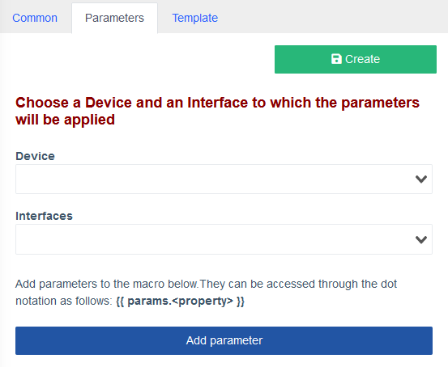

# Macros

!!! abstract "Overview"
    
    **Macros** is a component delivered separately, which allows the user to enhance the System's functions by executing custom CLI commands on their devices, utilizing a simple graphical interface, i.e., viewing logs, snooping, or even VLAN management on specified ports.

!!! warning "Attention"
    Creation and macro usage require specific **Role Permissions** settings.

    They can be found in **Users management** > **Roles menu** > **Component: Macros**.

    Pick and choose different combinations for different **User Roles** for additional security.

    

!!! danger "Warning"
    Macros only work on Devices that support `multi_console_command`, see [more](https://htmlpreview.github.io/?https://raw.githubusercontent.com/meklis/switcher-core/master/docs/device_info.html).

!!! tip
    You can find and download macro examples on our [demo website](https://demo.wildcore.tools/config/macros) and find detailed explanations of some sample macros on the [Twig template examples](./twig-examples.md) page.

## Macros menu

!!! info
    **Macros** menu can be found under **Configuration > Macros** in the left-side drawer.

    Here you can create a new macro from scratch or **Import** a premade one.

    

    *Opening the ****Macros**** menu for the first time*


## Creating a basic macro

In this section we will go through the macro creation process step-by-step.


1. On the **Macros** screen press the **Add new** button in the upper-left corner to create a new one.

    !!! info

        | Name            | Description                          |
        | --------------- | ------------------------------------ |
        | **Common**      | Here, the name, users, and device models allowed to run it, as well as visibility areas, are specified. The latter allows greater customization and interface decluttering by hiding macros that are not applicable to the selected context. |
        | **Parameters**  | This section encompasses the **Parameters** of the macro. In the **Device** field, the device on which the macro runs is specified, and **Variables** are loaded from cache as a JSON structure for ease of access.<br>With the **Interfaces** drop-down, you can select a specific interface on which the macro would be executed, after which an additional variable `iface` is loaded, that contains information about this interface.<br>The **Add parameter** button creates a new entry where the `{{params}}` object properties can be specified, which can then be accessed by the macro (see **Template** section). |
        | **Template**    | Templates are built with the [**Twig**](https://twig.symfony.com/) template engine, allowing for the inclusion of variables in commands, creation and assignment of custom variables, as well as branching and text permutations within the template. Refer to the [Twig Documentation](https://twig.symfony.com/doc/3.x/templates.html) for further details. |


2. Fill out the **Common** tab

    

    !!! info
        - Choose a **Name** that reflects the purpose of your macro from the first glance.
        - **Description** allows you to describe features or direct it's user.
        - In **Roles** drop-down you can select which user roles are permitted to execute this macro.
        - **Model vendors filter** allows you to filter the **Devices** by vendor for convenience.
        - **Models** field allows you to select specific devices on which the macro can be run.
        - **Display for** allows you to customize where exactly this macro can be run, i.e., on a whole `Device` or only on a `Port` or a `ONU`.
        - **Display output** defines whether you want to get feedback from all commands executed by the macro, just the last one or no output at all.
    ??? example
        

3. Parameters

    
    !!! info 
        
        - **Device** drop-down allows you to select a device, on which this macro will be run and load it's **Variables**. 
        - **Interfaces** loads an additional variable `iface`, which stores this port's description.
        
        Selecting a **Device** at this stage is optional, you can press the **Add parameter** button right away.

    ??? example 
        

4. Press the **Add parameter** button, a new **Parameter** card will appear. 

    Fill out the required fields in the **Parameter** card.

    

    !!! info

        - **Property**: This is the `{{params}}` object property name, used to access its value in the **Template** by using `{{params.property}}`.
        - **Property display name**: Provide a short description for your property, which will be displayed in the macro execution pop-up.
        - **Required** checkbox: Specify whether the parameter must be selected during macro execution.
        - To help you choose the right **Parameter type**, refer to the [**Parameter type options**](./parameter_type_options.md).
        - **Visibility condition**: This field defines whether the macro is shown. For example, `!iface` hides it from the device's `Interface` panel.


    ??? example
        
        

    !!! tip 
        
         button allows drag-and-drop reordering of the **Parameters**

5. Select a **Device** and an **Interface** in the **Template** tab.
    

    !!! info
        This step is optional and is required to get the cached variables from the device for ease of access.

        A new **Parameters form** block will appear, which shows the **Parameters** you've created in the *previous* step.

    ??? example
        

6. Create a **Twig**-style **Template** for your macro.
    

    !!! info
        You can create a **Template** from scratch or use one of the examples below.

        After you've filled out the **Chosen template** block, **Live result** shows the result of your **Template** compilation and the exact command that will be executed on a selected **Device**.

        For syntax refer to [**Twig Documentation for Designers**](https://twig.symfony.com/doc/3.x/templates.html).

        Find more **Template** examples [**here**](./twig-examples.md).

        

        ```twig linenums="1" title="Chosen template:"
        show {{params.show_type}}
        ```
    
7. Press **Create** button

    !!! tip
        All your macros are shown in the **Macros** menu as a table, along with the **Edit**, **Delete**, **Clone** and **Export** buttons.
        

        | Icon | Name | Description |
        | ---- | ---- | ----------- |
        |  | Edit | Use this button to edit a saved macro. |
        |  | Delete | Use this button to delete a macro. |
        |  | Clone | Use this button to create a copy of a macro. |
        |  | Export | Use this button to save a macro locally in `JSON` format.<br> The **Roles** seleted are removed for safety. |
        
## Macro usage

To use the macro created in the **Creating a basic macro** section, navigate to the **Device**/**Port** you specified for it and select the **Macros** tab.


When you click **Execute** button, a new dialogue will pop up.


Here are the **Displayed name** and values we specified earlier in the **Parameters** tab.

!!! tip 
    
    **Preview** button allows you to see what the command will look like when it's executed on selected device

By pressing **Execute** button, the macro is run and the result is displayed in a new pop-up, if the **Display output** was set to anything other than **Not display**.


??? info "Changelog"
    | Release №   | Changes                              |
    | ----------- | ------------------------------------ |
    | `0.21.004`  | Added Macros documentation           |