# Parameter type options

!!! abstract "Overview"
    
    This section explains the options you have for **Parameter type** field in the **Parameter** creation card in a **Macro**.

## Parameter types
!!! info
    **Parameter type** is an option that allows you to select a specific source for the value of your parameter.

    All **Parameters** are *Optional*, unless the **Required** checkbox is ticked.


| Type                              | Description | Value data type | Selector type |
| --------------------------------- | ----------- | --------------- | ------------- |
| **Dropdown list from predefined** | Allows the macro author to manually specify a list of parameters to be selected from during macro execution | `string` | Dropdown |
| **Dropdown list from variables**  | Allows dropdown parameter selection from an `Array`-like type variable provided by the selected **Device**.<br>See **Detailed overview** section below for usage with `Object` type variables. | `string`,<br>`int`,<br> `Object` | Dropdown |
| **Input field with value source** | Allows the user to manually enter the required parameters during macro execution, and/or select one from those provided by the selected **Device**, i.e. `{{user.name}}` | `string` | Dropdown, Input field |
| **Input field**                   | Allows the user to manually enter the required parameters during macro execution | `string` | Input field |


## Detailed overview

### Dropdown list from predefined

!!! quote ""

    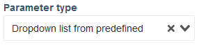

**Available parameter fields:**

!!! quote ""

    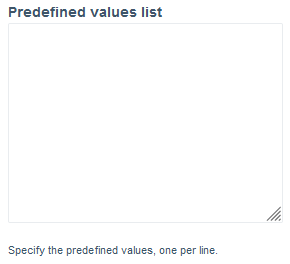

    This `multiline` input field allows you to specify a list of values that the user can select from during macro execution.

    Each separate value has to be specified on its own line, i.e.

    ``` linenums="1"
    value_1
    value_2
    value_3
    ```

    This creates a dropdown selector in the **Template** tab and on the macro execution pop-up.

    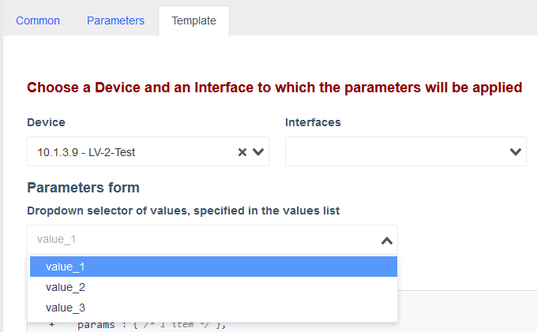

    !!! tip
        Select a device from the **Device** list to see the dropdown selector in the **Template** tab.
        
        It's name is shown above it and corresponds to the **Property display name** value of the parameter.
    
    The selected value updates the `params` object property with the name that's specified in the **Property** field in its **Parameter** card.
        
    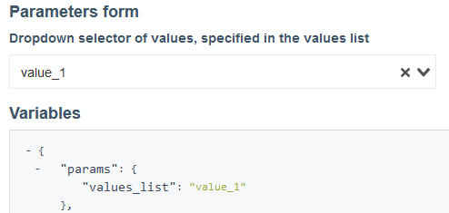

    !!! info 
        `"values_list"` here is the **Property** of this **Parameter**.

        It can be accessed with `params.<property>` in the template, i.e. `{{params.values_list}}` in this case.

### Dropdown list from variables

!!! quote ""
    
    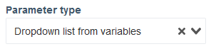

**Available parameter fields:**

!!! quote ""
    
    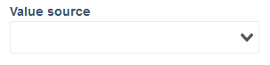

    This dropdown lets you to select an `Array`-like variable from a **Device**.

    The variable's values are listed below for convenience.

    

    !!! info
        The data type of stored values inside the array influences your workflow with the following **Available parameter** field.

!!! quote ""

    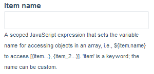

    This input field accepts scoped JavaScript expressions to access properties of `Objects` within the selected array. 
    
    The evaluated expression determines the display name in the **Parameter** dropdown selector for each item.

    To access the value of an object's property `${item.<property>}` syntax is used.

    By default, it's `${item.name}`, when this field is empty.

    !!! tip
        You can leave it empty if the values inside the array are simple data types, i.e. `string`, `int` etc.

    ??? info
        Some **Devices** have `interface` object properties inside the variables they provide.

        In JavaScript, `interface` is a *keyword* and thus can't be used as a variable inside a context, so this is the current workaround.
    
    ??? example
        1. Set your **Property** and **Property display name**, `port` and `Port` for this demonstration.
        2. Set **Parameter type** to **Dropdown list from variables**.
        3. Set the **Value source** to an array containing objects, `interfaces_list` in this case.
        4. Set the **Item name** to `${item.name} - ${item.status}`. 
        
            `name` and `status` are properties of the objects inside the array, as can be seen in the **Variants** field.
        
            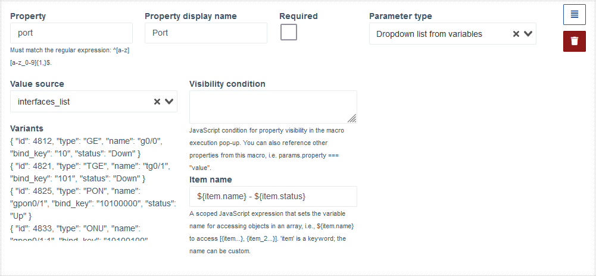

        5. Go to the **Template** tab and select a device that has `interfaces_list` as one of its variables.
        6. **Port** dropdown will appear, which has a list of the objects inside the `interfaces_list`, represented by the value of **Item name** field.
            
            Item selected here will correspond to the object inside the `interfaces_list` array, and it's other properties can be accessed in the template.

            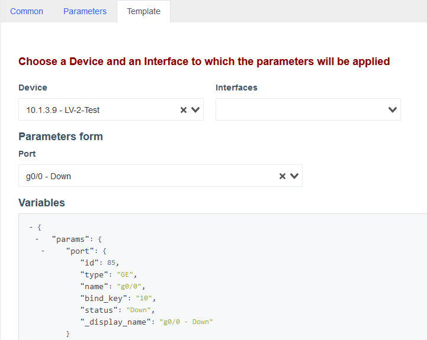


### Input field with value source

!!! quote ""
    
    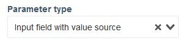

**Available parameter fields:**

!!! quote ""

    

    This dropdown allows selection of a **Device** variable property storing a "simple" type value, such as `string`, `int` etc.


!!! quote ""

    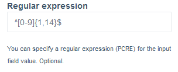

    This input field lets you define a pattern to filter the user's input in the **Input field** part of this **Parameter** in the **Template** tab and during macro execution.

### Input field

!!! quote ""
    
    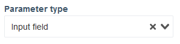

**Available parameter fields:**

!!! quote ""

    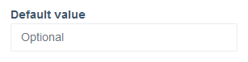

    This is an *optional* field that allows you to set a default value for the **Parameter**.


!!! quote ""

    

    This input field lets you define a pattern to filter the user's input in the **Input field** part of this **Parameter** in the **Template** tab and during macro execution.