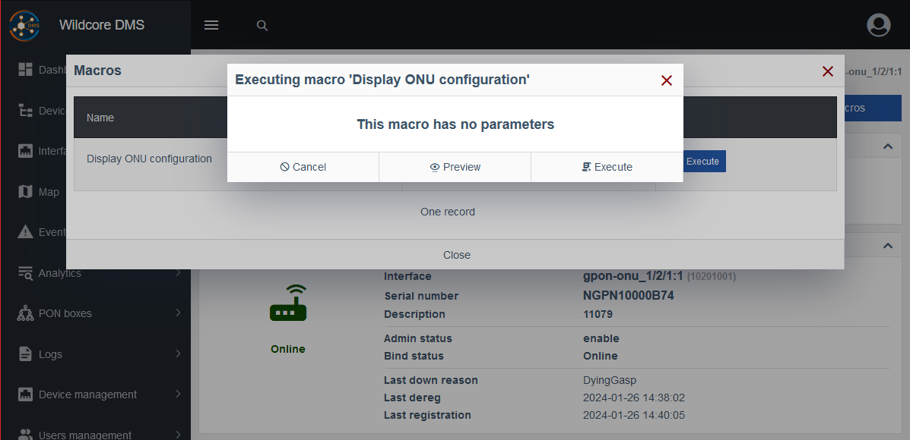
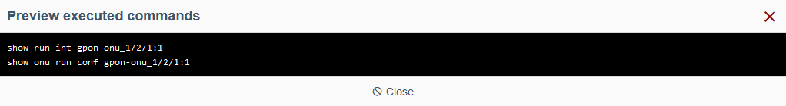
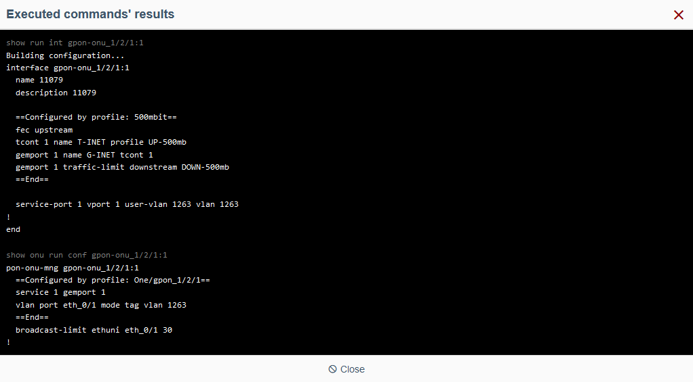
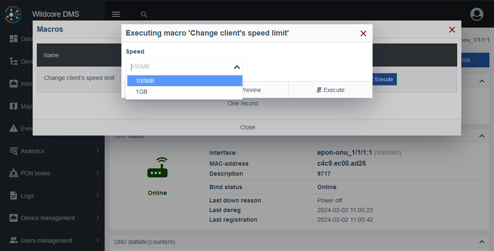
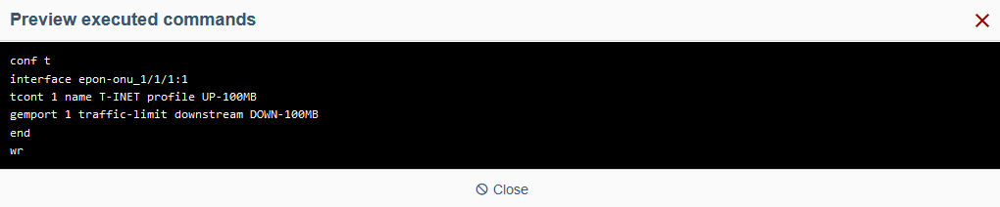
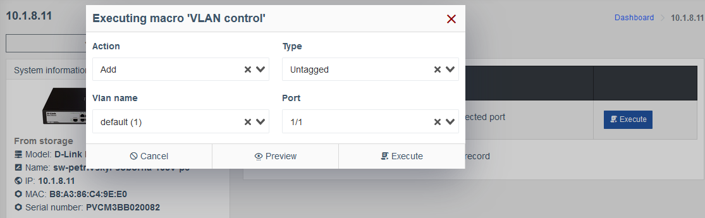
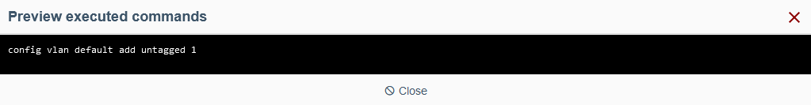
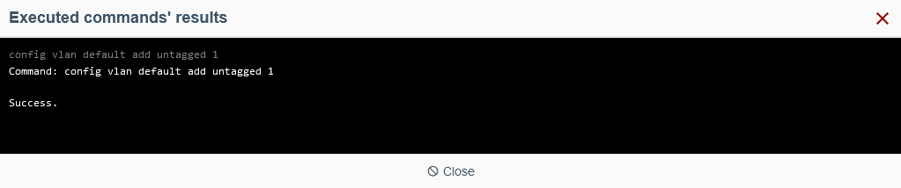

# Twig template examples

!!! abstract "Overview"
    This page presents basic **Macros** submitted by our users, along with explanations. 
    
    Feel free to copy and try them out!

!!! warning "Attention"
    Commands may vary depending on your setup. 
    
    Refer to your device's manual for applicable commands.

## Looking at ONU configuration

This example demonstrates a basic **Template** setup without any **Parameters**, that simply displays information.

### Common tab

!!! quote ""
    1. **Name:** `Display ONU configuration`
    2. **Description:** *feel free to enter a descriptive overview of this macro*
    3. **Roles:** *feel free to select ****Roles**** appropriate to run this macro*
    4. **Model vendors filter:** for the purpose of this demonstration we use the vendor `ZTE`
    5. **Models:** `ZTE C320`
    6. **Display for:** `ONU`
    7. **Display output:** `All commands`

### **Parameters tab**

For this demonstration, we skip this tab since we don't need any **Parameters**.

### **Template tab**

!!! quote ""
    1. **Device** and **Interface:** *feel free to select a ****Device**** and/or an ****Interface**** applicable to this macro*
    2. **Parameters form:** Since we don't have any **Parameters**, this section is not displayed.
    3. **Variables:** Here are the variables from the selected **Device** and **Interface**.
    4. **Template block:**

        - **Chosen template:**

            ``` twig
            show run int {{iface.name}}
            show onu conf {{iface.name}}
            ```

            ???+ info
                This is the input field that defines your macro, containing the specific CLI commands that are executed on the selected **Device** and/or **Interface**, combined with any Parameters you choose, if applicable.

                Here we use the `iface` variable that the selected device provides.

        - **Live result:**
        
            

            ``` shell
            show run int epon-onu_1/1/1:1
            show onu run conf epon-onu_1/1/1:1
            ```

            ???+ info
                Here you can see the result of this **Template**'s compilation, the exact command that will run on your hardware.

                For the purpose of this demonstration we selected a `ZTE C320` device and `epon-onu_1/1/1:1` interface.
                
                Our `{{iface.name}}` variable evaluated to `epon-onu_1/1/1:1` and the other static commands have been left unchanged.

Press the **Create** button and the macro is ready to use.

### Running the macro

Navigate to a device and an interface applicable for this macro and find the macro we just created in the **Macros** tab.

!!! tip 
    Since we selected `ONU` at the **Display for** step, the macro will only be visible on the appropriate sreen.

For this demonstration, we selected a `ZTE 320` **Device** and it's `gpon-onu_1/2/1:1` **Interface**.



Since we don't have any **Parameters**, the message **This macro has no parameters** is displayed instead.

When you press the **Preview** button, you can see it works the same way as shown in the **Live preview** on the **Template** tab.



The **Execute** button sends the commands to the selected device's interface, in this case `gpon-onu_1/2/1:1`.




## Changing the client's speed limit

### Common tab

Fill out this tab according to your requirements.

??? example
    1. **Name:** `Change client's speed limit`
    2. **Description:** `Select a speed limit from the dropdown to be applied to the client's connection`
    3. **Roles:** `Operator`
    4. **Model vendors filter:** `ZTE`
    5. **Models:** `ZTE C320`
    6. **Display for:** `ONU`
    7. **Display output:** `All commands`

### Parameters tab

!!! quote ""
    1. Add a new **Parameter**.
    2. **Property:** `speed`
    3. **Property display name:** `Speed`
    4. **Required:** `False`
    5. **Parameter type:** `Dropdown list from predefined`

        ???+ info
            Here we use predefined values to help the user choose the right one conveniently.

    6. **Predefined values list:**
        ```
        100MB
        1GB
        ```
    7. **Visibility condition:** *empty*

### Template tab

!!! quote ""
    1. **Device** and **Interface:** *feel free to select a ****Device**** and/or an ****Interface**** applicable to this macro*
    2. **Parameters form:** Here's the dropdown for the **Speed** parameter from the previous tab.
    3. **Variables:** Here are the variables from the selected **Device** and **Interface**, as well as `params` property which stores the values of the parameters we specified earlier.
    4. **Template block:**

        - **Chosen template:** 
            ``` twig
            conf t
            interface {{iface.name}}
            tcont 1 name T-INET profile UP-{{params.speed}}
            gemport 1 traffic-limit downstream DOWN-{{params.speed}}
            end
            wr
            ```

        - **Live result:**

            ``` shell
            conf t
            interface epon-onu_1/1/1:1
            tcont 1 name T-INET profile UP-100MB
            gemport 1 traffic-limit downstream DOWN-100MB
            end
            wr
            ```

            ???+ info
                For the purpose of this demonstration we selected the **Speed** of `100MB` in the dropdown above and a `ZTE C320` device with an Interface `epon-onu_1/1/1:1`.


                Similar to the previous example, `{{iface.name}}` evaluated to `epon-onu_1/1/1:1`, and `{{params.speed}}` stored the value we selected in the Speed dropdown.

The macro is now ready to use.

### Running the macro

Navigate to a device and an interface applicable for this macro and find the macro we just created in the **Macros** tab.

!!! tip 
    Since we selected `ONU` at the **Display for** step, the macro will only be visible on the appropriate sreen.

For this demonstration, we selected a `ZTE 320` **Device** and it's `epon-onu_1/1/1:1` **Interface**.



This time you can select the desired **Speed** from the dropdown and look at a **Preview**.



The **Execute** button sends the commands to the selected device's interface, in this case `epon-onu_1/1/1:1`.

!!! warning ""
    We will not actually **Execute** the macro in this demonstration for safety purposes.


## Managing a VLAN

This macro involves more **Parameters** compared to the previous one. 

Refer to the [**Parameter type options**](./parameter_type_options.md) page as needed.

### Common tab

!!! quote ""
    1. **Name:** `VLAN control`
    2. **Description:** `Manage VLANs on a selected port`
    3. **Roles:** `Operator, Engineer`
    4. **Model vendors filter:** `D-Link`
    5. **Models:** `D-Link DES-1228/ME ...` 
    
        *feel free to select more appropriate devices, we will use this one for demonstration*
    6. **Display for:** `Device, Port`
    7. **Display output:** `All commands`

### Parameters tab

!!! quote ""
    1. **Action** parameter:
        - **Property:** `action`
        - **Property display name:** `Action`
        - **Required:** `True`
        - **Parameter type:** `Dropdown list from predefined`
        - **Predefined values list:**
            ```
            Add
            Delete
            ```
        - **Visibility condition:** *empty*

    2. **Type** parameter:
        - **Property:** `type`
        - **Property display name:** `Type`
        - **Required:** `False`
        - **Parameter type:** `Dropdown list from predefined`
        - **Predefined values list:**
            ```
            Untagged
            Tagged
            ```
        - **Visibility condition:**
            ```
            params.action === 'Add'
            ```

            ??? info
                Here we reference the previous parameter, **Action**, and set the **Type** parameter to be shown only when the selected action is `'Add'`.

    3. **VLAN** parameter:
        - **Property:** `vlan`
        - **Property display name:** `VLAN`
        - **Required:** `True`
        - **Parameter type:** `Dropdown list from variables`
        - **Value source:** `data.vlans`

            ??? info
                This device variable stores an array of objects, properties of which describe the VLANs we want to configure.

        - **Visibility condition:** *empty*
        - **Item name:** `${item.name}  (${item.id})`

            ??? info
                We choose the VLAN's `name` and `id` properties to be shown in the drop-down for convenience.

    4. **Port** parameter:
        - **Property:** `port`
        - **Property display name:** `Port`
        - **Required:** `False`
        - **Parameter type:** `Dropdown list from variables`
        - **Value source:** `interfaces_list`
        - **Visibility condition:** `!iface`

            ??? info
                This condition hides the parameter from screens that provide the `iface` variable from a device, such as selected interfaces.

                Therefore, when running this macro from a **Device** screen, we can select a specific interface from the drop-down, otherwise, it's not shown.

        - **Item name:** `${item.name}`

### Template tab

!!! quote ""
    1. **Device** and **Interface:** *feel free to select a ****Device**** and/or an ****Interface**** applicable to this macro*

        ??? info
            For this demonstration we select a `D-Link DES-1228/ME` device and no **Interface**.

    2. **Parameters form:** 

        For this demonstration we select:

        - **Action:** `Add` 
        - **Type:** `Untagged` 
        - **VLAN name:** `sw802 (802)` 
        - **Port**: `1/1`

        ??? info
            You are presented with the parameters we specified in the previous step.

            **Type** drop-down is only visible when the **Action** is set to `Add`, **Port** is only visible when we haven't selected an **Interface**. 

    3. **Variables:** 

        Here are the variables from the selected **Device** and **Interface**, as well as `params` property, which stores the values of our `action`, `type`, `vlan` and `port` parameters.

        ``` json
        "params": {
            "action": "Add",
            "type": "Untagged",
            "vlan": {
                "name": "sw802",
                "id": "802",
                "ports": { /* 3 items */ },
                 "_display_name": "sw802 (802)"
            },
            "port": {
                "id": 5026,
                "type": "FE",
                "name": "1/1",
                "bind_key": "1",
                "status": "Down",
                "_display_name": "1/1"
            }
        }, 
        ```

        ??? info
            `_display_name` property here is the **Item name** variable we specified in the previous step.

            We specified `${item.name}` for our **Port** parameter, but we could also leave it empty since it evaluates to this by default.

    4. **Template block:**

        - **Chosen template:** 
            ``` twig
            {# Block for setting variables inside the template #}
            
            
            
            

            {# Template block #}
            
            config vlan {{params.vlan.name}} delete {{port.bind_key}}
            
            config vlan {{params.vlan.name}} add {{params.type | lower }} {{port.bind_key}}
            
            ```

        - **Live result:**
            ``` shell
            config vlan sw802 add untagged 1
            ```

The macro is now ready to use.

### Running the macro

Navigate to a device and/or an interface applicable for this macro and find the macro we just created in the **Macros** tab.

For this demonstration, we selected a `D-Link DES-1228/ME` **Device**.



**Preview:**



**Execution:**

