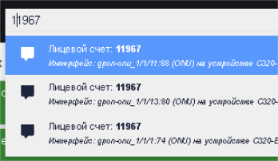

# Integration with MikBill


Available from version **0.19+**     
[MikBill Documentation](https://wiki.mikbill.pro/billing/wildcore)

# Setting up collaboration with Mikbill


## Retrieving Data from Wildcore to MikBill

#### 1. Create a user role and user for Mikbill:
**Go to: _users ⇒ roles_, click _"create a new role"_.**      
Role name for example: _mb_dms_     
check the boxes:

- System: **!!! Allow authorizing other users (generate keys)**
- Users: **List of users, Update information about themselves**
- Component **Diagnostics: Interface diagnostics (for billing)**
- OLTs: **Info from OLTs**
- Switches: **Info from switches**

Click _"create"_.

**Go to: _users  ⇒ users_, click _"create a user"_**       
Fill in all the fields, choose the device groups available to this user, as well as the role created above: _mb_dms_      
login for example - _mikbill_

Click _"create"_.

#### 2. Generate an API key (token) for this user
From the console:    
```shell linenums="1"
wca user:generate-key mikbill 365d
```     
where _mikbill_ is the username, and _365d_ is the key's expiration period.

Example:
```{ .shell .no-copy}
root@debian# wca user:generate-key mikbill 365d
+--------+------------------------+-----------------------------------------------------+-----------------------------+
|    ID  | User                   | Key                                                 | Expired At                  |
+--------+------------------------+-----------------------------------------------------+-----------------------------+
| 4780   | ID: 65                 | cd1f08c-dcea-4603-34d-471deb7c9387                  | 2024-11-14 14:37:04         |
|        | Login: mikbill         |                                                     |                             |
|        | Name: Биллинг          |                                                     |                             |
+--------+------------------------+-----------------------------------------------------+-----------------------------+
```
     
#### 3. If the billing admin panel operates on SSL, then Wildcore needs to be switched to SSL      
**From the console (example for Ubuntu/Debian)**:
```shell linenums="1"
apt update
apt -y install snapd nginx
snap install core
snap install --classic certbot
ln -s /snap/bin/certbot /usr/bin/certbot
# Настраиваем проксирование на nginx, бутаем nginx и запрашиваем сертификат
certbot --nginx -d dms.ispnet.demo #  (не забываем открыть 80й порт  к wildcore из мира)
```
where dms.ispnet.demo is your domain name       
**Example Nginx config (before obtaining the certificate)**    

```shell linenums="1"
cat /etc/nginx/sites-enabled/wildcore-proxy
server {
	listen 80;
	root /var/www/html;
	index index.html index.htm index.nginx-debian.html;
	server_name dms.ispnet.demo;
    location / {
       proxy_pass      http://localhost:8088;
       proxy_set_header X-Real-IP $remote_addr;
       proxy_set_header Host $host;
       proxy_set_header X-Forwarded-Proto $scheme;
       proxy_set_header X-Forwarded-Host $host;
       proxy_set_header X-Forwarded-Server $host;
    }
}
```
#### 4. Enabling Integration in Mikbill
Go to: _Settings ⇒ System Options ⇒ External Integrations, section **Wildcore**_      
Check the box: **Enable**      
Specify the Wildcore address: _https://dms.ispnet.demo_      
Enter the **API key** generated in step 2      
Save.


At this stage, Mikbill will already receive data about ONU signals and display them in the subscriber's card (if the device type is onu/ont and SN/MAC is found in Wildcore).        
Signal updates occur every time the account is opened.


         
Also, the Mikbill subscriber card has a Wildcore tab where you can view information directly from Wildcore.

**ONU Page:**          
For this, the subscriber must have an added device: onu/ont type. The billing will search for the device in Wildcore by onumac/onusn.          


**Switch Port Page:**      
For this, the subscriber must specify the switch and port; the billing will search for the device in Wildcore by IP (device type: SWITCH, the switch's IP in the Mikbill directory must match the switch's IP in Wildcore)      


Also, the Mikbill employee's login  must match the login  in Wildcore, and their role must have the corresponding rights:

- User management → Update self information
- OLTs → Info from OLTs
- Switches → Info from Switches

If there are not enough permissions, an error will be displayed: _Wildcore iframe permission denied_      
If necessary, you can also adjust the scale of the page loaded into the billing.     
To do this, go to: Configuration ⇒ System Configuration ⇒ System Configuration tab and change the WEB_ZOOM_IFRAME parameter.     
By default, it is set to 1 (100%).     
Specify as desired: 0.9 (90%), 0.75 (75%), etc.


## Retrieving Data from Mikbill to Wildcore

Wildcore can receive data from Mikbill about subscribers, displaying it on the card of the corresponding ONU or switch interface:

- Client UID
- Link to the subscriber's card
- Contract number
- Login
- Subscriber's address (City, street, house, apartment)


### Enabling Integration
#### 1. Activate the mikbill_integration component
Go to: _Configuration ⇒ System Configuration_, the _Components_ tab, and activate the _**mikbill_integration**_ component        

After that, in the _System Configuration_ tab, a **MikBill** settings section will appear.       
Enter the billing admin panel address, the API key generated for the billing in step 2,       
and choose which field will be available in Wildcore's _global search_ (uid, contract number, or login).      
Click Save

#### 2. Activate Automatic Synchronization
In _Configuration ⇒ System Configuration_, the _Scheduler_ tab, activate synchronization (you can also set the desired synchronization time in crontab format).       

In this example, synchronization will occur twice a day: at 4:00 and 12:00.

For manual synchronization (relevant for the first run) – execute the command in the console:
```shell linenums="1"
wca mikbill_integration:sync-clients
```    

The process will take some time. It depends on the number of subscribers and the performance of your server with Wildcore.

#### All ONUs and switch ports (assigned to subscribers in their accounts) will be supplemented with data from the billing system.

Clicking on the link will open the subscriber's account in Mikbill in a new tab.

#### Also, in the global search, you can now search for subscribers by UID, login, or contract number (depending on what is selected for global search).


## FAQ
#### Question 1: In the billing system, in the Wildcore tab, an ONU is displayed that is always offline, even though the subscriber is active. Why is this happening?
Answer: Most likely, an ONU with that identifier (onumac, onusn) is present (or has worked previously) on other ports or OLT. Wildcore searches for the ONU by identifier and opens the first result from the search. Delete the ONU with this identifier from all outdated ports and OLT.

#### Question 2: I deleted duplicate ONUs from outdated ports and OLT, but the "removed ONU" still opens. What should I do?
Answer: You need to wait a bit (up to 10-15 minutes) until the OLT re-queries and the data in the database is updated.

_To be continued..._
