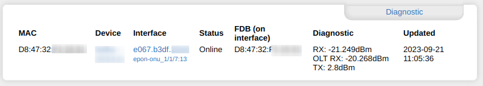
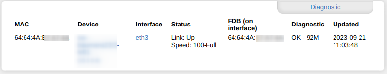
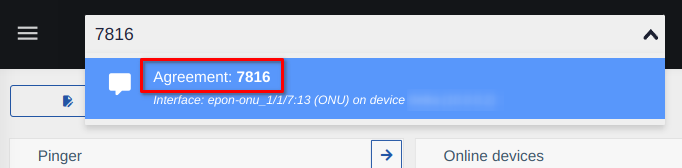
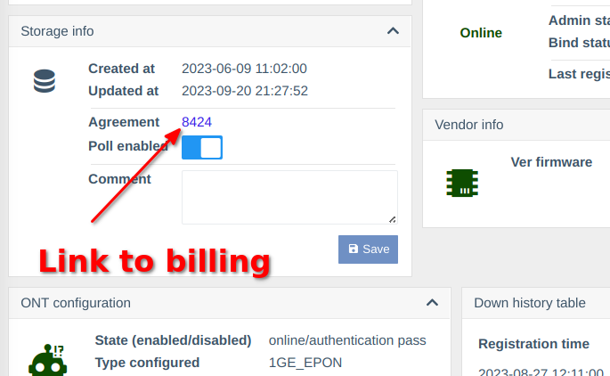
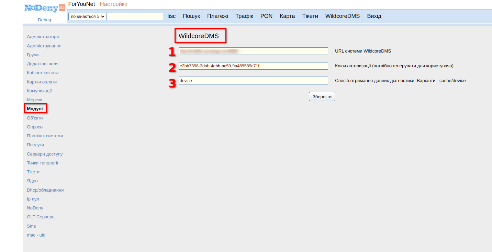
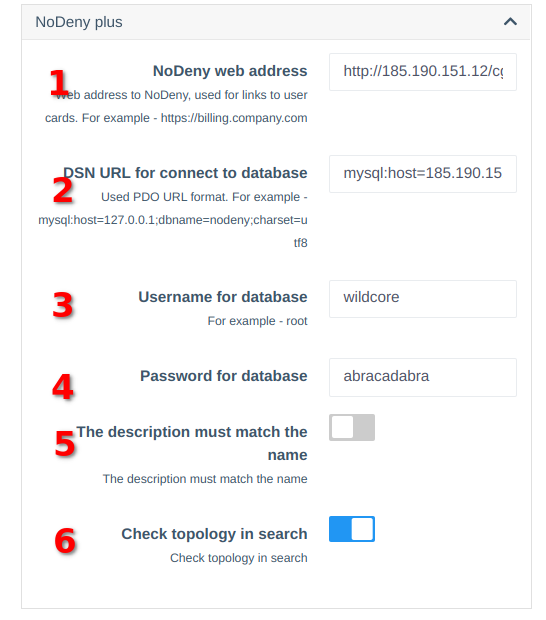
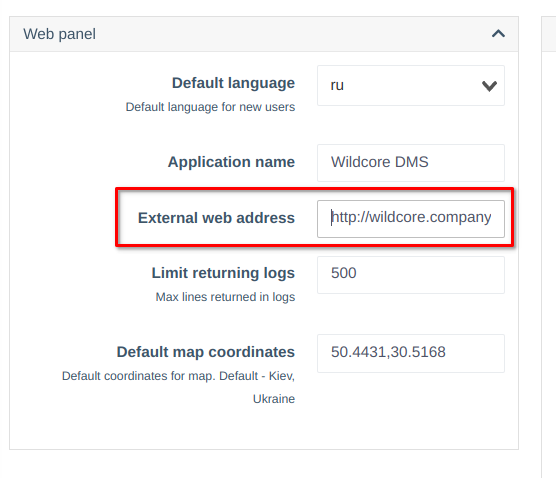

# Billing NoDeny plus integration
## About the Component
The component allows you to interact with NoDeny plus billing.    


## Functionally
* Diagnostic window in the client card inside billing
  
  
* Searching over client MAC-addresses    
  *Wildcore used table mac_uid for compare MAC-Addresses*
* Global search by name in WildcoreDMS   
  
* Link to client card inside billing from Wildcore
   

## Requirements
* NoDeny plus
* Wildcore, version 0.18+

## Installation

### In billing
1. Download latest version of module from github - [meklis/wildcore-nodeny-module](https://github.com/meklis/wildcore-nodeny-module/releases)
2. Install module in billing using [Nodeny instruction](https://wiki.nodeny.com.ua/index.php?title=%D0%A3%D1%81%D1%82%D0%B0%D0%BD%D0%BE%D0%B2%D0%BA%D0%B0_%D0%BC%D0%BE%D0%B4%D1%83%D0%BB%D0%B5%D0%B9)
3. Create user in nodeny database (with grants - SELECT), for wildcore
4. Configure module in billing
    *  From admin go to Settings->Modules->WildcoreDMS
       
       1. Web address of wildcore system, for example - http://wildcore.company.com:8088    
       2. User auth key. The [block below](#generate-auth-key-for-billing) describes how to generate a key
       3. Where to get diagnostic data from. Could be from cache or device. If a cache is specified, to update the diag data you need to click 'update' on the device on the wildcore page


### In Wildcore
#### Configure component  
After update, when component `nodeny_plus` is installed, go to     
**Configuration->System configuration->TAB Configuration** and scroll to `NoDeny plus` block.    
     
**Description of parameters**    
**1. Address of nodeny billing, with /cgi-bin/stat.pl**.     
   For example - `https://billing.company.com/cgi-bin/stat.pl`     
   _Its parameter used for creating links to billing from wildcore interface_  
**2. Database connection string, in [PDO format](https://www.php.net/manual/en/pdo.connections.php).**       
   Example of connection string - `mysql:host=billing.company.com;dbname=nodeny_db;charset=utf8`, where        
      - `billing.company.com` - server address with nodeny database     
      - `nodeny_db` - nodeny database name     
**3. Username for nodeny database**     
**4. Password for nodeny database**     
**5. If its option is enabled, when client MAC address found, founded interfaces by description will filtered. The description must match the name on the billing**    
**6. If its option is enabled, system will check topology(links)**     
     _If a link is detected, this port will be ignored_     

#### Check for wildcore URL is correct in `Web panel` block      
Example of URL - `http://wildcore.company.com:8088`  
   

After finish config - click 'Save' in top of page     
#### Generate auth key for billing    
Open console in server and write command
```shell linenums="1"
sudo wca user:generate-key admin 365d
```
* `admin` - username in wildcore system. Billing will be used from its user; 
* `365d` - key expiration
Output will be as 
```shell
+-----+--------------+--------------------------------------+---------------------+
| ID  | User         | Key                                  | Expired At          |
+-----+--------------+--------------------------------------+---------------------+
| 121 | ID: 1        | e6cadf08-e4d3-42b3-b48b-bf0a86393b38 | 2024-09-19 19:32:47 |
|     | Login: admin |                                      |                     |
|     | Name: Admin  |                                      |                     |
+-----+--------------+--------------------------------------+---------------------+
```
Then, save key `e6cadf08-e4d3-42b3-b48b-bf0a86393b38`. Its key will be used in billing

