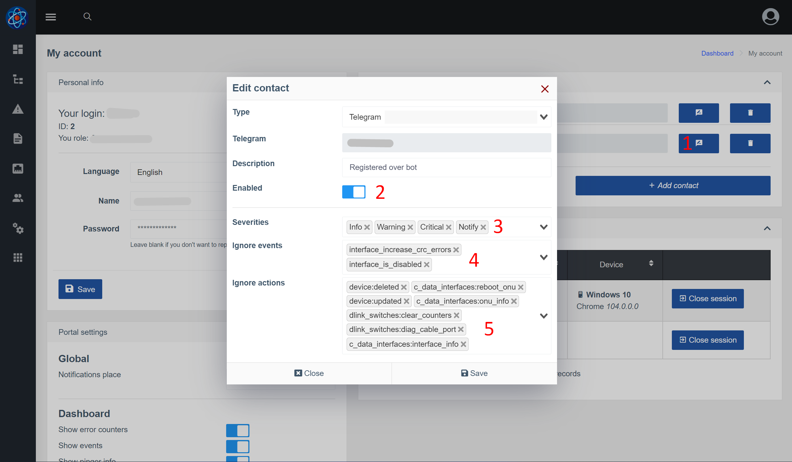

# Notifications
## About the Component
The **Notifications** component allows you to send individual notifications to system users via Telegram and Email.
Notifications can be of two types - events (Events) and notifications (logs of actions in the system).


One of the features of this component is the ability to send notifications to a specific user (and not to a group).
The user can also configure which notifications and through which channel (Email/Telegram) should be received.

### General scheme of interaction


Notes:

* Events have two dates - start and end (alert and resolved)
* Actions (notifications) have one date - the time of the action.

For this reason, they are divided into different groups and have different settings.

## Notifications in the web interface
### Setting up a sending channel - Telegram


1. Tab selection
2. Bot name - here you need to enter the name of your bot, which was entered during registration in [@BotFather](https://t.me/BotFather)
3. API key - received key from @BotFather
4. Template alert(create event)*
5. Template resolved(completion of event)*
6. Template notification(action)*
7. An example of an object generated for a notification. If this is an action (notification), the parameter event = null. In case this event is action = null.
   These variables can be used to generate notification text.

_*Template engine [twig](https://twig.symfony.com/)_ is used

### Setting up a sending channel - Email


1. Address of your SMTP server (IP or domain)
2. SMTP port
3. What encryption to use (usually the port also depends on the type of encryption)
4. Your username for authorization on the SMTP server. This is usually your email
5. Password for authorization on the SMTP server
6. From which email to send (header From in the email body). This is usually your email
7. What name to specify when sending (From header)
8. Setting up templates (more detailed description in the telegram block)


### Configuring rules for sending by actions (notifications) <a id="action_rules_conf"></a>
On the settings page for sending actions, you can specify which actions should generate a notification.
You can also add some conditions, for example, send only if the action ended with an error.


1. Remove the rule
2. The name of the action. This is an input field with a hint (the system prompts based on actions that have already taken place)
3. Enable/disable the rule
4. Send if action fails
5. Send if the action was successful

### Configuring rules for sending on events <a id="event_rules_conf"></a>


1. Remove the rule
2. Event name. This is an input field with a hint (the system prompts based on events that have already occurred)
3. Enable/disable the rule
4. Whether to generate a notification when the event ends. Relevant, for example, when creating an event about a hardware restart.
5. How many seconds to wait before sending a notification. If the event ends earlier, the notification will be canceled. This setting only applies to alert notifications, resolved is always sent immediately.

### Configuring contacts and sending rules in user account <a id="config_contact"></a>


1. Click edit contact in account settings / edit user to get a popup window with contact settings
2. You can disable a contact if you do not want to receive notifications for some time
3. At what levels to send notifications through this contact. There is also _Notify_ for levels - these are notifications (actions)
4. List of events that DO NOT send through this contact
5. List of actions that DO NOT send through this contact


## Setting up notifications via telegram
### Channel setup
1. Go to the settings of the telegram sending channel
2. Specify the name of the bot, the key and save
3. Restart the bot with the command ```wca supervisor:control telegram-bot restart``` (so that the incoming message handler receives new settings)

### Add contacts
1. Go to account settings / change user and add the phone number used in telegram.
   
2. After adding a contact - go to your bot and send /start or any other message.
   In response, the bot should request the transfer of a contact number. After transmitting the contact number, the bot should respond with the following:
   
3. Reload the account settings page - a new contact with the Telegram type should appear.

**Sending notifications via Telegram is configured!**
Further, you can fine-tune [what notifications you want to receive for this contact] (#config_contact),
[what events](#event_rules_conf) and [what actions](#action_rules_conf)