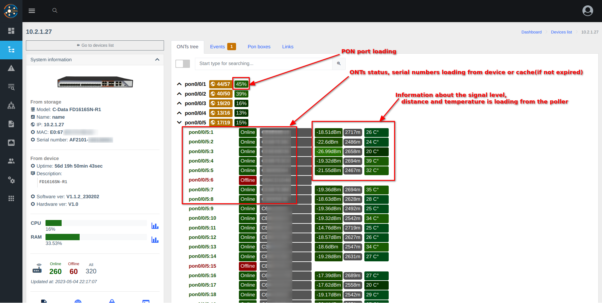
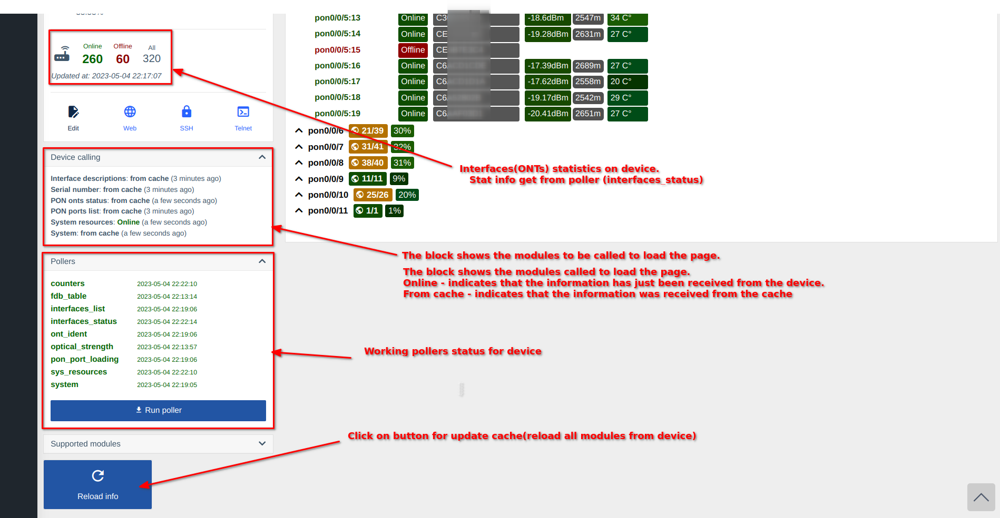
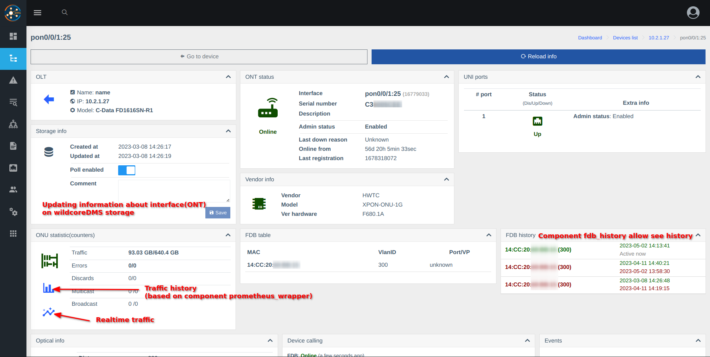

# OLTs component
Allow working with devices with type OLT.
 
## Access functional for users(based on roles)

"Info from OLTs" permission is allowed, by default.    

## Screenshots 

### ONTs tree
        
       

### ONT information 
       

*The displayed information and blocks will differ depending on the vendor and device model.*