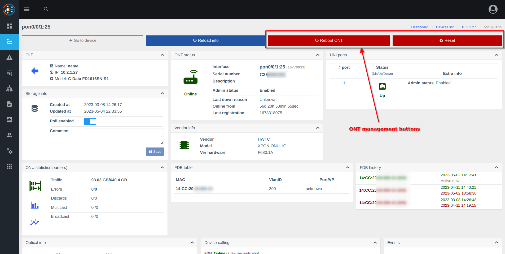

# OLTs control (olts_control)
Component extends of the OLTs component.    
**The component implements the ONU control. Functionality depends on vendor and OLT model**
 
## Control access to functional for users(based on roles)

Current permissions **not allowed** by default

## Screenshots 
        
