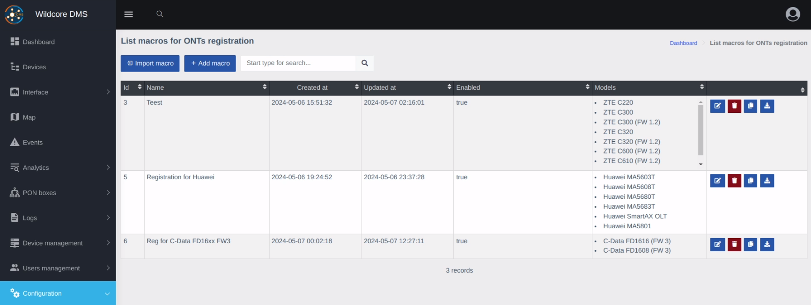
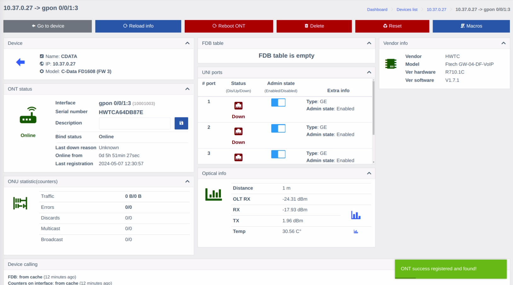

!!! abstract "Overview"
    This page provides description of the **ONTs registration** component.

    This component checks for the presence of unregistered ONTs and allows the registration of new ONTs by filling out a short form and works for all types of OLTs.

!!! info
    ONT registration page can be found under **Configuration > ONTs Registration**.

    

    Additionally, there a **Unregistered ONTs** widgen on the **Dashboard**, which lists the detected unregistered ONTs automatically.

    

## How It Works
After detecting an unregistered ONT, it appears in the list (on the panel, for all devices, and on the device itself).

Clicking the "Register" button opens the registration form. The fields are dynamically generated based on parameters prepared by the engineer.

When you fill out the form and press the registration button, a list of commands is generated based on the template, entered parameters, and parameters obtained from the device and the unregistered ONT.

If the template compilation is successful, the commands will be executed on the OLT. 

After successful registration, a notification of successful registration will be displayed, and it will automatically redirect to the new ONT.

!!! note

    The entire console output during registration can be viewed in the equipment call logs (multi_console_command module) for both successful registration and errors.

    In case of an error in any of the commands, the execution of commands will be stopped.
    The error may occur after entering commands for ONT registration itself.

    In this case, you need to find the ONT under which it was registered and manually configure it on the OLT (or delete it and try to register again).

    [**Twig**](https://twig.symfony.com/) template engine is used for the registration Macros. Refer to the official documentation for the template mechanism to learn about available functions, such as branching (if-else).

    If you have any unique settings on each individual OLT, you can specify them in the additional device parameters and use them in the template or parameters. A common practice is defining custom VLANs (for individual ports or the entire device). Such parameters will be available in the `device.params` object.

## Overview of the Registration process
!!! tip
    A thorough guide to registration of an ONT can be found on the [**Registration workflow**](./registration-workflow.md) page.

1. Create a registration macro on the **ONTs Registration** page.

    !!! note "Key differences from regular Macros"
        - **Common tab**: Here are only the macro name and device specification fields are available.

        - **Parameters tab**: Instead of the **Interface** selector, there is **Unregistered ONT**. It lists only ONTs, that were detected as unregistered.

        - **Template tab**: Same as **Parameters tab**.

2. Go to the **Device** page you wish to register an ONT for, find it in the **Unregistered ONTs** tab and press the **Register** button.
3. Execute the previously prepared macro.

If everything went correctly, you will be redirected to the newly registered ONT page.

