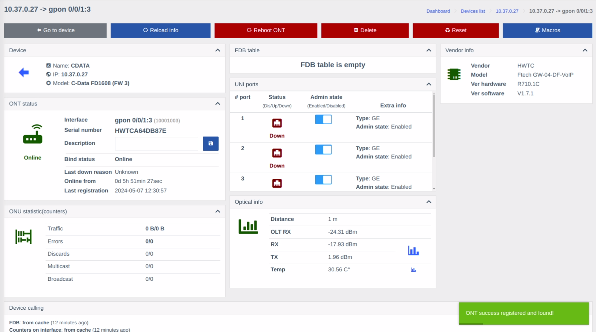

# ONT registration from the Device page
1. Go to the Device you wish to register an ONT for, select the **Unregistered ONTs** tab and press the **Register** button.

    

2. A pop-up window will appear. Select the desired Line profile and Service profile from drop-down menus. 

You can **Preview** the macro before execution.

!!! tip
    If there seems to be something wrong with the form, press the **Reload**  button in the top right corner. 
    
    By default the form fetches data from cache and the reload button forces an update.

If the preview seems correct, you can press the **Execute** button.

3. If everything went correctly, you will be redirected to the newly registered ONT page.
    