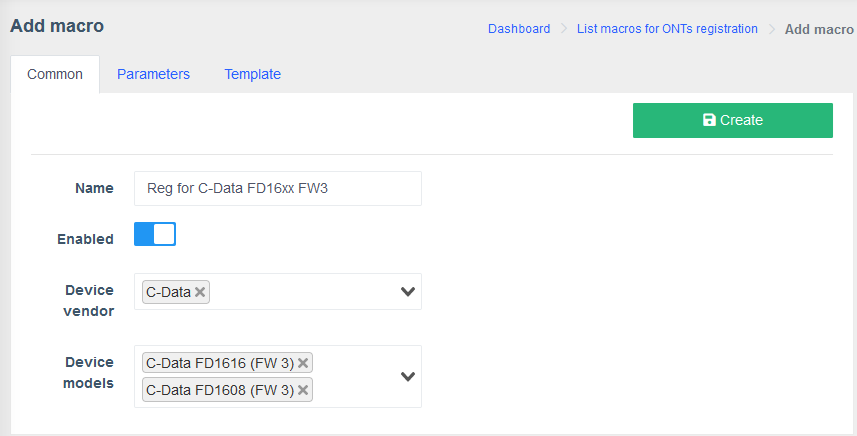
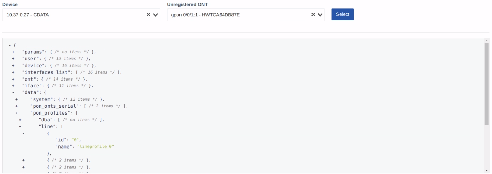
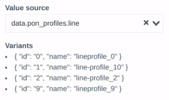
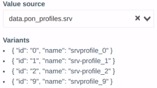
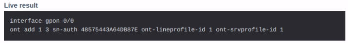

# Registration template macro creation

!!! tip
    If you are unfamiliar with the **Macros** system, a thorough guide and descriptions of all the fields and parameters can be found in the [**Macros**](../../components/macros/getting-started.md) section of this documentation.

!!! warning "Attention"
    There can be only one registration macro for one model, otherwise you will get an error.

### Common tab
!!! quote ""
    1. **Name:** `Reg for C-Data FX16xx FW3`
    2. **Enabled**: `Yes`
    2. **Device vendor:** for the purpose of this demonstration we use the vendor `C-Data`
    3. **Device models:** `C-Data FD1616 (FW3)`, `C-Data FD1608 (FW3)`

    ??? example
        

### Parameters tab
!!! quote ""
    Select a C-Data device and the ONT you want to register from the drop-downs at the top of the page.

    

    Add a new **Parameter**.

    1. **Property:** `line`
    2. **Property display name:** `Line profile`
    3. **Required:** `True`
    4. **Parameter type:** `Dropdown list from variables`
    5. **Value source:** `data.pon_profiles.line`

        ??? example "Sample profiles"
            

        ???+ info
            The profiles you may receive from your device may differ.

            If that's the case, make the required changes to your macro. 

    6. **Item name:** `${item.name} (${item.id})`
    7. **Item filter:** `item.id != 0`

    Add another **Parameter**.

    1. **Property:** `srv`
    2. **Property display name:** `Service profile`
    3. **Required:** `True`
    4. **Parameter type:** `Dropdown list from variables`
    5. **Value source:** `data.pon_profiles.srv`

        ??? example "Sample profiles"
            

        ??? info
            The profiles you may receive from your device may differ.

            If that's the case, make the required changes to your macro. 

    6. **Item name:** `${item.name} (${item.id})`
    7. **Item filter:** `item.id != 0`

### Template tab
!!! quote ""
    Select a C-Data device and the ONT you want to register from the drop-downs at the top of the page.

    

    **Template block:** 
        
    Paste the following code:

    ``` twig
    interface gpon 0/0
    ont add {{iface._port}} {{free.first}} sn-auth {{ont._serial_hex}} ont-lineprofile-id {{params.line.id}} ont-srvprofile-id {{params.srv.id}}
    ```

    If the macro worked, you should see a similar output in the **Live result** field.
    