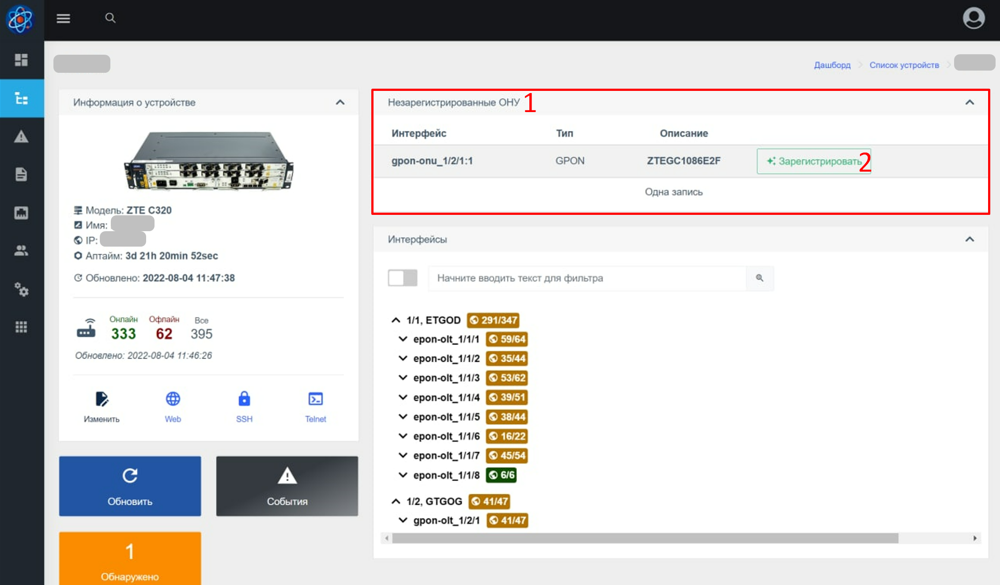
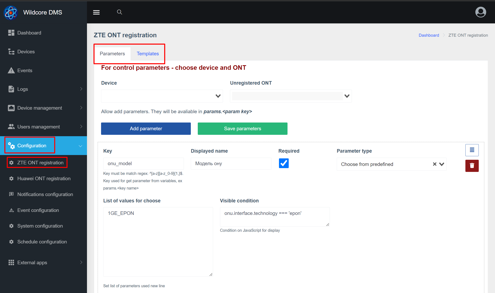
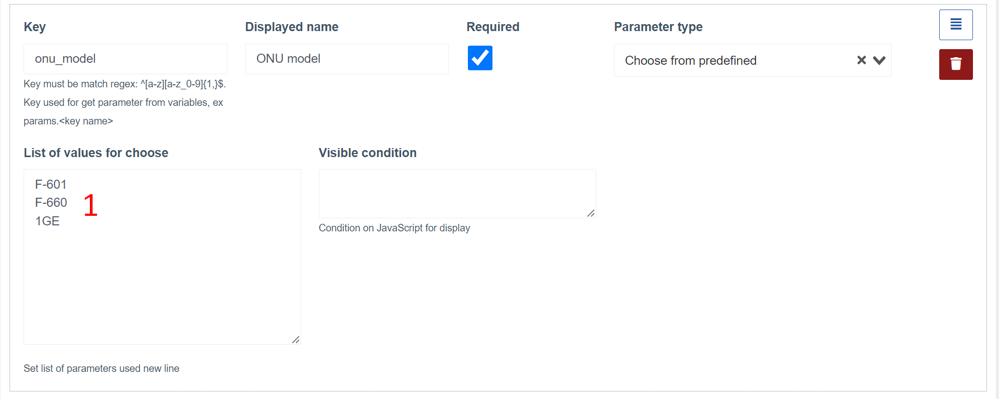
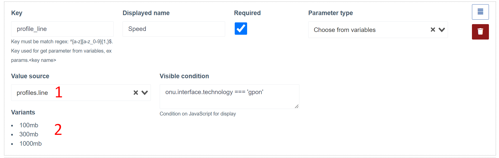
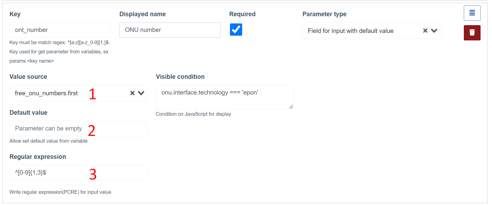
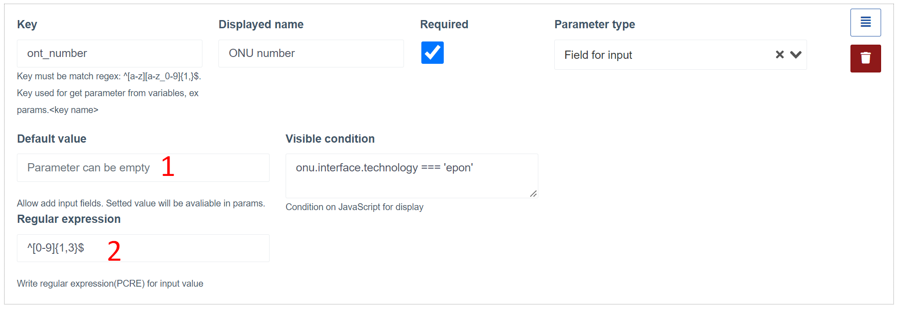
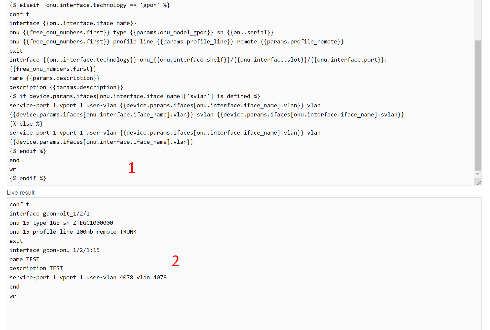

# Registration of ONU on ZTE/Huawei OLT
This component checks for the presence of unregistered ONUs and allows registering new ONUs by filling out a short form.    
The documentation describes the operation of two components:

- `huawei_onts_registration`
- `zte_onts_registration`

## How It Works
After detecting an unregistered ONU, it starts appearing in the list (on the panel, for all devices, and on the device itself).      
After clicking the "Register" button, the registration form opens.       
Form fields are dynamically generated based on parameters prepared by the engineer.       
After filling out the form fields and clicking the registration button, a list of commands is generated for ONU registration based on the template, entered parameters, and parameters obtained from the device and the unregistered ONU.          
If the template compilation is successful, the commands will be executed on the OLT.        
After successful registration, a notification of successful registration will be displayed, and it will automatically redirect to the new ONU.

### Notes

* The entire console output during registration can be viewed in the equipment call logs (multi_console_command module) for both successful registration and errors.
* In case of an error in any of the commands, the execution of commands will be stopped.
  The error may occur after entering commands for ONU registration itself.
  In this case, you need to find the ONU under which it was registered and manually configure it on the OLT (or delete it and try to register again).
* To create a template, use [twig](https://twig.symfony.com/). Refer to the official documentation for the template mechanism to learn about available functions, such as branching (if-else).
* If you have any unique settings on each individual OLT, you can specify them in the additional device parameters and use them in the template or parameters. A common practice is defining custom VLANs (for individual ports or the entire device). Such parameters will be available in the `device.params` object.


## Web Interface
### Registration of Unregistered ONU
**List of Unregistered ONUs on the Device**


**ONU Registration Form**
<a id="reg_form"></a>

### Registration Configuration
**Configuration Page**


**Parameters Settings Tab**<a id="config_params"></a>


1. Device and ONU selection block. Only ZTE OLT devices are displayed in the device list. You need to select a device and an unregistered ONU to get a list of dynamic parameters.
2. Variables available after selecting the device and ONU, which can be used in the registration form field settings.
3. Registration form field

**Template Settings Tab**<a id="config_template"></a>


1. Device and ONU selection block. Only ZTE OLT devices are displayed in the device list. You need to select a device and an unregistered ONU to get a list of dynamic parameters.
2. Registration form prepared on the [parameters tab](#config_params)
3. Variables available after selecting the device, ONU, and filling out the form parameters, which can be used to create a template.
4. Template change block (the generated set of commands can also be viewed under the template)

## Variables
Variables are nested objects with fields. The values of object fields are automatically generated based on the current user, the equipment where the unregistered ONU is located.

You can use these variables to create a template as well as the behavior of the registration form.

**The root object contains the following fields**:

* **user** - the current user in the system
* **device** - the device on which the registration is performed
* **params** - values entered into the registration form
* **profiles** - a list of linear and remote profiles obtained from the OLT
* **onu** - the ONU being registered
* **free_onu_numbers** - contains two fields (the first free onu) and a list of all free onu on the port where the unregistered ONU is located.


## Registration Form Parameters
### The system supports the following types of parameters:
* Select (drop-down list) from predefined values
* Select (drop-down list) from variables
* Input field with a default value from a variable
* Input field


### Typical parameters configuration block (for example, the type is a selection from predefined values)


1. **Key*** - The key name will be used to access the parameter value in the template, which will be available as `params.KEY_NAME`. It is advisable to enter keys only in Latin and, if necessary, use underscores;
2. **Display Name*** - The name of the field that will be displayed in the registration form;
3. **Mandatory flag** - indicates that this field must be filled in during registration (or selected in the case of a drop-down);
4. **Parameter Type*** - parameter type. You must select one of the following;
5. **Visible condition** - JavaScript condition for displaying the field. Should return true or false depending on the variables.
6. **Sort button** - by holding the button, you can drag the parameter up/down. This will change the order of fields in the registration form.
7. **Delete button**

_* - Required field_

### Parameters for field types
**Select from predefined values**


1. Here you can list options (each on a new line) for selection during registration

**Select from a variable**


1. Source of values (only arrays containing primitive values are displayed in the list)
2. After selection, a list of values is displayed

**Input field with a default value from a variable**


1. Source of values (only variables of primitive type are displayed in the list)
2. Default value if there is no variable or it is empty
3. Regular expression for input value


**Input field**


1. Default value
2. Regular expression for input value


## Command Template
The template is used to create a list of commands that will be executed on the OLT during ONU registration.
When creating a template, variables should be used.
Under the template block (or to the right) is another block that compiles the template and allows viewing the final list of commands that will be executed on the OLT.
Compiling the final list of commands will work only when selecting equipment, ONU. It is also recommended to fill out the form.



1. Template block
2. Live results block (final list of commands)


For Huawei OLT, pressing "Enter" may be required during command execution.
For this, there is a special construction - `<cr>`. Add `<cr>` at the end of the command to press "Enter" additionally after entering it.

From version **0.19**, it is possible to split the template into blocks.
You can create separate command blocks and add them to other blocks using the construction
```twig
 
```

## Configuration Recommendations
* Add ZTE/Huawei OLT
* Add an unregistered ONU to the network on this OLT

This will allow you to more thoroughly understand what variables are, how they are filled, and see the command generation in action


## Ready-to-use Registration Templates from Users
Registration templates are provided in the component settings format.
Below is a video on how to import component configuration into the system
<iframe width="100%" height="415"
src="https://www.youtube.com/embed/YTPYlFeyUzc">
</iframe>


#### ONU Registration on ZTE (@quantum_nintendo)
* [Instructions .txt](onts_registration/WC_ZTE_REG_quantum_nintendo.txt) 
* [Component.json](onts_registration/zte_unregistered_onts_quantum_nintendo.json) 

#### ONU Registration on ZTE (@spirit_crasher)
* [Component.json](onts_registration/zte_unregistered_onts_spirit_crasher.json) 

#### ONU Registration on Huawei
* [Component.json](onts_registration/huawei_onts_registration.json) 