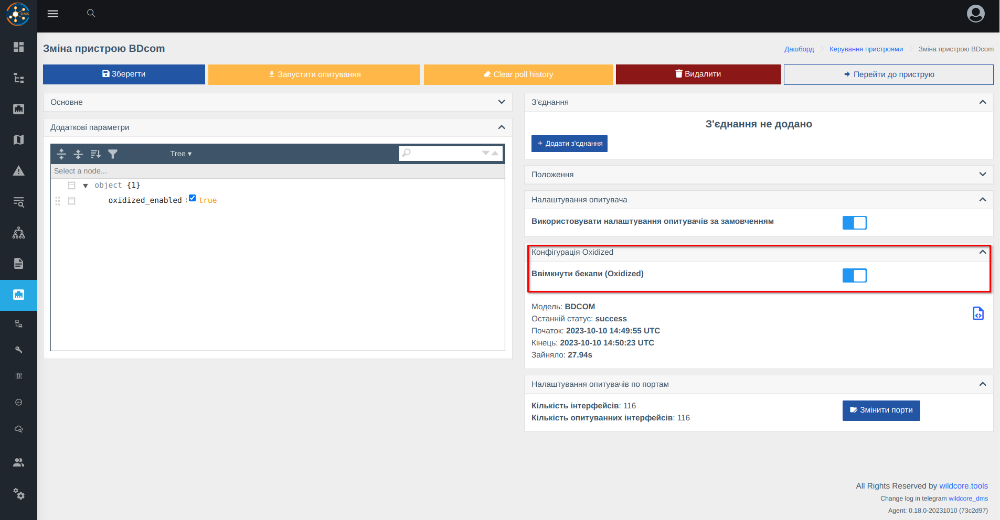
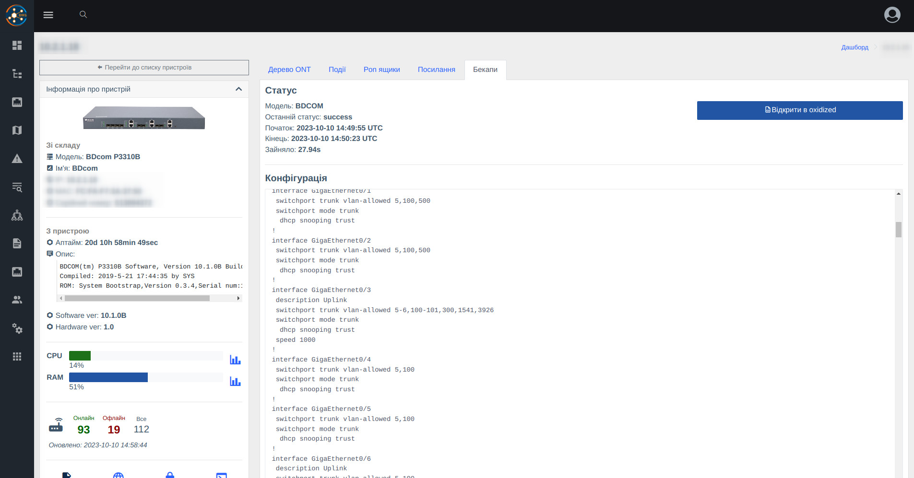
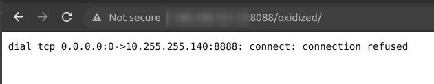
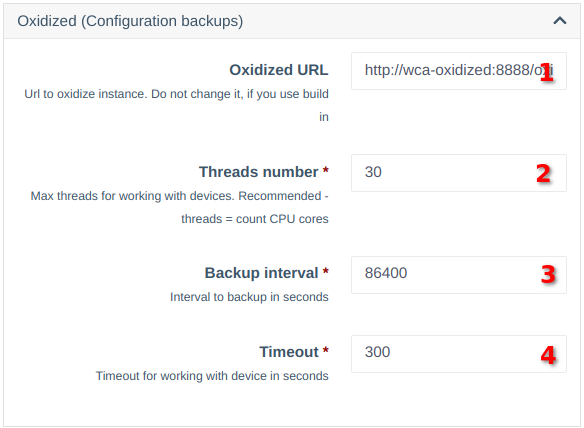

# Configuration Backups
The component interacts with the [Oxidized](https://github.com/ytti/oxidized) software.
Using Oxidized, it's possible to take backups via SSH/Telnet and store them in a local Git repository.

## Functionality Implemented in Wildcore
**1. Integrated and configured Oxidized (with user access restrictions)**

**2. Enabling backup collection through device configuration**


**3. Viewing the current config in a dedicated equipment tab (with user access restrictions)**


**4. Links to equipment in Oxidized, allowing you to view changes**

## ❗Notes on Startup
1. Backup collection is disabled by default.
2. If there is no equipment in the system to take backups from, Oxidized won't work (external applications will receive an error).
   
3. After enabling on the first device, Oxidized will start working after some time (checks every 5 minutes).
   If you don't want to wait, you can restart the container manually - `docker restart wca-oxidized`.

## Settings
In the system settings, there is an Oxidized block allowing you to configure some parameters.


1. **URL to Oxidized API** - If you don't plan to use an external instance, you don't need to change this parameter.
2. **Threads number** - The number of devices from which backups can be taken simultaneously (change according to your system if necessary).
3. **Backup interval** - How often to take backups. The time is specified in seconds.
4. **Timeout** - Time to take a backup, in seconds.

_When changing parameters marked (*), you will need to restart the system with the command:_
```shell 
cd /opt/wildcore-dms && docker compose up -d --build
```
## Storing Configurations in Your Git Repository
_To send the configuration to your Git, you need to have Git installed and configured in your system._

**1. Set up a local repository**
```shell
git config --global --add safe.directory /opt/wildcore-dms/var/oxidized/configs.git
git remote add origin <YOUR REPOSITORY>
git push --set-upstream origin master
```
**2. Add a cron task to send changes**
```shell
*/5 * * * * cd /opt/wildcore-dms/var/oxidized/configs.git && git push --set-upstream origin master
```

## Equipment Support
**Oxidized** is an open-source product. Thanks to its opensource, you can set up your own instance separately and add support for the necessary equipment.    
Also, you can contact us to add the required equipment (if it's already in Wildcore).

For Wildcore to work with your personal instance, change the address to Oxidized in the system settings.
Also, for Oxidized to receive a list of equipment for collection, specify the following config:
```yaml
source:
  default: http
  http:
    url: http://<АДРЕСА СИСТЕМИ WILDCORE>/api/v1/component/oxidized/internal/devices-list
    scheme: http
    delimiter: !ruby/regexp /:/
    read_timeout: 120
    map:
      ip: ip
      name: name
      model: model
      username: login
      password: password
      input: input
      full_name: full_name
    vars_map:
      enable: enable
      telnet_port: telnet_port
      ssh_port: ssh_port
      remove_secret: remove_secret
```
_Be aware that the Oxidized server must be listed in the allowed IPs._