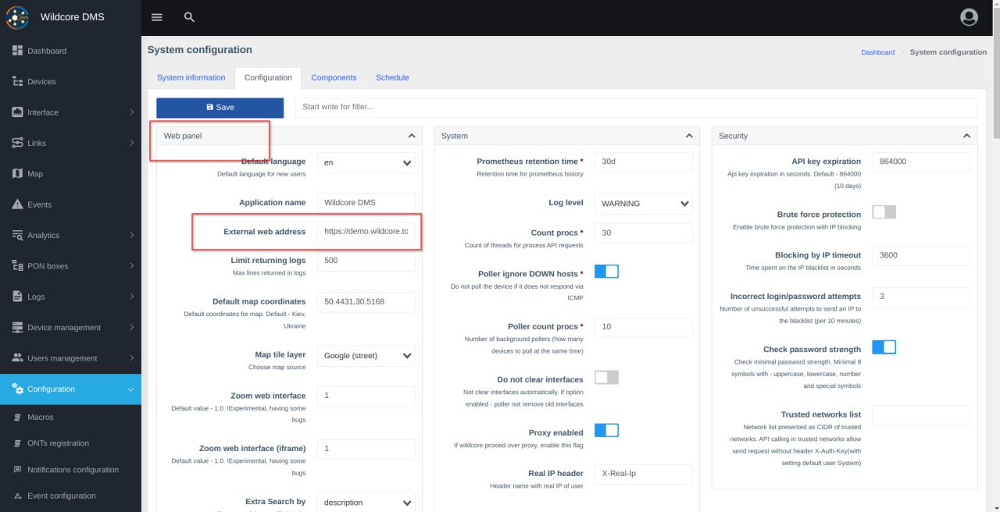
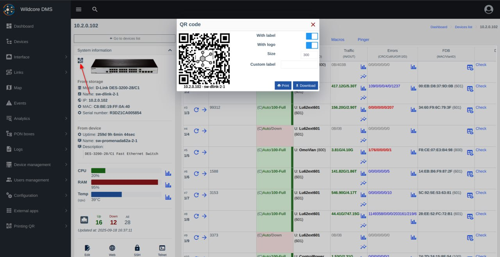
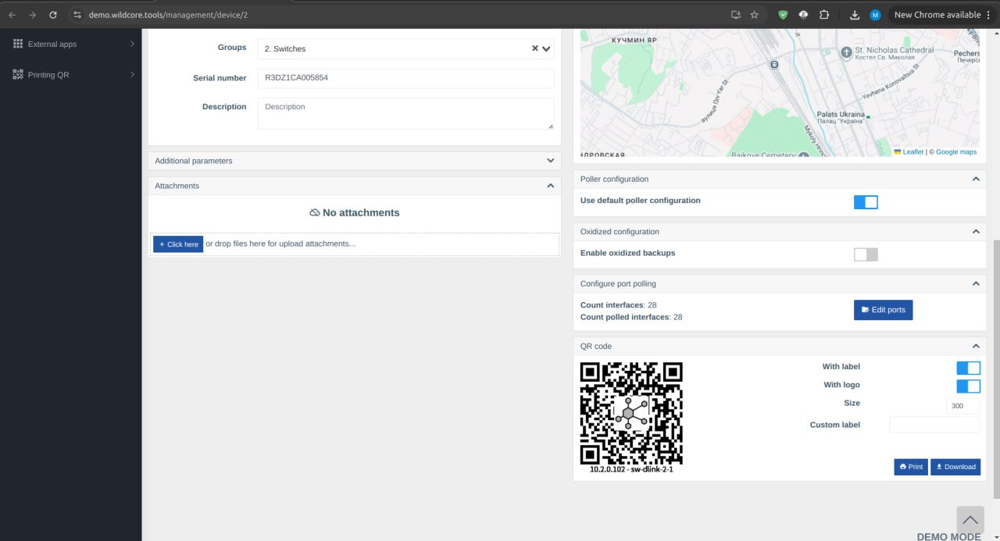
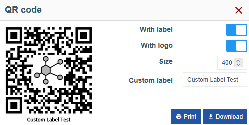
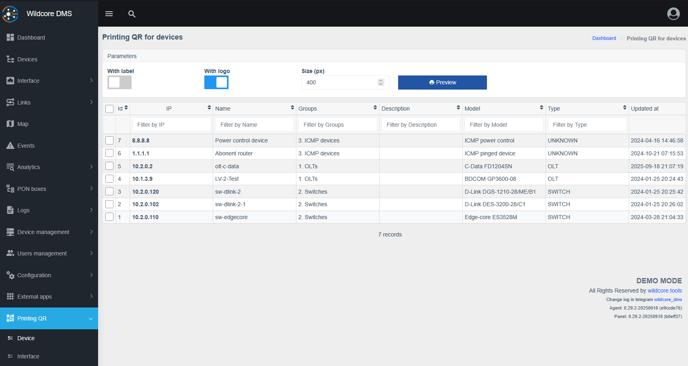
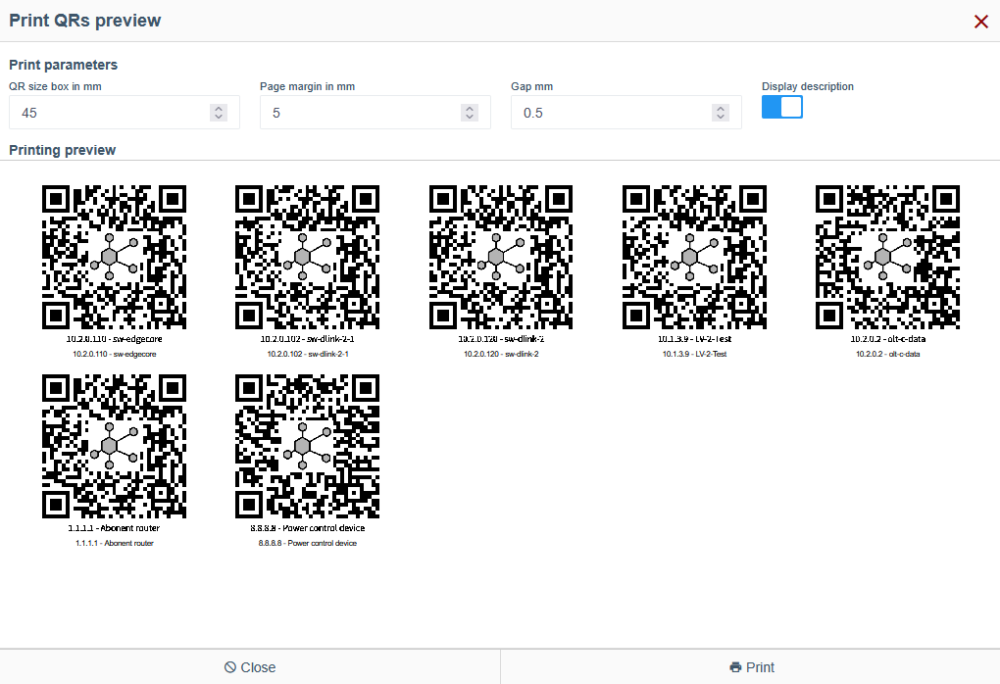
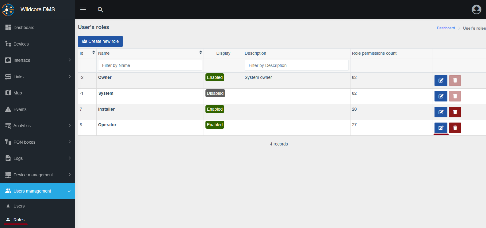
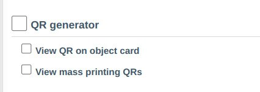

# QR Code Generator

!!! abstract "Overview"
    
    **QR Code Generator** is a component that allows you to generate a QR Code with a direct link to your WildCore object (device/interface).

!!! warning
    **QR Code Generator** requires Wildcore version `>=0.29`. Update instructions can be found [here](../installation-and-updating/update.md). 
    
    It is enabled by default immediately after the update.

## Setup
**QR Code Generator** component requires a short setup.

1. Go to `Configuration > System configuration > Configuration`.
2. Enter the proper `External web address` for your WildCore deployment.
3. Click `Save` at the top of the page.

??? quote "Visual aid"
    

## Generating and printing the QR Code
### Finding the QR code
QR codes for your devices and interfaces can be found in various locations, as well as on a QR mass printing page in the side menu.

To find the appropriate QR code you can navigate to:

1. Device/Interface dashboard page.

    ??? quote "Visual aid"
        
        

2. Central QR printing page, available on the left hand menu, for the type of object you're looking for.

    ??? quote "Visual aid"
        

By navigating to these locations you can find, download or print the code directly from the page.

### Printing the QR Code

Printing is a straightforward process, but the steps vary a little depending on the location you're printing from.

#### Printing from the Device/Interface dashboard

1. Go to the device/interface dashboard.
2. Find the QR code section, as shown in the "Visual aid" dropdown [above](#finding-the-qr-code).

    For devices it's an icon next to it's picture in the `System information` panel in the top left corner.

    ??? quote "Visual aid"
        
    
    For interfaces, scroll to the bottom of the page to find the `QR code` section.
    
3. Edit the QR code looks and size.

    You can add your logo, edit the label or change the dimensions of the QR code in pixels.

    ??? quote "Visual aid"
        

4. Click `Download` or `Print`.

#### Printing from the QR printing page

1. Go to `Printing QR > Device` or `Printing QR > Interface` according to the types of objects you're looking for.

    ??? quote "Visual aid"
        

2. Select all appropriate devices with checkboxes next to them.

3. Toggle necessary options at the top of the page, such as `With label` or `With logo`, and choose the appropriate the size.

4. Click `Preview` and fine tune the final layout parameters.

    They are as follows:

    - `QR size box in mm`: the actual printed QR code size
    - `Page margin in mm`: distance from the edge of a sheet you're printing on
    - `Gap mm`: distance between QR codes on a sheet

    You can customize these options in order to fit your desired dimensions, which can be useful for stickers of different formats.

    ??? quote "Visual aid"
        

5. Click `Print`.

## Permissions

!!! info
    Separate permissions are available for viewing the QR codes on the object dashboard and the mass printing page.

1. Go to `Users management > Roles` and `Edit` an appropriate role.

    ??? quote "Visual aid"
        

2. Find the `Component: QR generator` section and toggle necessary checkboxes. 

    Don't forget to save the changes at the top of the page.

    ??? quote "Visual aid"
        