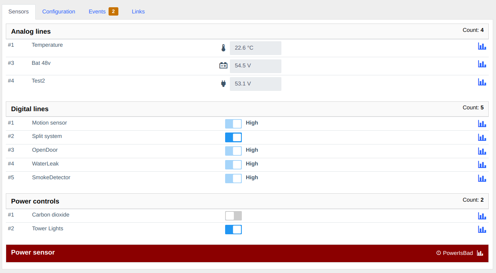
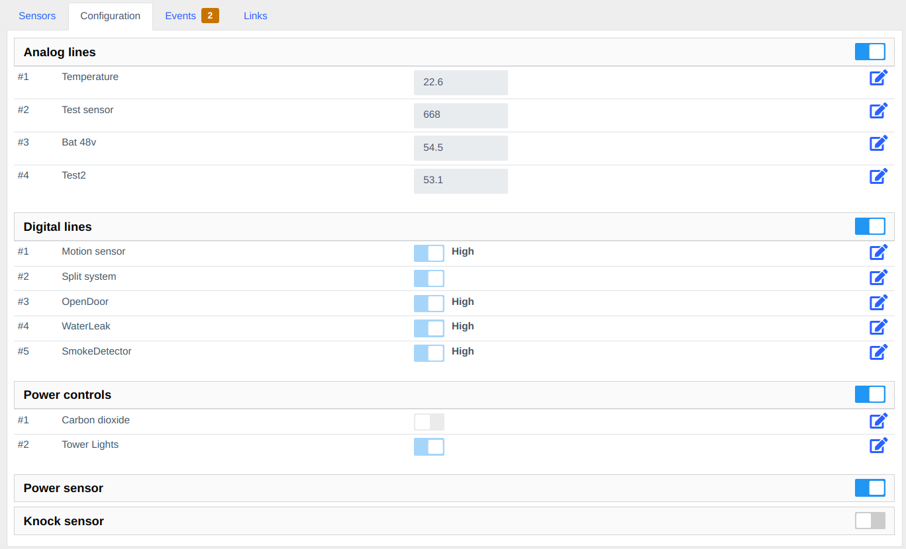
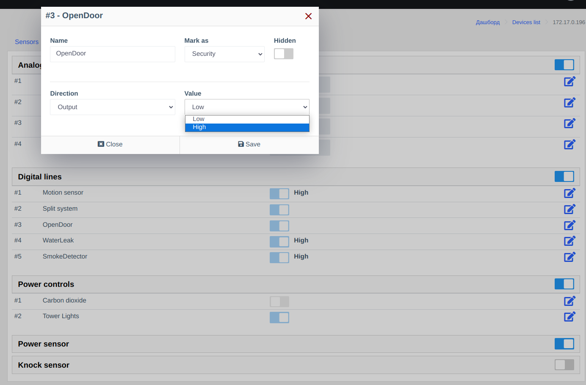

# Sensors Component
Allows working with remote monitoring and management devices.
Currently, only devices of the "Ping3" type are supported.

As this is a fairly versatile device with analog and digital lines, additional configuration is required to work with the device.
Values are obtained through SNMP.

## Functionality

**Web Panel**

- Viewing data from sensors
- Viewing history of indicators
- Management of digital inputs and outputs 220V
- Ability to set a name

**Metrics:**

- device_sensor

**Pollers:**

- system
- sensors_data

## Screenshots

## Notes
### Obtained Values
Values obtained via SNMP are displayed and stored according to the formula - value/10.    
This should be taken into account when configuring the device.

### Auto-detect
PING3 devices are not added automatically through auto-detection, and when adding a new device, you need to manually specify the model.     
