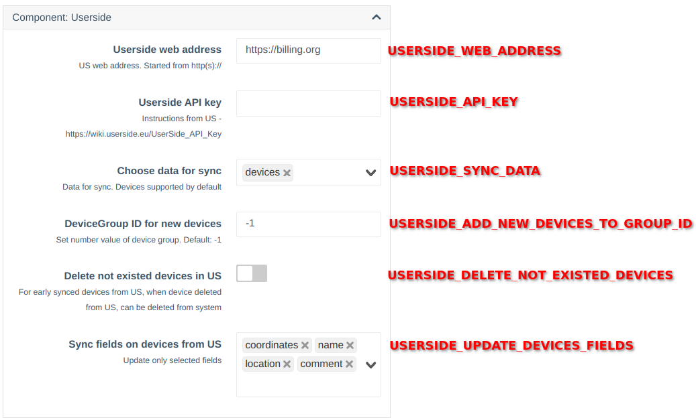

# Userside API Integration

!!! info "Component available since version **0.26**"
### Description
This component is designed to synchronize data from the Userside system.  
It currently allows synchronization of devices, including their credentials, name, coordinates, and comments.

!!! warning "If device credentials (community, login, or password) were changed in the Userside system, they must be updated manually in WildCore"

!!! info "During synchronization, new credentials may be automatically created if no matching entries (by community, login, and password) are found in the system"

### Installation and Configuration
The component is built-in and does not require separate installation. It must be enabled before use.

!!! info "To configure the API in the Userside system, use the instruction: [https://wiki.userside.eu/UserSide_API_Key](https://wiki.userside.eu/UserSide_API_Key)"

#### Scheduler Configuration
!!! info "When the component is enabled, a task will be automatically added to the scheduler and automatic synchronization will be enabled"

#### Configuration


**Parameter Descriptions**:

* **USERSIDE_WEB_ADDRESS** - Web address of your Userside installation

* **USERSIDE_API_KEY** - API key for accessing Userside

* **USERSIDE_SYNC_DATA** - Types of data to synchronize

  Type: `multiselect`    
  Options: `['devices']`    
  Default: `['devices']`

* **USERSIDE_ADD_NEW_DEVICES_TO_GROUP_ID** - ID of the group to which new devices will be added.

  !!! info "Group ID can be found at management/device-group"
  !!! info "It is recommended to create a separate group for new devices and then manually move them."

* **USERSIDE_DELETE_NOT_EXISTED_DEVICES** - Delete devices that no longer exist in Userside.

  Type: `checkbox`    
  Default: `no`

  !!! info "This option works for equipment that was previously added or updated from Userside."
  !!! warning "Deleting or modifying in Userside may result in removal of equipment from Wildcore!"

* **USERSIDE_UPDATE_DEVICES_FIELDS** - Device fields to update during synchronization.

  Type: `multiselect`    
  Options: `['coordinates', 'name', 'location', 'comment']`    
  Default: `['coordinates', 'name', 'location', 'comment']`


!!! noty "After saving the parameters, it is recommended to run the first synchronization manually"

#### Verification
```shell 
sudo wca -v userside_integration:sync 
``` 

**Command Description**:
```shell

wca userside_integration:sync --help
Description:
  Sync data from userside

Usage:
  userside_integration:sync [<load-only>...]

Arguments:
  load-only             Sync only types [default: ["devices"]]

Options:
  -h, --help            Display help for the given command. When no command is given display help for the list command
  -q, --quiet           Do not output any message
  -V, --version         Display this application version
      --ansi|--no-ansi  Force (or disable --no-ansi) ANSI output
  -n, --no-interaction  Do not ask any interactive question
  -v|vv|vvv, --verbose  Increase the verbosity of messages: 1 for normal output, 2 for more verbose output and 3 for debug

```
