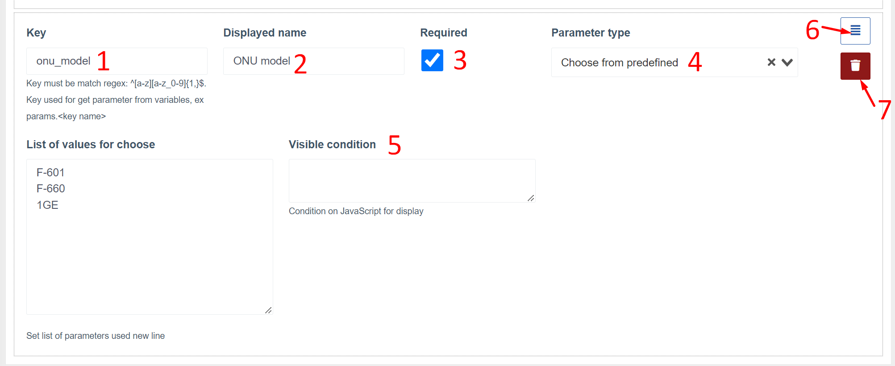
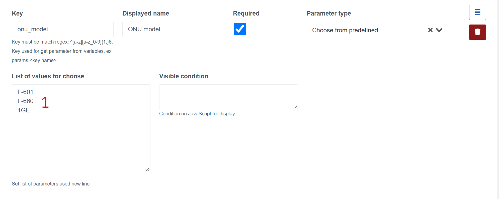
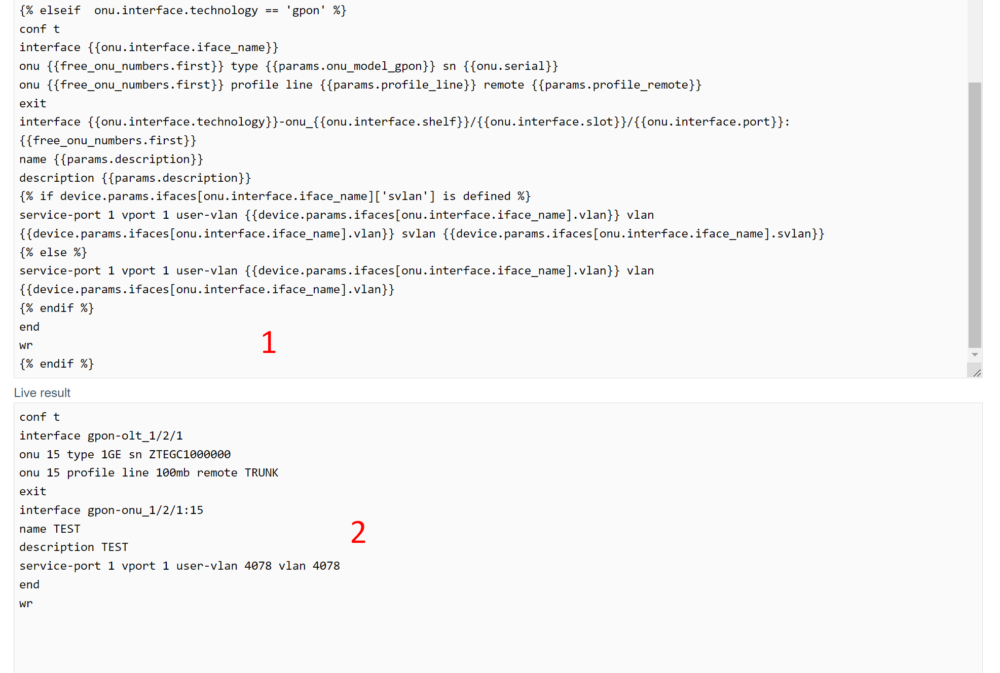

# Registration of ONU on OLTs ZTE
This component checks for unregistered ONUs on ZTE OLTs.
It also allows registration of new/unregistered ONUs by filling out a short form.

## How it works?
After an unregistered ONU is detected, it starts to be displayed in the list (on the dashboard, for all devices and in the device itself).
When you click the "Register" button, a registration form opens.
The form fields to fill out are dynamically generated based on parameters prepared by the engineer.
After filling in the form fields and pressing the register button, a list of commands for registering an ONU is compiled based on a template, entered parameters and parameters received from the device and an unregistered ONU.
If the template compilation is successful, the commands will be executed on the OLT.
Upon successful registration - a notification of successful registration will be displayed and automatically redirected to a new ONU.

### Notes

* The entire console output on registration can be viewed in the equipment call logs (multi_console_command module), both for successful registration and in case of an error;
* In case of an error on any of the commands, the execution of the commands will be suspended.
The execution can be suspended already after the entered commands for the ONU registration itself.
In this case, you need to find under the ONU, under which number it was registered and manually configure it through the engineer on the OLT (or delete it and try to register again);
* To generate the template, use [twig](https://twig.symfony.com/). Use the official documentation for the template engine to find out what features are available. For example, branching(if-else);
* If you have some unique settings on each individual OLT - you can specify them in the additional device parameters and use them in the template or parameters. A common practice is to specify custom vlans (for individual ports or the entire device). Such parameters will be available in the `device.params` object

## Component in the web interface
### Registration of an unregistered ONU
**List of unregistered ONUs on the device**

** ONU registration form **

### Registration configuration
**Configuration Page**

**Parameter settings tab**

1. Device and ONU selection block. Only ZTE OLTs are displayed in the device list. You need to select a device and an unregistered ONU to get a list of dynamic parameters.
2. Variables available after selecting the device and ONU, which can be used in the settings of the registration form fields
3. Registration form field

**Template settings tab**

1. Device and ONU selection block. Only ZTE OLTs are displayed in the device list. You need to select a device and an unregistered ONU to get a list of dynamic parameters.
2. Registration form prepared in [options tab](#config_params)
3. Variables available after selecting a device, ONU and filling in the form parameters that can be used to compose a template
4. Block for changing the template (under the template you can also view the generated set of commands)

## Variables
Variables are nested objects with fields.
The value of the object fields is generated automatically based on the current user, the equipment on which the unregistered ONU is located.

You can use these variables to generate the template as well as the behavior of the registration form.

**The root object contains the following fields**:

* **user** - current user in the system
* **device** - device on which registration is performed
* **params** - values entered in the registration form
* **profiles** - list of line and remote profiles received from OLT
* **onu** - ONU that is being registered
* **free_onu_numbers** - contains two fields (the first free onu) and a list of all free onu on the port where the unregistered ONU is located.

## Registration form parameters
### The following types of parameters are available in the system:
* Selection (drop-down) from preset values
* Selection (drop-down) of variables
* Input field with default value from variable
* Input field

### A typical parameter configuration block (for example, type is a choice from preset values)

1. **Key(key)*** - By the name of the key, it will be possible to access the parameter value in the template, which will be available by params.KEY_NAME. It is advisable to enter keys only in Latin and, if necessary, use underscores;
2. **Displayed name*** - The name of the field that will be displayed in the registration form;
3. **Flag "required"** - indicates that during registration, this field must be filled in (or selected in case of dropout);
4. **Parameter type*** - Parameter type. You must select one of the following;
5. **Visible condition** - javascript condition for displaying the field. Should return true or false depending on the variables.
6. **Sort button** - by holding the button you can drag the parameter up/down. This will change the order of the fields in the registration form
7. **Parameter delete button**

_* - required field_

### Parameters by field types
**Choose from preset options**

1. Here you can list the list of options (from a new line) for selection during registration

**Select from variable**

1. Source of values (only arrays containing primitive values are displayed in the list)
2. After selection - a list of values is displayed

**Input field with default value from variable**

1. The source of the value (only variables with a primitive type are displayed in the list)
2. Default value if there is no variable or empty
3. Regular expression for input value

**Input field with default value from variable**

1. Default value
2. Regular expression for input value

## Command pattern
The template is used to create a list of commands to be executed on the OLT during ONU registration.
When composing a template, you must use variables.
Below the template block is another block that compiles the template and allows you to view the final list of commands that will be executed on the hardware.
Compilation of the final list of commands will work only when choosing equipment, ONU. It is also recommended to fill out the form.

1. Template block
2. Live result block (final list of commands)

## Guidelines for setting up logging
* Add ZTE OLT
* Add an unregistered ONU in the network on this OLT

This will allow you to understand in more detail what variables are and how they are filled.

