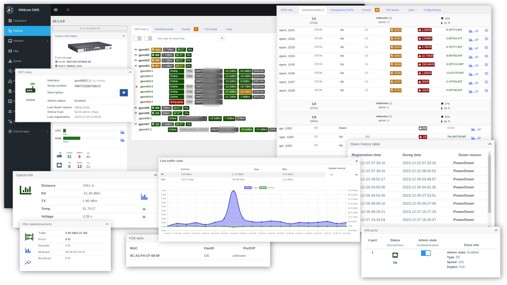
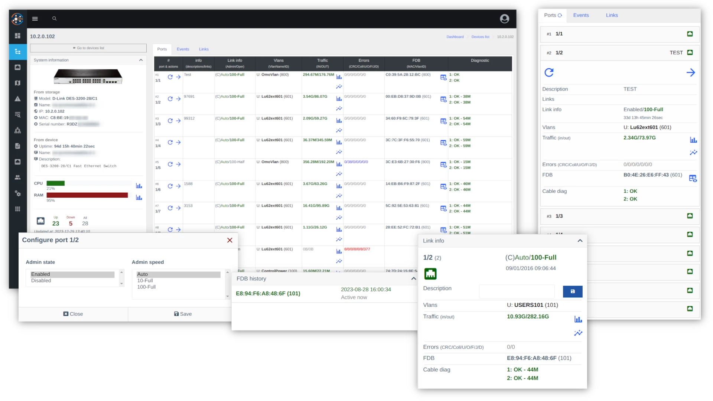

# Main features

!!! abstract "Overview"

    WildcoreDMS is a network hardware monitoring and management system for internet service
    providers: OLTs (GPON/EPON), switches, routers and sensors in one web interface, with metric
    history, events, notifications and tools for support staff and installers.

## Supported hardware

More than 150 models from over 20 vendors, including:

- **OLTs:** Huawei MA56xx/MA58xx (GPON/EPON), ZTE C3xx/C6xx, BDcom P3xxx/GP3600, C-Data FD11xx/FD12xx/FD16xx/FD17xx, V-Solution, GCOM;
- **Switches:** D-Link, Edge-core, Huawei, Cisco, Juniper, HP/HPE, Dell, Eltex, Raisecom, TP-Link, Mikrotik (RouterOS/SwOS), Arista, Alcatel, Allied Telesis, Extreme and others;
- **Routers:** Mikrotik RouterOS;
- **Other:** ICMP devices (ping any host), sensors/monitoring devices.

Full list with each model's capabilities — [Supported hardware](../supported-hardware.md).
Hardware is accessed via **SNMP v1/v2c**, **console (Telnet/SSH)** and **API** (RouterOS).

!!! info
    Functionality may vary depending on the hardware type, vendor and model.

## Hardware information and state

Data is available both in real time and from polling history.

- **OLTs**
    - SNMP and ICMP availability, CPU/RAM/temperature, uptime;
    - PON ports, ONU tree, PON port load, SFP modules;
    - ONUs: status (Online/Offline/LOS/PowerOff), serial number/MAC, RX/TX/OLT-RX signal levels,
      distance, temperature, disconnect reasons and history, vendor and firmware;
    - ONU Ethernet ports and their VLANs, ONU IP address, MAC table behind the ONU;
    - **[signal level history](../system/onu-signal-history.md)** with min/max and deviation from the current value;
    - **[DHCP Snooping](../system/dhcp-snooping.md)** and **[ONU blacklist](../system/onu-blacklist.md)**;
    - traffic and errors on physical ports and ONUs;
    - link aggregation (LACP) and per-port VLANs (ZTE C600).

- **Switches**
    - availability, CPU/RAM/temperature;
    - port state, speed, description, VLANs, errors, traffic, state change history;
    - FDB table and **FDB history** (where and when a MAC address was seen);
    - SFP modules and optical levels (DDM), cable diagnostics;
    - LLDP neighbors;
    - ARP and routes on L3 hardware, DHCP Snooping.

- **Mikrotik RouterOS** — interfaces, ARP, DHCP servers and leases, address lists, simple queues, BGP sessions.

Every value shows where it came from — the cache (with a date) or directly from the hardware;
the **"Refresh info"** button requests fresh data.
See [Working with hardware](../system/working-with-hardware.md).

## Hardware management

- **ONUs:** reboot, reset, delete (deregister), enable/disable, clear counters, change description,
  manage UNI ports;
- **Switch ports:** enable/disable, speed, description, VLANs on ports, clear counters;
- **Device:** reboot, save configuration;
- **[ONU registration](../components/onts-registration/getting-started.md)** via a simple form:
  unregistered ONUs are shown on the dashboard and on the OLT page, free ONU numbers are suggested.
  Works on Huawei, ZTE, BDcom, C-Data and others — the registration template is tailored to your network;
- **[Macros](../components/macros/getting-started.md)** — your own console command scenarios with
  parameters, conditions and confirmations for any action not available out of the box;
- **[Web console](../components/console.md)** — a terminal to the hardware right in the browser,
  with auto-login and a session log.

All actions are recorded in the action log.

## Background data collection

Pollers collect port and ONU state, signal levels, FDB, traffic, errors, device resources, etc.
in the background. The data is used for interface history, charts, analytics and events.
Polling intervals are configured per model, device and individual port —
[Hardware Poller](../system/poller.md). The system also receives **SNMP traps**
(link and ONU state changes) for an instant reaction.

## Events and notifications

- Events are generated by rules based on [Prometheus](https://prometheus.io/) and
  [PromQL](https://prometheus.io/docs/prometheus/latest/querying/basics/). Out of the box:
  device or port failure, growing errors, bad ONU signal. Rules can be changed and your own added —
  [Events](../components/events.md).
- [Notifications](../components/notifications.md) — **Email** and **Telegram**. Each user receives
  only notifications about hardware available to them.
- Integration with Prometheus/Alertmanager and Grafana.

## Analytics and data history

The **"Analytics"** section — network-wide reports with filters, charts and Excel export:

| Report | What it shows |
|--------|---------------|
| **Device statuses** | Device availability over time: when and how many devices were down |
| **ONU statuses** | ONU state history (Online / Offline / LOS / PowerOff) by OLT and group |
| **ONU signal levels** | ONU distribution by signal level, ONUs outside the normal range (normal RX/OLT RX limits are set in the settings) |
| **Increasing errors** | Ports and ONUs with growing error counters, with a chart per interface |
| **Duplicate MAC addresses** | The same MAC on several ports/ONUs (uplinks are ignored) — finding cloned routers and loops |
| **Duplicate ONUs** | The same ONU serial or MAC on different OLTs/ports |

**What is stored and for how long:**

- **polling metrics** — port and ONU states, signal levels, traffic, errors, CPU/RAM load, device
  availability. Charts, analytics and events are built on them. Retention is set by
  `PROMETHEUS_RETENTION_TIME` (**30 days** by default) — see
  [System configuration](../installation-and-updating/env-configuration.md);
- **interface and ONU state history** — the uptime table and disconnect reasons on the port/ONU page;
- **FDB history** — on which port/ONU and when each MAC address was seen;
- **ONU signal level limits** — min/max since the last reset, see
  [ONU signal level history](../system/onu-signal-history.md);
- **logs** — user actions, hardware calls, poller, scheduler, SNMP traps, web console sessions.

!!! note
    Analytics shows data for **all** devices regardless of the user's groups, so grant access to
    administrators only.

## Map, topology and links

- Devices and ONUs on the **map** (Google, OpenStreetMap, OpenTopoMap), links between them with
  route editing; setting coordinates from the map or phone geolocation.
- **[Objects nearby](../web-interface/nearby-objects.md)** — devices and ONUs near you or a given
  point, with a route to them.
- **[Links](../components/links/describe.md)** between devices,
  **[autotopology](../components/links/autotopology.md)** via LLDP/FDB, topology as a tree and a graph,
  [link utilization](../components/links/utilization.md).

## Search and diagnostics

- Global search: devices, ports and ONUs by name, IP, description, contract number, ONU serial/MAC,
  FDB history, and by tags (`#tag`).
- Subscriber lookup by MAC/IP through ARP/FDB tables, FDB history.
- Diagnostics: ICMP ping, ARP ping, traceroute, subscriber port diagnostics for billing.
- Favorite interfaces and tags for quick access to important ports.

## Web interface

- Customizable **[dashboard](../web-interface/dashboard-overview.md)** with widgets.
- **[Dark and light themes](../web-interface/theme.md)**, field hints, Ukrainian, English and Russian languages.
- Adapted for phones and tablets, with **[bottom navigation](../web-interface/mobile-navigation.md)**.
- Works as an **app (PWA)** — installs on a phone or computer (HTTPS required).
  [Installation guide](https://support.google.com/chrome/answer/9658361).
- **[Attachments](../components/attachments.md)** (photos, documents) for devices, ports and ONUs.
- **[QR codes](../components/qr-code-generator.md)** for hardware labels linking to its page.

## Users and security

- **[Roles and permissions](../management/roles.md)** — detailed permissions for viewing and every
  action (e.g. an installer can register ONUs but not manage PON ports).
- **[Device groups](../management/device-groups.md)** — every user sees only their own hardware.
- **[Single Sign-On](../sso/index.md)** (OpenID Connect): Keycloak, Authentik, Google Workspace,
  Microsoft Entra ID, Auth0, Authelia — with roles assigned from groups.
- Two-factor authentication, IP sign-in restrictions, brute-force protection,
  encryption of hardware credentials.
- [API keys](../web-interface/api-key-generation.md) with expiration and active session management.

## Integrations and API

- **Billing systems:** [MikBill](../components/mikbill_integration.md), [NoDeny Plus](../components/nodeny_plus.md),
  [Userside](../components/us_integration.md) — subscriber data next to the port/ONU and diagnostics from billing.
- **[Config backups](../components/oxidized.md)** with [Oxidized](https://github.com/ytti/oxidized)
  and change history (optionally stored in Git).
- **[REST API](../api/index.md)** with full OpenAPI/Swagger documentation and
  [examples](../api/examples.md) for integrating with your systems.
- Metrics in Prometheus, access to Grafana and Alertmanager from the web interface.

## Installation and updates

The system runs in **Docker** — no need to install dependencies and libraries manually.
Installation and updates are done by the **[wca-tool](../wca-tool/index.md)** utility, and
maintenance by [`wca`](../cli/index.md) console commands (CSV device import, managing components,
users, cache, etc.). System parameters are in the [`.env`](../installation-and-updating/env-configuration.md)
file and partly in the web interface.
Additional capabilities are added as [components](../components/index.md).
