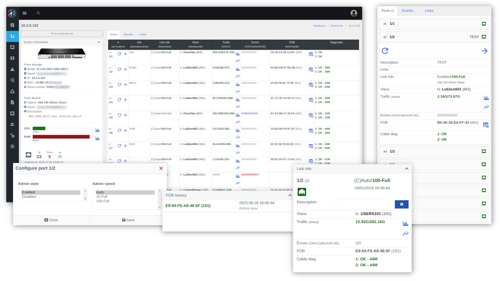

# Core Functions

### Real-time Equipment Operation
This method of obtaining information is best suited for accurate and fast equipment diagnostics.

#### Displaying Equipment Information and Status
With the system, you can obtain real-time information about the equipment.

- **For OLT**
    - Availability via SNMP and ICMP
    - CPU/RAM/Temperature
    - Port list
    - MAC/SN of ONUs
    - ONU status
    - FDB table
    - Signal levels
    - List and status of Ethernet ports on ONUs
    - Causes of downtime
    - Traffic
    - Errors

- **For Switch**
    - Availability via SNMP and ICMP
    - CPU/RAM/Temperature
    - Port status
    - Errors
    - Traffic
    - FDB table
    - Cable diagnostics (DDM SFP module)

#### Equipment Management
The system has certain hardware control elements, such as: rebooting the ONU, removing the ONU, changing port/ONU descriptions, and managing ports (turning on/off).    
Additionally, it allows for expanding control independently through the use of [macros](../components/macros.md).

!!! info
    Functionality may vary depending on the type of equipment, manufacturer, and model

### Adapted for Mobile Devices and Tablets
The web interface of the system is built on the basis of [SPA](https://en.wikipedia.org/wiki/Single-page_application).    
The interface operates without page reload, representing a full-fledged web application.    
Thus, even with "slow" internet speed, the user can use the system.    

!!! tip
    The system allows for operation as a Progressive Web Application (PWA).    
    For it to work, the system requires operating through HTTPS.   
    Here you can find installation instructions for applications [support.google.com](https://support.google.com/chrome/answer/9658361?hl=en&co=GENIE.Platform%3DiOS).   

### Events and Notifications
The use of [Prometheus](https://prometheus.io/) and [PromQL](https://prometheus.io/docs/prometheus/latest/querying/basics/) queries gives the flexibility to configure event generation. Out of the box, event generation is configured for device or interface failure, error growth, and poor signal.

Notifications can be configured via Email or Telegram. The system's notification feature ensures that a specific user receives only the notifications they need. For example, in case of equipment failure, notifications are received only by users with access to that equipment.

### Registration of new ONUs
The system includes a component for ONU registration, allowing registration by filling out a simple form.      
Unregistered (new) ONUs are displayed in a widget on the main page and in the device dashboard.

!!! tip 
    Learn more about [ONU registration](../components/onts_registration.md)

!!! note
    Works for Huawei and ZTE OLTs. 

### Background Information Collection from Equipment
Background pollers collect information about FDB, port/ONU status, errors, traffic, and more.    
This data is used to obtain interface history, build graphs, and generate notifications.

### Flexible Access Rights Configuration for Users
Thanks to advanced access rights and roles configuration, you have the ability to restrict certain functionality for users.   
For example, you can prohibit a technician from mounting or managing PON ports or restarting equipment.    
Additionally, equipment is divided into groups, and there is an option to limit visibility of groups and equipment for a specific user.

### Equipment Configuration Collection
The system uses a tool called [Oxidized](https://github.com/ytti/oxidized) for configuration collection.     
You can view the current equipment configuration without accessing it directly and also see the history of changes.    

!!! tip       
    If desired, you can store the configuration in Git.

### Works in Docker
We use [Docker](https://en.wikipedia.org/wiki/Docker).     
Thanks to Docker, you no longer have to install software of specific versions, deal with dependencies, and install necessary libraries.    
All you need to install the system is to download and run the [wca-tool](../wca-tool/index.md) utility.    
The utility will install Docker and other necessary software for running.

!!! tip
    **[wca-tool](../wca-tool/index.md)** is a specialized utility for installing and updating the system