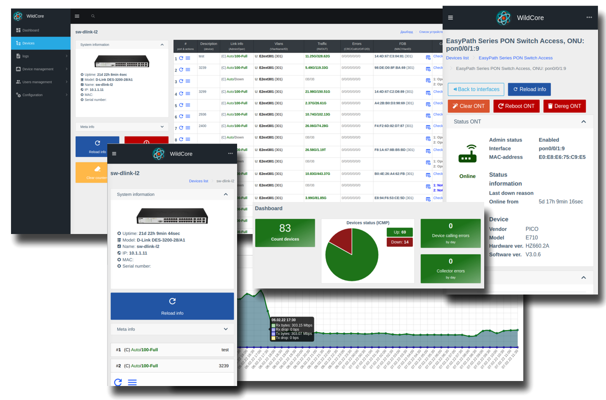

# **WildcoreDMS** - monitoring, diagnostics and device management system.

### Our goal
Provide the installer / operator with a convenient tool for diagnosing the network, equipment and a specific subscriber,
thereby:

- Increase the speed of response to diagnosing and solving problems with the network;
- Save the engineer from the need to always "sit on the phone" and process requests from employees.

### System features
* Modularity - the ability to connect only the necessary components
* Work in docker
* Easy installation and updating - using a special utility, installation and updating is done in a few commands
* Easy system setup - after installation, you only need to add devices and users
* Role-Based Access Control (RBAC)
* Logging of user actions, work with equipment, work scheduler
* Collection of metrics in Prometheus
* API - integrate wildcoreDMS with billing or other systems

### System components
* **analytics** - Allow see current status and history of device, interfaces and ONTs
* **autodiscovery** - Search and automatically add supported equipment on the network
* **events** - Events. Allows you to view and save the history of equipment/interfaces based on the created promQL rules
* **fdb_history** - stores FDB history and allows display by interface/ONU
* **notifications** - Allows you to send notifications via telegram/email on events and actions
* **pinger** - Monitors equipment via ICMP, displays current status in dashboard and device list
* **pon_boxes** - Allows you to manage PON boxes
* **prometheus_wrapper** - Works with the prometheus API. Allows you to display graphs in the web interface for traffic, signal levels, temperature, errors
* **router_os** - Work with routers from Mikrotik
* **olts** - a component that implements a standardized API for working with olts
* **switches** - a component that implements a standardized API for working with switches 
* **olts_control** - a component realize simple ONT management(reboot, change description, disable/enable, reset, etc)
* **switches_control** - a component realize simple switch port management(disable/enable, description, etc)
* **zte_unregistered_onts** - Registration of ONUs on ZTE
* **huawei_onts_registration** - ONUec registration on Huawei

_All of the above components are provided with the system at the time of beta testing_

### Supported Hardware
* Alcatel (switches)
* Cisco (switches)
* Dlink (switches)
* Edge-Core (switches)
* Eltex (switches)
* HP (switches)
* Dell (switches)
* UBNT (switches)
* TP-LINK (switches)
* Huawei (switches, OLTs)
* BDcom (OLTs)
* C-data (OLTs)
* V-Solution (OLTs)
* ZTE (OLTs)
* Mikrotik (routers)

Full list of supported hardware by models - [https://github.com/meklis/switcher-core/blob/master/docs/DEVICES.md](https://github.com/meklis/switcher-core/blob/master/docs/DEVICES.md)

