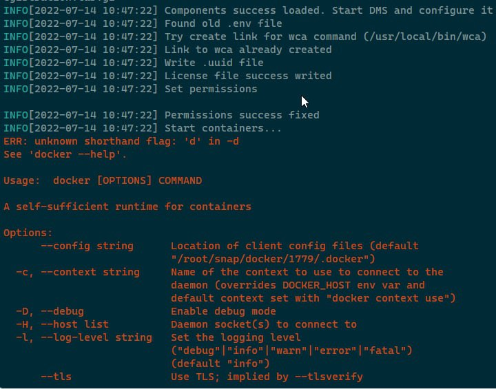
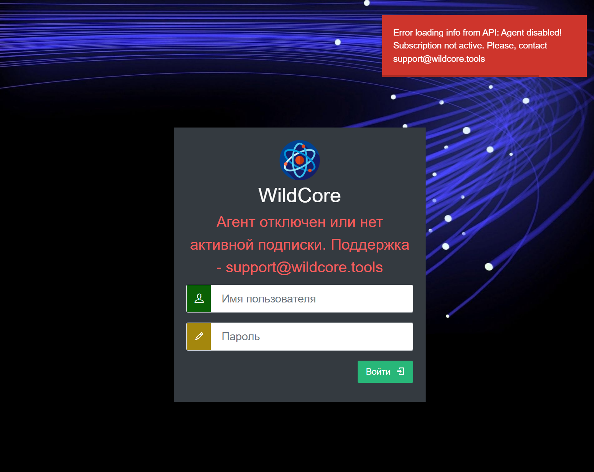

*At the moment, the only way to install and work is provided inside the docker with installation via wca-tool.*

## Installation
Execute the command
```shell
sudo wca-tool --key=YOUR_AGENT_KEY install
```
*YOUR_AGENT_KEY - the agent key that you received upon contacting (see requirements)*
The installation process takes some time (usually 10-15 minutes).

If the installation is successful, a message will be displayed
```shell
WildcoreDMS success installed!
Now, you can use wildcoreDMS by URL: http://<service ip|domain>:8088
Default login/password - admin/admin

You can change some parameters in /opt/wildcore-dms/.env file, as listen ports for example
```

After installation, go to the web panel.
By default, the panel is available on port `8088`, and the default login/password is admin/admin.


## Frequent installation problems
### docker-compose-plugin not installed
Usually the error looks like this:


It is required that docker-compose be installed on the system as a plugin for docker, and not as a separate utility.

To fix the problem:

1. Install the `docker-compose-plugin` package for your OS (see installation instructions in the official docker documentation - [docs.docker.com](https://docs.docker.com/engine/install/))
2. Check that it actually works - the `docker compose version` command should return the version of the plugin.
3. Continue installing wildcoreDMS with ```sudo wca-tool update```

### Agent disabled
After successful installation, when you try to login - a message is displayed

This problem may be related to the installation of the system on "weak" servers (less than indicated in the recommendations)
Solved as follows:

1. We are waiting for 5-10 minutes (the DBMS should start. You can also follow the launch with the command `docker logs -f wca-db`)
2. Run the command `docker exec -it wca composer install`
3. Run the command `wca migration:migrate --up *:*`
   1. If during the execution of the command we received a connection to the database (for example, Connection refused) - return to point 1.
4. Run the command `wca system:check`
5. Trying to re-login through the web interface


### Network related errors
May appear as log entries like: `Connection refused`, `Connection timeout`, `Forbidden`

Recommended actions:

1. Read from the logs where exactly the attempt is made to connect
2. Make sure that this address is available from the server (check the availability with the same curl in case of HTTP)
3. If everything is fine with the answer - check that everything is fine with the docker (installed according to the official dock, there were no old versions and the version was installed specifically for your system)

After fixing the problem, you can perform an additional installation with the `wca-tool update` command.
