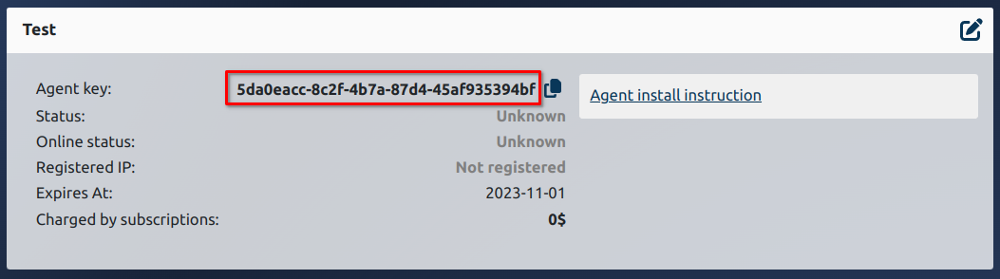

*At the moment, the only way to install and work is provided inside the docker with installation via wca-tool.*
 
#### 1. Install actual version of wca-tool     
```shell
sudo curl -L "https://releases.wildcore.tools/wca-tool/latest/wca-tool-$(uname -s)-$(uname -m)" -o /usr/local/bin/wca-tool && sudo chmod +x /usr/local/bin/wca-tool
```

#### 2. Run command for install DMS 
```shell
sudo wca-tool --key=YOUR_AGENT_KEY install 
```
!!! tip
    **YOUR_AGENT_KEY** - the agent key that you received upon contacting (see requirements) or from your cabinet   
      
!!! note
    The installation process takes some time (usually 10-15 minutes)

If the installation is successful, a message will be displayed
!!! 
    ```shell
    WildcoreDMS success installed!
    Now, you can use wildcoreDMS by URL: http://<service ip|domain>:8088
    Default login/password - admin/admin
    
    You can change some parameters in /opt/wildcore-dms/.env file, as listen ports for example
    ```

After installation, go to the web panel.
By default, the panel is available on port `8088`,     
and the default login/password is **admin/admin**.


## Frequent installation problems
### docker-compose-plugin not installed
Usually the error looks like this:


It is required that docker-compose be installed on the system as a plugin for docker, and not as a separate utility.

To fix the problem:

1. Install the `docker-compose-plugin` package for your OS (see installation instructions in the official docker documentation - [docs.docker.com](https://docs.docker.com/engine/install/))
2. Check that it really works - the `docker compose version` command should return the plugin version.
3. Continue installing wildcoreDMS with the command ```sudo wca-tool update```
 

### Network related errors
Can be manifested by entries in logs like: `Connection refused`, `Connection timeout`, `Forbidden`

Recommended actions:

1. Read from the logs where exactly the attempt is made to connect
2. Make sure that this address is available from the server (check the availability with the same curl in case of HTTP)
3. If everything is fine with the answer - check that everything is fine with the docker (installed according to the official dock, there were no old versions and the version was installed specifically for your system)

After the problem is fixed, the reinstallation can be performed with the `wca-tool update` command.

### Web not working and command wca returned error 
Use command `docker ps -a` for checking working containers and check logs on restarting containers over command `docker logs ...` 

