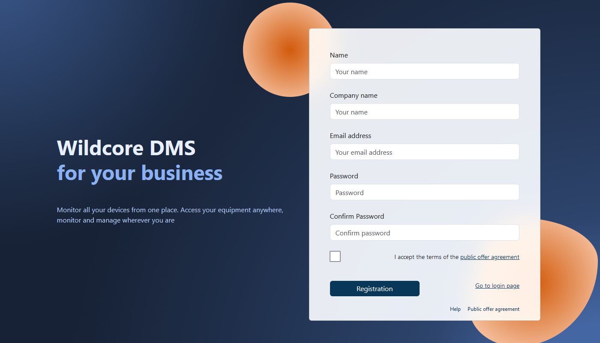
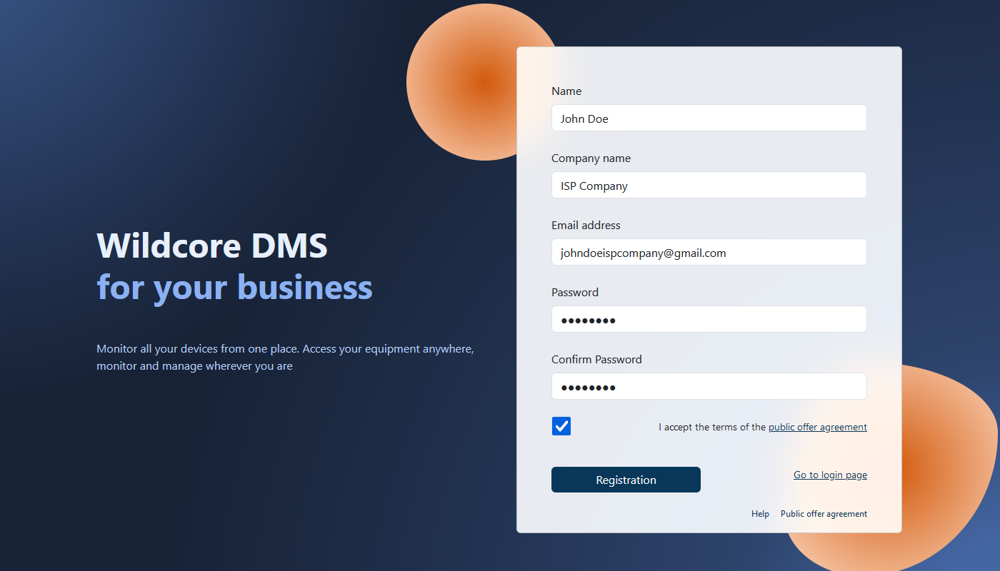
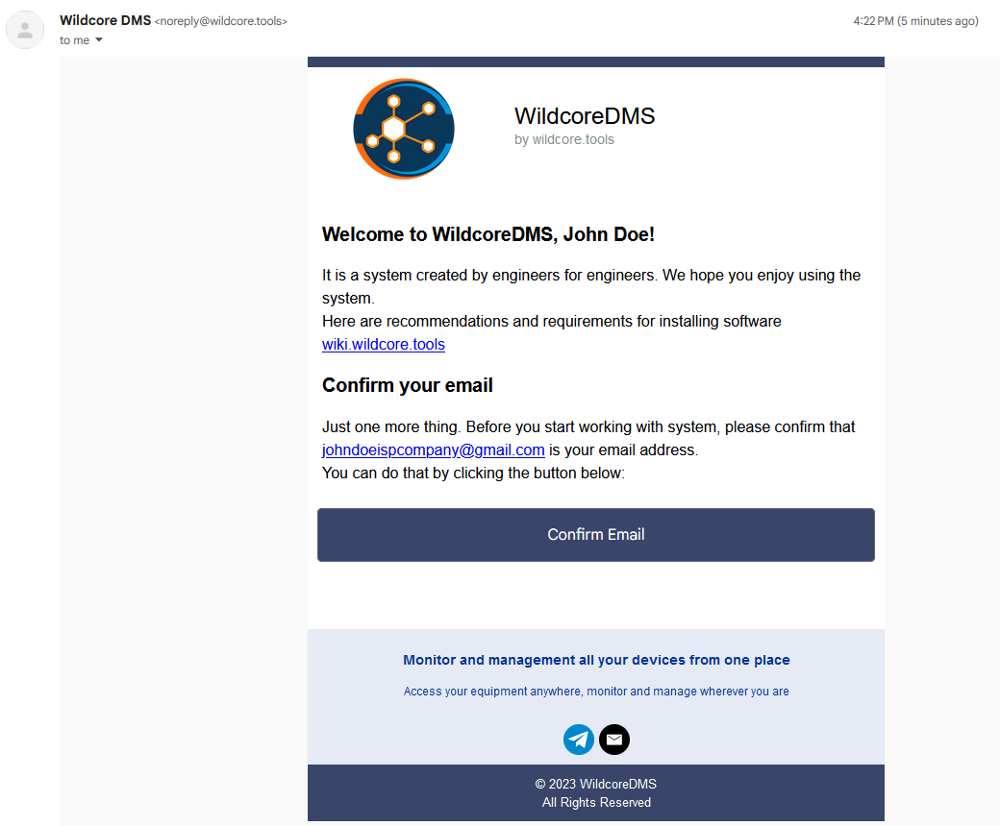
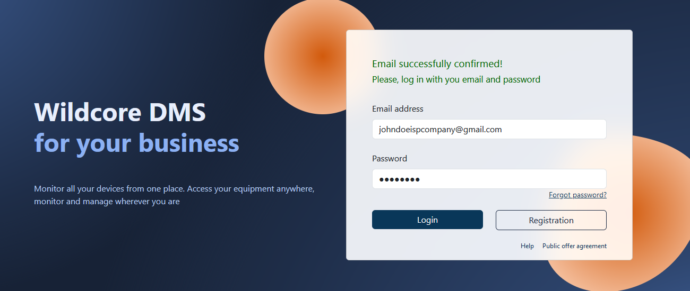
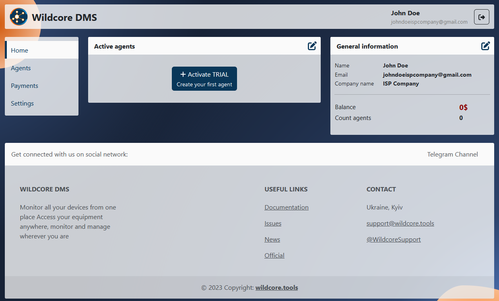
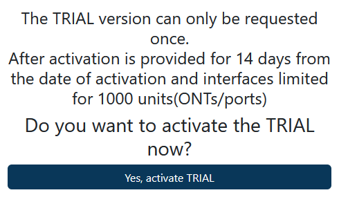
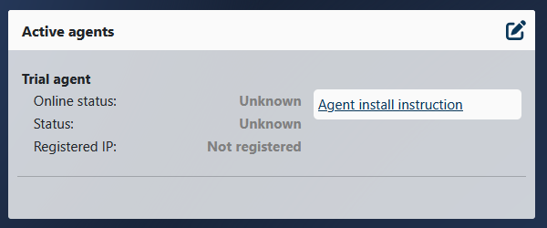
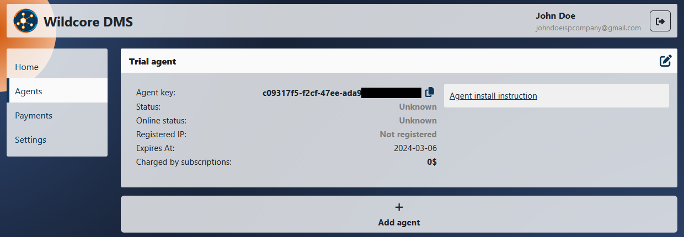
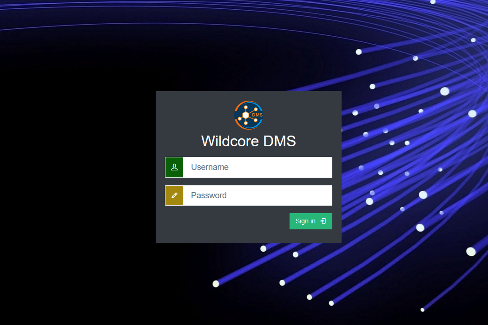

# Getting started

!!! abstract "Overview"
    This page provides an overview of the **WildcoreDMS** onboarding process, from installation to running it.

!!! warning "Note"
    At the moment, the only way to install the **WildcoreDMS** is through our custom `wca-tool`, using a custom **Docker** container.

!!! warning "Note"
    Prior to installation, ensure that your system meets the [System requirements](./requirements.md)

## Registration

!!! info
    This section will take you through the registration process. Feel free to skip it if you have already set up an account.

1. Go to the [Registration page](https://cabinet.wildcore.tools/auth/Registration).

    

2. Fill out the **Name**, **Company name**, **Email address** and **Password** fields, accept the  [Terms and Conditions](https://wildcore.tools/public-offer-agreement.pdf) and press the **Registration** button.

    

3. Confirm your registration

    Please verify your registration by checking the email inbox you provided. In a few minutes, an email from `noreply@wildcore.tools` should arrive.
    
    !!! tip
        If you experience delays, kindly check your **Spam** folder.

    Once received, please press the Confirm Email button inside the email.

    

4. Log in with your email and password

    

## Creating an Agent

1. Log in into your personal **Cabinet**

    

2. Activate your Trial Agent

    Press the **Activate TRIAL** button in the **Active agents** panel, read the pop-up carefully and agree to it.

    

    Your first trial **Agent** is now active.

    


## Installation

1. Install the latest version of the `wca-tool`

    ``` shell
    sudo curl -L "https://releases.wildcore.tools/wca-tool/latest/wca-tool-$(uname -s)-$(uname -m)" -o /usr/local/bin/wca-tool && sudo chmod +x /usr/local/bin/wca-tool
    ```

2. Find your Agent key in the **Agents** tab in your **Cabinet**.

    

3. Run the following command to install the **WildcoreDMS**

    ``` shell
    sudo wca-tool --key=YOUR_AGENT_KEY install 
    ```

!!! note
    The installation process may take some time (usually about 10-15 minutes)

If the installation was successful, the following message will be displayed:

```
    WildcoreDMS (version x.xx.x) success installed!
    Now, you can use wildcoreDMS by URL: http://<service ip|domain>:8088
    Default login/password - admin/admin

    You can change some parameters in /opt/wildcore-dms/.env file, as listen ports for example
```

After installation, you can navigate to the **Web Panel**.

!!! tip
    The panel is available at `http://localhost:8088` by default.

You will be greeted by the **WildcoreDMS** login screen.



!!! tip
    The default login credentials are:

    - **Username:** `admin`
    - **Password:** `admin`


## Frequent installation problems

### docker-compose-plugin not installed
Usually the error looks like this:


!!! failure "Issue"

    `docker-compose` must be installed on your system specifically as a plugin for **Docker**, rather than as a standalone utility.

!!! success "Solution:"

    1. Install the `docker-compose-plugin` package for your operating system (refer to the installation instructions in the official [**Docker** documentation](https://docs.docker.com/engine/install/).
    2. Verify its functionality by running the command docker compose version, which should return the plugin version.
    3. Proceed with the **WildcoreDMS** installation by executing `sudo wca-tool update`.
 

### Network related errors
Network errors may manifest as `Connection refused`,` Connection timeout`, or `Forbidden` entries in the logs.

!!! success "Solution:"

    1. Examine the logs to pinpoint the problematic connection attempt.
    2. Confirm the existence of the target address on the server (for HTTP, try the same `curl`).
    3. If the response is valid, investigate your **Docker** setup.

    Refer to the official [Docker documentation](https://docs.docker.com/engine/install/) for detailed instructions. Ensure compatibility with your OS version as per the documentation or that no older versions are present.

Once the issue is resolved, you can proceed by executing the `wca-tool update` command.

### Web panel malfunctions or `wca` command errors

!!! success "Solution:"
    Utilize the `docker ps -a` command to see the currently running containers. 
    
    Inspect the logs with `docker logs ...` for containers showing errors.