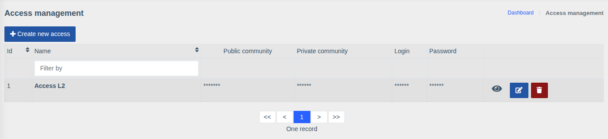
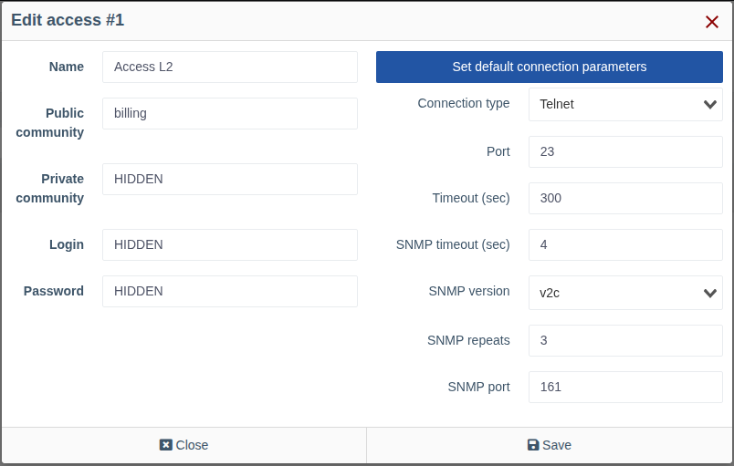

# Device accesses

!!! abstract "Overview"

    An **access** is a set of credentials WildcoreDMS uses to connect to hardware:
    read and write SNMP communities, console login and password (Telnet/SSH), and, if needed,
    non-standard ports and timeouts. One access can be used by any number of devices.

Menu: `Device management > Accesses`.

Secret fields are masked in the list. The eye button reveals the values; the buttons on the right
edit and delete the access.

## Creating and editing

Click **"Create new access"** or the edit button next to an existing one.

| Field | Description |
|-------|-------------|
| **Name** | Name shown when choosing an access in the device card, e.g. `Access L2` or `OLT Huawei` |
| **RO community** | SNMP community for reading (polling, viewing information) |
| **RW community** | SNMP community for writing — required for SNMP actions (port description, enabling/disabling a port, etc.) |
| **Login** / **Password** | Console credentials (Telnet/SSH): used by macros, ONU registration, the web console and modules that work over the console |

### Connection parameters

By default the system-wide connection parameters are used
(*"Used default connections parameters"*). To set custom ones for this access, click
**"Set custom connection parameters"**:

| Field | Description |
|-------|-------------|
| **Connection type** | `Telnet` or `SSH` — console protocol |
| **Port** | Console port (23 for Telnet, 22 for SSH by default) |
| **Timeout (sec)** | Maximum execution time of a console command |
| **SNMP timeout (sec)** | Wait time for a single SNMP request |
| **SNMP version** | `v1` or `v2c` |
| **SNMP repeats** | Number of SNMP request retries when there is no response |
| **SNMP port** | SNMP port (161 by default) |

The **"Set default connection parameters"** button returns to the system-wide parameters.

!!! tip
    If some hardware is reachable on other ports or responds slowly (e.g. an OLT with many ONUs),
    create a separate access for it with longer timeouts.

!!! info "Permissions"
    Managing accesses requires the **"Device access control"** permission.
    From the console the access list is shown with `wca device-access:list`.
