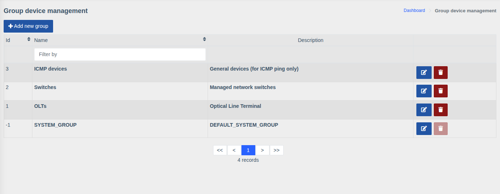

# Device groups

!!! abstract "Overview"

    Groups combine devices (e.g. by district, branch or hardware type) and define
    **which devices a user sees**: each user sees only devices from the groups assigned to them.

Menu: `Device management > Groups`.

## Creating a group

1. Click **"Add new group"**.
2. Enter a **Name** and optionally a **Description**.
3. Save.

Row buttons edit and delete the group.

## How groups affect access

- A device can belong to several groups — the **Groups** field in the [device card](./devices.md).
- Groups are assigned to a user in the **Device groups** field of their [account](./users.md).
- In lists, search, on the map, in events and notifications a user sees only devices from their
  assigned groups. Failure notifications are also sent only to users with access to the device.
- The exception is the **"Analytics"** permission: it shows information about all devices
  regardless of groups, so grant it to administrators only.

!!! note "System group"
    The `SYSTEM_GROUP` group is created automatically and can't be deleted.

!!! tip "Example"
    For installers of the "North" district create a `North` group, add the district's hardware to
    it and assign it to the installers. They won't see hardware of other districts.

!!! info "Permissions"
    Managing groups requires the **"Device groups management"** permission.
