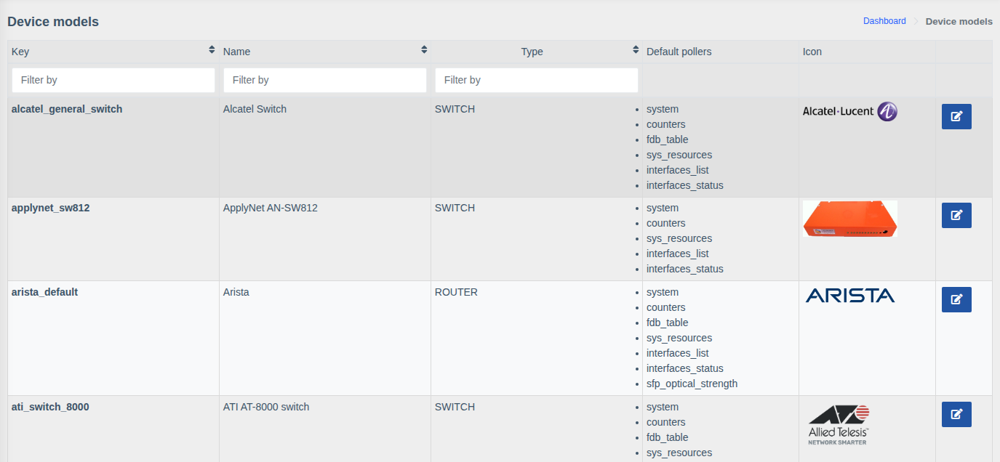
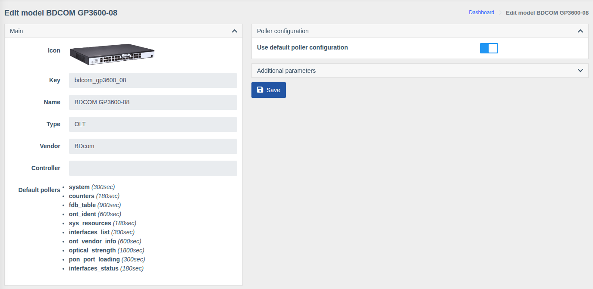

# Device models

!!! abstract "Overview"

    A model defines how WildcoreDMS works with a device: what information can be retrieved,
    which pollers run and at what intervals. Model settings apply to all devices of the model
    (unless a device has its own).

Menu: `Device management > Device models`.

The model list is maintained by the system — supported models are added with WildcoreDMS updates
(see [Supported hardware](../supported-hardware.md)). The list shows the type, vendor and pollers
of each model.

## Model settings

**Main** — reference information, it can't be changed:

| Field | Description |
|-------|-------------|
| **Icon** | Model image |
| **Key** | Internal model identifier |
| **Name** | Model name |
| **Type** | `OLT`, `SWITCH`, `ROUTER`, etc. |
| **Vendor** | Hardware vendor |
| **Controller** | Service field |
| **Default pollers** | Pollers and their intervals defined for the model |

**Poller configuration** — turn off **"Use default poller configuration"** to enable/disable
individual pollers or change their intervals for the whole model. See
[Hardware Poller](../system/poller.md).

**Additional parameters** — JSON with working parameters for all devices of the model
(e.g. [local PON description](../system/working-with-hardware.md#local-pon-description)).
Parameters in the device card take precedence over the model's.

Click **"Save"** after making changes.

!!! info "Permissions"
    The page requires the **"Device management"** permission.
