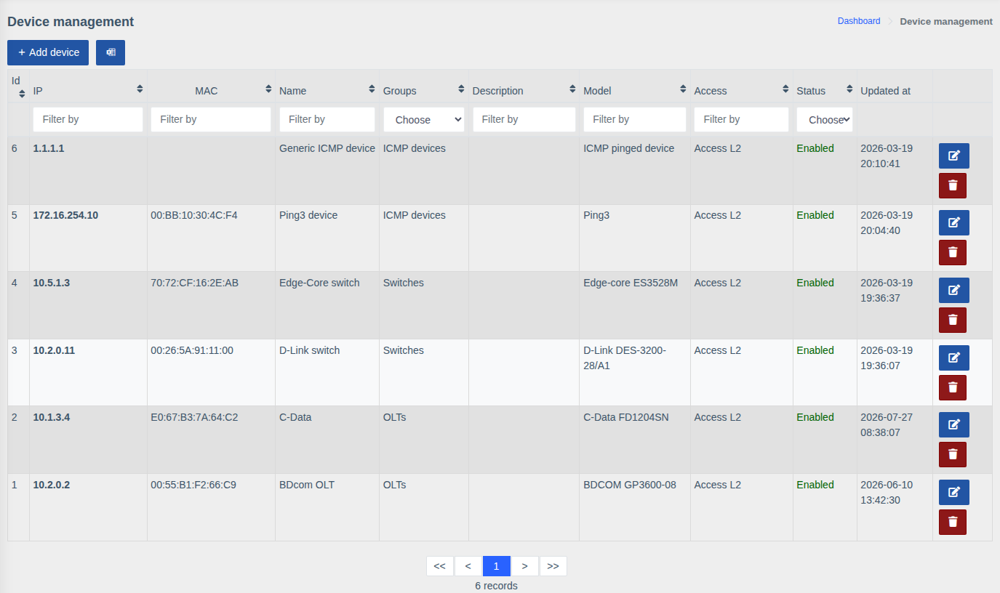
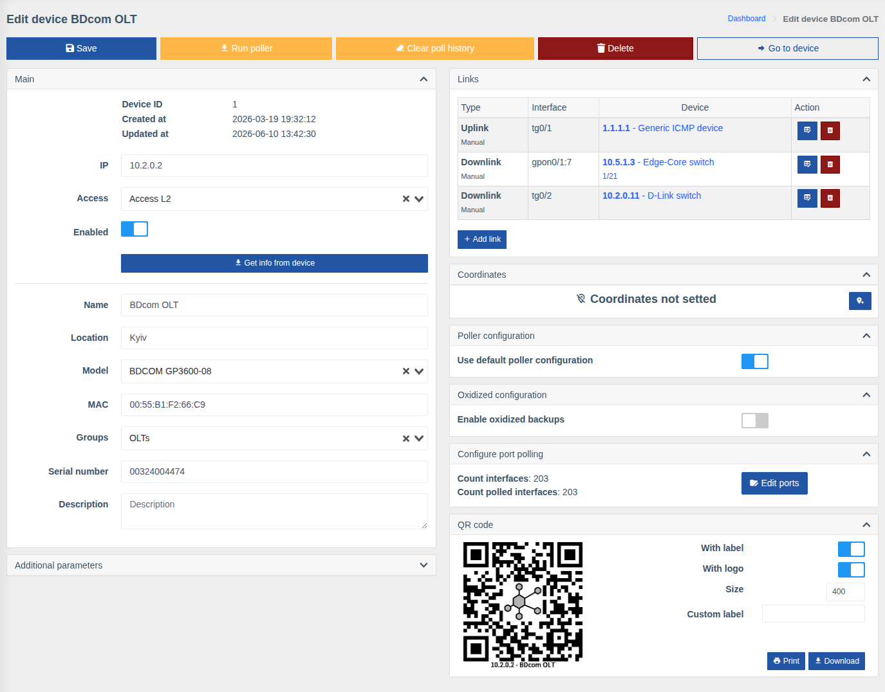

# Devices

!!! abstract "Overview"

    The device management page is the registry of hardware WildcoreDMS works with:
    adding new devices, changing their parameters, disabling and deleting them.

Menu: `Device management > Devices`.

## Device list

The table has **Id**, **IP**, **MAC**, **Name**, **Groups**, **Description**, **Model**,
**Access**, **Status** and **Updated at** columns. Every column can be filtered (field or list
under the header) and sorted by clicking the header. The **Status** filter quickly finds
disabled devices.

Row buttons edit and delete the device.

## Adding a device

1. Make sure an [access](./device-access.md) with the correct SNMP communities exists.
2. Click **"Add device"**.
3. Enter the **IP** and choose the **Access**.
4. Click **"Get info from device"** — WildcoreDMS polls the device over SNMP and fills in
   **Model**, **Name**, **Location**, **MAC** and **Serial number**
   (depending on what the hardware reports).
5. Choose **Groups**, change the name and description if needed.
6. Click **"Create"**.

!!! tip
    If the model wasn't detected automatically, choose it from the list manually.
    Bulk adding — via CSV import, see [Import devices](../cli/import-devices.md).

## Editing a device

### Action buttons

| Button | Action |
|--------|--------|
| **Save** | Save changes |
| **Run poller** | Run all device pollers in the background without waiting for the schedule |
| **Clear poll history** | Clear the device polling history (with confirmation) |
| **Delete** | Delete the device together with its interfaces and history |
| **Go to device** | Open the device page (dashboard) |

### Main

| Field | Description |
|-------|-------------|
| **IP** | Address WildcoreDMS uses to connect to the device |
| **Access** | [Access](./device-access.md) with credentials |
| **Enabled** | A disabled device is not polled by background tasks and is excluded from autotopology, but stays in the system with all its settings |
| **Name** | Device name in lists, search and on the map |
| **Location** | Address or installation place |
| **Model** | [Device model](./device-models.md) — defines how WildcoreDMS works with the device |
| **MAC**, **Serial number** | Device identifiers |
| **Groups** | [Device groups](./device-groups.md) — define which users see the device |
| **Description** | Free-form comment |

### Other blocks

- **Additional parameters** — JSON with working parameters overriding the model's ones.
  Example — [Local PON description](../system/working-with-hardware.md#local-pon-description).
- **Links** — the device's connections to others (uplink/downlink). See
  [Links](../components/links/describe.md).
- **Coordinates** — the device position on the map: the pin button lets you pick a point on the map.
- **Poller configuration** — custom poller intervals for this device instead of the model's,
  see [Hardware Poller](../system/poller.md).
- **Oxidized configuration** — enable configuration backups for the device
  (if the [Config backups](../components/oxidized.md) component is installed).
- **Configure port polling** — number of interfaces and how many are polled; the
  **"Edit ports"** button disables metric storage for individual ports
  (see [Hardware Poller](../system/poller.md)).
- **QR code** — a label with a link to the device, see
  [QR code Generator](../components/qr-code-generator.md).

!!! info "Permissions"
    The page requires the **"Device management"** permission. Running the poller from the card
    requires **"Run poller on device dashboard"**.
